# Rebased.js 使用手册

> 面向使用者的功能手册：把「每个页面里有什么、每个功能干什么用、什么时候用、怎么用」讲清楚。

**怎么读这份手册**

| 你的目的 | 从哪读 |
|----------|--------|
| 先跑起来 | §二 快速上手 |
| 搞清全站通用规则（导航、自动刷新、认证、主题、URL 直达） | §三 通用交互约定 |
| 查某个页面的功能 | §四 页面详解（按页面分节） |
| 办一件具体的事（提交、合并、冲突、追查代码…） | §五 典型任务流程 |
| 手里有个功能点编号（F-xxx） | §六 功能点索引 |
| 想知道「为什么不提供某功能」 | §七 明确不做与已知边界 |

**口径说明**

- 功能、按钮文案、默认值、上限与报错文案**以当前代码为准**；本手册与 `docs/pages-and-api-audit.md`（功能盘点）、`docs/e2e-verification.md`（逐项实测记录）配套使用。
- 配图取自 `docs/shots/`，均为真实操作截图（截图所在仓库为冒烟测试仓，其中的分支名/提交信息属测试数据）。
- 页面路由写在每个小节标题里，可复制到地址栏直达（也可按 §三 的 URL 参数带上下文直达）。
- 按钮与菜单文案照代码标签书写；界面上的**两字按钮**会在中间自动留空（代码 `保存` → 界面 `保 存`），两者指同一个按钮。

**术语速查**

| 词 | 含义 |
|----|------|
| 工作区 | 你正在编辑的文件当前状态 |
| 暂存区 | 已挑选、将进入下次提交的改动 |
| 检出（checkout） | 切换分支或切到某个提交 |
| 变基（rebase） | 把一串提交搬到另一个基上，历史保持线性 |
| 摘樱桃（cherry-pick） | 把某次提交的改动复制到当前分支 |
| 还原（revert） | 生成一次反向提交来抵消某次提交 |
| 贮藏（stash） | Git 原生的临时收走改动机制（存在仓库里） |
| 搁置（shelf） | 本应用提供的存档式暂存架（含未跟踪文件快照） |
| 补丁（patch） | 导出的 diff 文件，可离线传递与套用 |
| 工作树（worktree） | 同一个仓库的多个检出目录，可并行开发 |
| 溯源（blame） | 逐行显示最后改动该行的提交与作者 |
| 快照浏览 | 以某次提交为根的只读文件树浏览，不触碰工作区 |
| 操作条 | 出现「进行中的操作」（合并/变基/摘樱桃/还原）时才显示的顶栏状态区 |

## 一、Rebased.js 是什么

**一句话**：Rebased.js 是**本地 Git 仓库的可视化客户端**——界面在浏览器里，干活的是你机器上真实的 `git` 命令。

| 维度 | 说明 |
|------|------|
| 干什么 | 浏览提交图、看差异、暂存与提交、分支/标签/远程、变基与合并、冲突解决、贮藏与搁置、补丁、工作树、子模块、PR/MR 评审 |
| 解决什么问题 | 免去「记命令 + 背哈希 + 开终端」：状态、历史、差异、冲突、远端分叉都在页面上看得见、点得到 |
| 对象 | 你本机的真实仓库（打开即用），不是托管服务、不做云端拷贝 |
| 应用自身数据 | 最近仓库列表、账户令牌、保护分支规则、补丁与搁置存档等保存在本机应用配置中 |
| 前提 | 本机已安装 `git`；应用服务在本机运行（默认地址 `http://localhost:3081`） |
| 与命令行共存 | 你在终端/IDE 里的改动（提交、检出、建分支）会自动反映到页面，无需刷新 |
| 单仓库维度 | 一次面向一个仓库操作；没有多项目会话 |

### 1.1 我该去哪一页

| 我想…… | 去这里 |
|---------|--------|
| 打开/初始化/克隆仓库 | 首页 |
| 看提交历史、提交详情、推送/拉取/更新 | 提交日志页（仓库主页） |
| 只看某条分支的历史线 | 提交日志页 → 过滤行的「分支过滤」 |
| 把没有分叉的长链折起来看 | 提交日志页 → 过滤行的「折叠线性分支」（也可以直接点图上的圆点/虚线折展） |
| 看工作区改了什么、挑选改动提交 | 变更状态页 |
| 看某个文件改了什么、和别的版本比 | 差异页 |
| 管理分支、检出、比较分支 | 分支页 |
| 把另一条分支合进来 | 合并页 |
| 整理本地提交（改顺序、合并、改信息、删除） | 变基对话框 + 日志行右键菜单 |
| 临时收走手头的改动 | 贮藏页 / 搁置页 |
| 发布版本标记 | 标签页 |
| 配置远程仓库、处理认证 | 远程管理页 |
| 解决冲突 | 冲突解决页 |
| 追查某一行代码的来历 | 文件溯源页 |
| 找「谁在什么时候改过这个文件」 | 文件历史页 |
| 按提交逐个浏览已提交的改动 | 已提交变更页 |
| 按关键字找提交 | 提交搜索页 |
| 只读浏览某个历史版本的全部文件 | 提交日志页 → 选中提交 → 详情面板「浏览快照」（就地展开快照栏） |
| 导出/套用改动（不依赖远程） | 补丁页 |
| 一次开多个工作目录并行开发 | 工作树页 |
| 管理子模块 | 子模块页 |
| 让某些文件不再出现在变更列表 | 忽略配置页 |
| 评审 GitHub PR / GitLab MR | GitHub 面板 / GitLab 面板 |
| 看后台到底跑了哪些 git 命令、为什么失败 | 命令控制台 |
| 改主题、账户令牌、保护分支、git 可执行文件 | 设置页（应用设置 / 仓库设置） |

## 二、快速上手

### 2.1 启动

1. 确认本机已安装 `git`（应用会直接调用它）。
2. 在项目根目录执行 `pnpm dev`：同时启动主应用 `http://localhost:3081` 与备用端 `http://localhost:3082`。
3. 浏览器打开 `http://localhost:3081`，进入**首页**。

### 2.2 打开你的第一个仓库（三条路）

| 场景 | 怎么做 |
|------|--------|
| 仓库已在本机 | 首页「打开」→ 填仓库目录路径 → 打开：校验通过后直接进提交日志页 |
| 还没有仓库 | 首页「初始化」→ 填一个新目录 → 生成空仓库并进入（此时还没有任何提交） |
| 要从远程拿 | 首页「克隆」→ 填仓库地址 + 目标目录 → 克隆完成后自动打开 |

打开的仓库会进入首页「最近仓库」列表，下次点一下就能进。填错路径不会静默失败：非 Git 目录会红字提示「不是 git 仓库：…」。

### 2.3 认识仓库界面

打开仓库后落到**提交日志页**，它是仓库的枢纽：其余页面都从这里进出。

| 区域 | 作用 |
|------|------|
| 面包屑「首页 ｜ 仓库名 ｜ 分支」 | 回首页、看当前分支 |
| 顶栏按钮区 | 撤销最近提交 / 变更 / 分支 / 合并 / 贮藏 / 设置 / 更多 |
| 提交图 | 每条提交一行，含分支标签、作者、日期；点行看详情（点圆点或两行之间的实线边则折叠它所在的那条链，且不改变当前选中） |
| 右侧详情面板 | 选中提交的完整信息与常用动作（浏览快照、查看变更集、摘樱桃、还原、重置到此处） |
| 操作条 | 只在有「进行中的操作」（合并/变基/摘樱桃/还原）时出现，可中止或去解决冲突 |

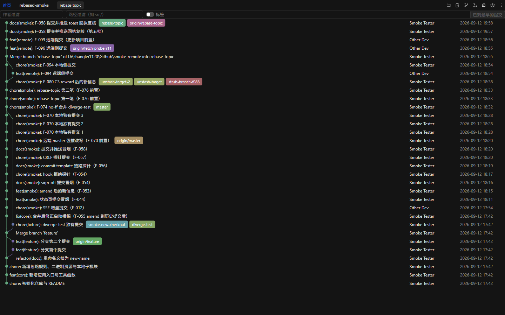

### 2.4 第一次提交

1. 顶栏「变更」→ 进入变更状态页，看到分好组的改动（已暂存 / 工作区 / 未跟踪）。
2. 勾选要提交的文件（或点组头全选）→ 「暂存」。
3. 在提交框写提交信息 → 「提交」。
4. 想顺手推上去就点「提交并推送」。

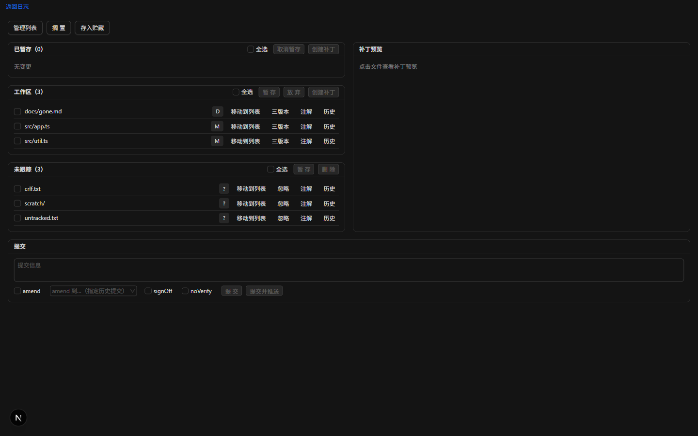

### 2.5 出问题先看这三处

| 症状 | 去处 |
|------|------|
| 远端要求认证 | 弹出「需要认证」对话框 → 填账户与令牌 → 保存并重试（令牌可在设置页统一管理） |
| 推送被拒（远端有你没有的提交） | 自动弹出「推送被拒 — 更新项目」→ 选合并或变基 → 更新成功后自动续推 |
| 合并/变基撞上冲突 | 自动跳到冲突解决页 → 逐个文件用「用我们的 / 用他们的 / 手动合并」→ 「完成合并」或「继续变基」 |
| 某个操作报错但看不懂 | 顶栏「更多」→「控制台」：看实际执行的 git 命令、退出码与错误输出 |

## 三、通用交互约定

> 这一节讲全站统一规则（导航、刷新、主题、提示、危险操作门槛），读完再看各页小节会顺很多；各页小节里不再重复这些。

### 3.1 应用骨架与导航

三个层级：**首页**（`/`，欢迎屏：最近仓库列表 + 打开/初始化/克隆 + 「设置」）→ **仓库页族**（`/repos/:id`，日志页是枢纽页）→ **22 个仓库子页面**。

- **面包屑与分支名**：每个仓库页顶栏从左往右是「首页 ｜ 仓库名 ｜ 当前页名」三级面包屑——最左「首页」可点回欢迎屏；**仓库名在非日志页可点回日志页**（日志页自己是末级「提交」）；当前页名加粗（与「更多」菜单文案一致：提交/变更/分支/合并/贮藏/设置/溯源/历史/已提交/搜索/标签/远程管理/补丁/搁置/控制台/忽略/GitHub 面板/GitLab 面板/工作树/子模块/冲突）。面包屑右侧是**当前分支名胶囊**（点击复制；后面跟待拉取蓝点↓/待推送绿点↑计数，两侧全 0 时只有分支名；游离 HEAD 显示 `(detached HEAD)`）。
- **仓库顶栏导航（共用）**：除欢迎屏与应用设置页外，所有仓库页共用同一条顶栏导航——左侧三级面包屑 + 分支名胶囊（日志页另有进行中操作条），右侧图标按钮组「日志/变更/分支/合并/贮藏/设置 + 更多」；**当前页对应的图标按钮高亮**（主色浅底填充），落在「更多」菜单里的页面则高亮「更多」按钮本身。
- **仓库内页之间怎么走**：顶栏图标按钮与「更多」菜单在每个仓库页都能用（不再需要先回日志页）；页内行内按钮另可直达相关页（变更页行内去差异/溯源/文件历史/补丁/搁置，溯源与文件历史互跳，两页设置互跳），撞上冲突会自动跳冲突页。
- **怎么回去**：见下表，绝大多数子页顶栏就有回边，不会「进去出不来」。

| 从哪 | 怎么回去 |
|------|----------|
| 20 个仓库子页面（分支/变更/标签/冲突/溯源/仓库设置…） | 顶栏「日志」图标按钮或面包屑仓库名 → 该仓库日志页；面包屑「首页」回欢迎屏 |
| 合并页 | 对话框「取消」即返回日志页 |
| 差异页 | 差异页在**新标签页**里打开（不顶掉来源页）：看完直接关掉这个标签，来源页（变更／已提交／历史／溯源／分支／日志）仍在原样；页内没有返回按钮 |
| 仓库设置页 | 顶栏「日志」图标按钮回日志页；页首竖线右侧是「应用设置」互跳 |
| 应用设置页 | 「返回首页」→ 欢迎屏；竖线右侧是「仓库设置」（没有最近仓库时该链接禁用） |
| 日志页 | 顶栏最左「首页」→ 欢迎屏，不改动仓库内容 |

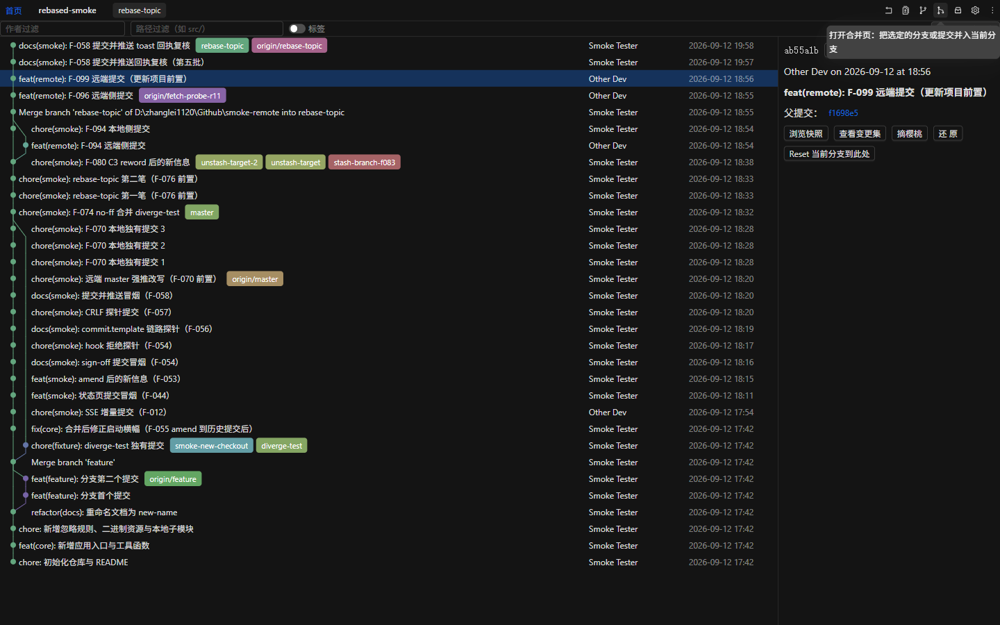

### 3.2 顶栏与「更多」菜单

仓库顶栏右端固定八件：**撤销最近提交**（回退箭头，仅日志页有）、**日志**、**变更**、**分支**、**合并**、**贮藏**、**设置**、**更多**（省略号）；左端是「首页 / 仓库名 / 当前页名」三级面包屑 + 当前分支名胶囊（日志页另有进行中操作条）。其中「日志/变更/分支/合并/贮藏/设置」六个是页面入口，「撤销最近提交」是动作（带确认框），「更多」是其余入口的抽屉。**当前页对应的图标按钮高亮**（主色浅底填充）——落在「更多」菜单里的页面则高亮「更多」按钮本身；差异/冲突页不在导航内，无高亮。

- **可用性门**：「GitHub 面板」「GitLab 面板」两项各需检测到对应远程才出现——所以「更多」菜单实际是 **16 / 17 / 18 项**（无托管远程 / 仅其一 / 两者都有）。
- **不在菜单里的四个**：「变基」「拉取」「推送」「更新项目」点开的是对话框，不跳页——**这四项只在日志页的「更多」里出现**（对话框挂在日志页上；其它仓库页的「更多」只有页面导航项）。

| 想去哪 | 点哪里 |
|--------|--------|
| 日志页 | 顶栏「日志」（任何仓库页都有；当前就在日志页时该按钮高亮） |
| 变更（状态）页 | 顶栏「变更」 |
| 分支页 | 顶栏「分支」（原「分支快捷弹窗」的等效落点） |
| 合并页 | 顶栏「合并」 |
| 贮藏页 | 顶栏「贮藏」 |
| 仓库设置页 | 顶栏「设置」 |
| 溯源页 | 「更多 → 溯源」；也可从变更页行「注解」、文件历史行「Annotate」进 |
| 文件历史页 | 「更多 → 历史」；也可从变更页行「历史」、溯源页右栏操作条「文件历史」进 |
| 已提交页 | 「更多 → 已提交」 |
| 搜索页 | 「更多 → 搜索」 |
| 标签页 | 「更多 → 标签」 |
| 远程管理页 | 「更多 → 远程管理」 |
| 补丁页 | 「更多 → 补丁」；也可从变更页组级「创建补丁」跳 |
| 搁置页 | 「更多 → 搁置」；也可从变更页页头「搁置」跳 |
| 控制台页 | 「更多 → 控制台」 |
| 忽略页 | 「更多 → 忽略」 |
| GitHub 面板 | 「更多 → GitHub 面板」（需检测到 GitHub 远程） |
| GitLab 面板 | 「更多 → GitLab 面板」（需检测到 GitLab 远程） |
| 工作树页 | 「更多 → 工作树」 |
| 子模块页 | 「更多 → 子模块」 |
| 差异页 | 变更页双击文件行或行「三版本」；已提交页点文件；溯源页右栏操作条「差异页」；文件历史双击条目（**以上入口一律在新标签页打开**，来源页原地保留） |
| 冲突页 | 日志页操作条「去解决冲突」；合并/变基/摘樱桃/还原撞上冲突会**自动**跳这里 |
| 快照浏览（就地） | 日志页详情面板「浏览快照」；或提交行右键「浏览快照」 |
| 变更集（就地） | 日志页详情面板「查看变更集」→ 快照栏里多一个「变更集（N）」标签；点清单里的文件名，在同一标签栏开它的**差异标签**（不再新开浏览器标签页） |

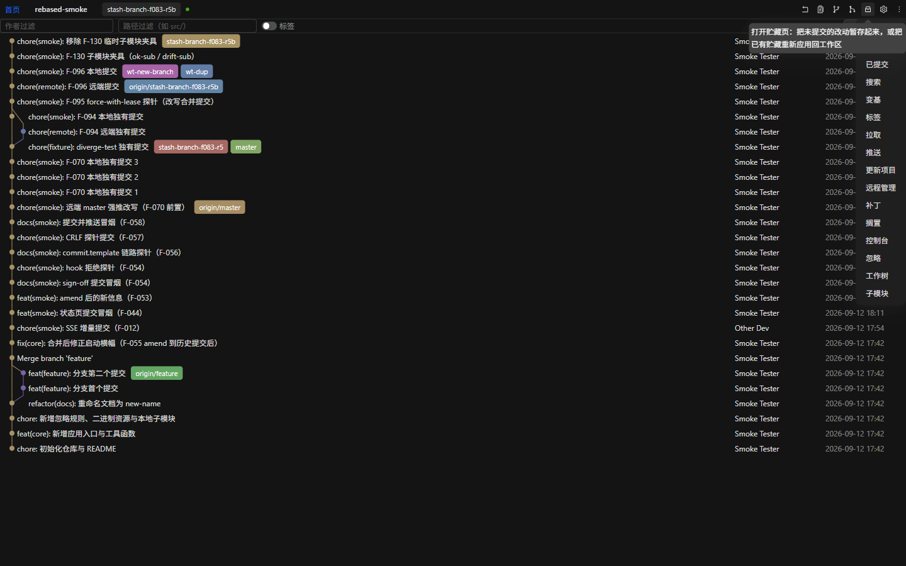

### 3.3 操作条（进行中操作）

仓库卡在合并/变基/摘樱桃/还原中途时，日志页顶栏分支名旁会亮出一条状态：琥珀色标签 + 红色「中止」按钮。

| 状态标签 | 什么时候出现 |
|----------|--------------|
| 「合并中」 | 合并出现冲突、还没提交合并结果 |
| 「变基中（第 n/m 步）」 | 变基进行到第 n 步、共 m 步；无进度信息时只显示「变基中」 |
| 「拣选中」 | 摘樱桃出现冲突、还没落定 |
| 「还原中」 | 还原出现冲突、还没落定 |

| 在操作条上能做什么 | 点了会怎样 |
|--------------------|------------|
| 「中止」 | 弹确认框「确定中止当前操作？工作区将回到操作前状态」→「确定」后回到操作前，**已做的冲突解决不保留** |
| 「去解决冲突」 | 只在一处出现（合并中），跳到冲突页逐文件处理 |

- 继续往下走不在操作条上，而在**冲突页**底部：文案随操作类型变——「完成合并」/「继续变基」/「继续摘樱桃」/「继续还原」；还有未解决的冲突时点不动。
- 变基、摘樱桃、还原撞上冲突时还可以在冲突页「跳过」当前这一个提交（其变更丢弃，不可恢复）；合并没有「跳过」概念。
- 操作条只挂在日志页；人在子页面时想中止，先回日志页。

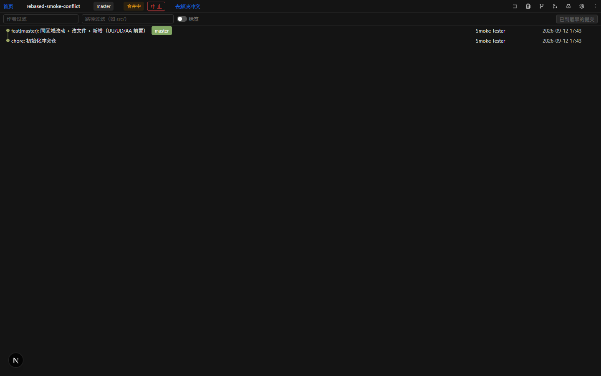

### 3.4 自动刷新（无需手动刷新）

页面自己订阅服务端的推送：服务端每 **2 秒**核对一次仓库，只在真有变化时推送，页面收到即重取数据。你不必按 F5，也不必来回切页。

| 推送什么 | 什么时候来 | 页面上看到什么 |
|----------|------------|----------------|
| 仓库状态变化 | 提交、检出、HEAD 移动——命令行敲的和页内点的都算 | 分支名与待拉取/待推送圆点即时更新；日志页立刻多出或少掉提交 |
| 操作状态变化 | 合并/变基/摘樱桃/还原开始或结束，变基推进到下一步 | 顶栏操作条的标签与「第 n/m 步」即时变化 |
| 引用变化 | 分支、标签、贮藏、远程引用的新建、删除与指向移动 | 日志行的分支与标签胶囊、分支页/标签页/贮藏页列表更新 |
| 提交边查边显示 | 打开日志页 | 提交列表分块出现，不用等全量返回 |
| 差异边算边显示 | 打开差异页 | 差异文本分块渲染，全文到达后切为标准对比视图 |

| 会自己跟随的页面 | 日志页、变更页、分支页、标签页、贮藏页、合并页、冲突页 |
|------------------|--------------------------------------------------------|
| 需要自己重取的页面 | 其余页面：控制台/工作树/子模块/GitHub/GitLab 面板自带「刷新」按钮；切回浏览器标签页时也会重校验一次 |

- **命令行改动同样反映**：在终端里 `commit`/`checkout`/`branch` 后回到浏览器，页面已经是最新的。
- **跨标签页也生效**：一个仓库开两个标签页时，两边各自收到推送，会一起更新。
- **一个边角**：检出换分支不改变任何引用的值，靠状态里的分支名变化兜底——所以换分支也照样刷新。

### 3.5 URL 直达参数（速查表）

可以把链接直接发给别人或在书签里保存；页面进去就按参数摆好。

| 页面 | 参数 | 作用 |
|------|------|------|
| 日志页 `/repos/:id` | `?select=<提交号>` | 进入时选中该提交、展开右侧详情面板（溯源页操作条「日志定位」、文件历史页/搜索页的结果点击走这里）；页内点任意行也会**把选中写回地址栏**——刷新、复制链接、前进后退都回到同一选中 |
| 日志页 | `?browse=<路径>` 或 `?browse=` | **「浏览快照」面板**：**键在即开**，值决定前台是谁——`?browse=<路径>` = 该文件的内容标签在前台；`?browse=`（空值）= **文件树**在前台；缺键 = 面板关着（树与文件标签都不渲染）。它与 `?diff=` 是**两个独立参数**、互不代劳，但共用一条右栏（任一存在就会出现右栏） |
| 日志页 | `?diff=<路径>` 或 `?diff=` | **「查看变更集」面板**：键在即开——`?diff=<路径>` = 该差异标签在前台；`?diff=`（空值）= **变更集清单**在前台；缺键 = 关着。它看的恒是 `?select=` 那一版，故不需要额外的版本号参数。切标签也会改写这个值，所以**刷新前后看到的一致**（含「我正停在清单上」） |
| 日志页 | `?snap=<版本>`、`?file=<路径>`（旧） | 2026-09 之前的写法（有版本号即展开、`file` 指文件）。现在只作**只读兼容**——读到就改写成 `?browse=`（有 `file` 时改写成 `?browse=<该文件>`，并沿用版本号补上 `?select=`），旧书签/旧链接仍落在同一视图上；应用自己**不再写出**这两个参数 |
| 日志页 | `?compare=<分支名>` | 进入分支对比视图：当前分支与该分支的双向提交差异；「退出对比」回普通日志 |
| 差异页 `/repos/:id/diff` | `?file=<路径>` | 要比对的文件（必填，缺了不渲染内容） |
| 差异页 | `?staged=1` | 比对暂存区版本（变更页里已暂存分组的行双击时带上；进页后页内切换不再回写地址栏） |
| 差异页 | `?from=<版本>&to=<版本>` | 比对任意两个版本；成对出现，出现后不再按工作区比对，页内暂存切换随之隐藏 |
| 差异页 | `?three=1` | 三版本对比（HEAD / 暂存区 / 工作区三段），变更页行「三版本」的入口 |
| 差异页 | `?root=1` | 根提交没有父版本时的降级：只给提示行、不请求父版本（同时给了 from/to 时以 root 为准） |
| 差异页 | `?renameFrom=<旧路径>` | 重命名改名前的原名提示行（不做伪差异） |
| 差异页 | `?files=<JSON 数组>` | 同一组文件清单，供页头「上一个/下一个」切换；切换时保留 from/to/three/files，renameFrom 与 root 属单条目、切换即清除 |
| 溯源页 `/repos/:id/blame` | `?file=<路径>` | 溯源的目标文件（与差异页、文件历史页同名同义） |
| 溯源页 | `?select=<完整哈希>` | 中栏选中的提交（右栏三个标签看的都是这一版）；**缺省不写进地址**——不写时自动选中中栏最新一条（不产生新的浏览步骤） |
| 溯源页 | `?view=changes\|latest\|annotate` | 右栏在前台的标签：`changes` 本文件改动（缺省）、`latest` 与最新版本差异、`annotate` 逐行注解；非法值按 `changes` 处理 |
| 溯源页 | `?rev=<版本>`（旧） | 2026-09 之前的写法，等价于「选中该提交 + 逐行注解」。现在只作**只读兼容**——读到就规范化成 `?select=<哈希>&view=annotate`（文件历史页「Annotate」的旧链接仍落在同一视图）；应用自己不再写出这个参数 |
| 文件历史页 `/repos/:id/history` | `?file=<路径>` | 只看该文件的提交 |
| 其余页面 | —— | 首页、应用设置与其余仓库子页面不接受 URL 参数：进去是默认视图，范围在页内选 |

### 3.6 认证与令牌

| 问题 | 答案 |
|------|------|
| 什么时候弹认证框 | 拉取/推送/更新项目被远端拒绝认证（401）时自动弹「需要认证」，标题下「主机：」由失败的请求决定、只读不可改 |
| 怎么保存重试 | 填账户名 + 访问令牌 →「保存并重试」：先把凭据保存到本机，再自动把刚才那次操作重跑一遍；两个框任一为空时按钮点不动 |
| 不想填了 | 「取消」即放弃这次操作，仓库内容不变 |
| 令牌存在哪里 | 应用设置页「账户」卡片（主机 + 账户 + 掩码预览）；本机配置文件里保存，文件权限为仅本人可读 |
| 平时怎么预先录入 | 应用设置页「账户」卡片「添加账户」；主机填 `github.com` 这类域名，列表按主机 + 账户去重 |
| 为什么控制台看不到明文令牌 | 令牌是在服务端注入 git 命令的，控制台在展示前把认证参数整对剥离，命令与输出里都不会出现明文 |
| 界面上能看到令牌吗 | 看不到，列表只显示掩码预览（形如 `abcd***`）；删除账户只是清本机记录，不动远端服务器上的账号 |

### 3.7 主题与显示

| 项 | 口径 |
|----|------|
| 主题在哪切 | 应用设置页「界面主题」，三选一：自动 / 明亮 / 暗色 |
| 「自动」是什么意思 | 跟随操作系统的明暗偏好；系统切换时页面即时跟着变，不用刷新 |
| 生效范围 | 整站组件、页面底色与差异编辑器一起变；设置还没读到时按暗色显示，避免闪白 |
| 界面密度 | 全站统一紧凑档（正文 12px、控件更矮），一屏能看更多提交；只有设置页保持标准档，方便填表单 |
| 响应式断点 | 只有一个：窗口宽度窄于 768px 时，两栏布局（日志页的提交图 + 右侧详情面板；就地快照栏是它右侧的第三栏，随之一起被压缩）改为上下堆叠，各占一半高度、各自滚动 |
| 快照栏的例外 | 日志页展开的就地快照栏是**一栏**（日志｜详情｜快照）：文件树与文件内容合并成栏内的标签页，故这里不存在「树与内容并排」的窄屏问题 |
| 窄屏还会怎么变 | 顶栏与过滤行自动折行；长仓库名、长路径用省略号截断；始终不出现横向滚动条 |

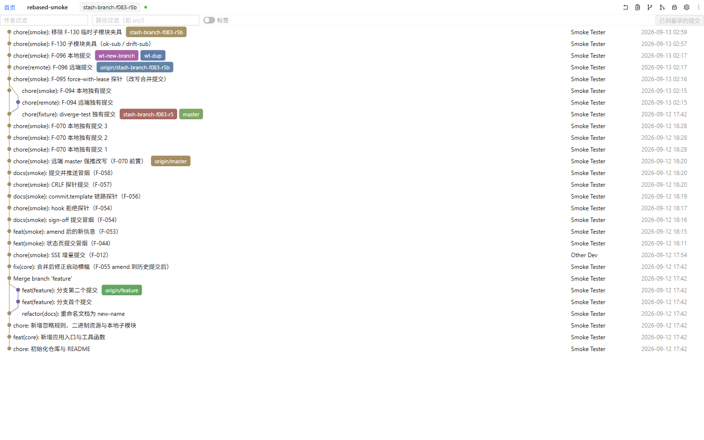

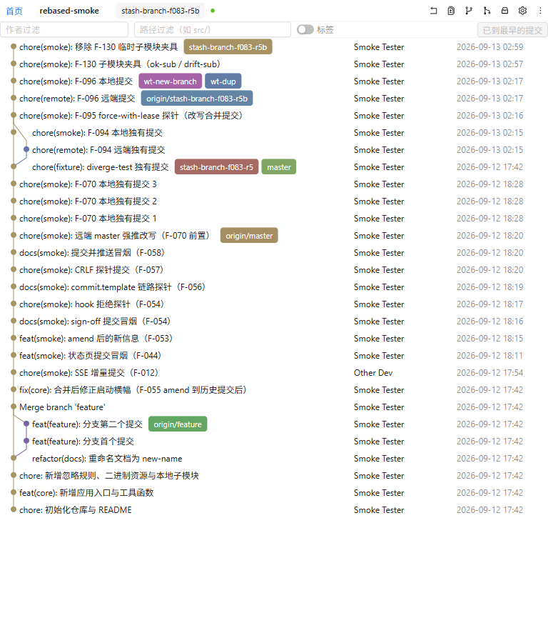

### 3.8 提示与危险操作口径

| 类型 | 什么时候出现 | 说明 |
|------|--------------|------|
| 浮层提示 | 每次写操作之后 | 页面顶部短暂浮现，成功绿/警告黄/失败红；失败显示服务端返回的中文原文，几秒后自动消失 |
| 确认气泡 | 「一步就动仓库或远端状态、误触代价高」的操作 | 就地弹一条带「确定/取消」的气泡，确认才执行 |
| 二次勾选门 | 只有一处：重置对话框选 hard 时 | 必须勾「我了解 hard 将丢弃未提交改动」才能点确定 |

| 走确认气泡的操作（举例） | 走二次勾选的操作 |
|--------------------------|------------------|
| 撤销最近提交、中止进行中操作、放弃文件修改、放弃选中 hunk、删除未跟踪文件、删除分支/标签/贮藏/搁置条目/补丁/远程/账户/工作树、恢复与删除搁置、推送全部标签、提交 PR/MR 评审结论（Approve / Request changes） | 重置模式选 hard（丢弃暂存区与工作区全部改动） |

| 不可恢复的操作 | 后果 |
|----------------|------|
| 放弃修改 / 放弃选中 hunk / 删除未跟踪文件 | 工作区里的改动直接消失 |
| 重置选 hard、更新项目里的「Reset to tracked」 | 未提交的改动永久丢失 |
| 删除未合并分支 | 会被强制删除，其独有提交不可恢复 |
| 「Drop Commit」、「跳过」冲突提交 | 该提交的改动丢弃且不可恢复 |
| 丢弃贮藏/搁置条目、删除补丁文件 | 存档条目从磁盘移除 |
| 「Push up to Commit」、勾选 force-with-lease 推送 | 可能覆盖远端较新的提交，远端历史不可恢复 |
| 工作树的「强制移除」 | 该工作树里未提交的改动一并丢弃 |

### 3.9 右键菜单

**只有日志页有右键菜单**：在提交行上点右键即弹出（其他页面保留浏览器自带的右键菜单）。

| 菜单组 | 条目 | 用途 |
|--------|------|------|
| 定位与取出 | 检出此提交（游离 HEAD） | 把工作区换成该提交的快照，HEAD 进入游离状态，不移动任何分支 |
| 定位与取出 | 从此处新建分支… | 以该提交为起点建分支并检出，弹框填名字 |
| 定位与取出 | 从此处新建标签… | 建轻量标签或填附注建附注标签 |
| 定位与取出 | 在浏览器中打开 | 打开该提交在 GitHub/GitLab 上的网页（需已配置托管远程） |
| 对提交动手 | 摘樱桃 | 把该提交的改动复制到当前分支，生成一笔新提交 |
| 对提交动手 | 还原 | 生成一笔反向提交抵消该提交，历史保留 |
| 对提交动手 | Reset 当前分支到此处 | 把当前分支指针移到该提交（走确认框，需先选重置方式） |
| 对提交动手 | 浏览快照 | 就地展开该提交时刻的完整文件树与文件内容（不改工作区） |
| 改写历史 | Fixup Commit / Squash Commit | 生成 `fixup!`/`squash!` 提交指向该提交，留待交互式变基自动并入 |
| 改写历史 | Push up to Commit | 把远程分支推进到该提交为止（可能需强推，不可恢复） |
| 改写历史 | Reword Commit / Drop Commit | 改写该提交的提交信息 / 从历史中删除该提交 |
| 改写历史 | Squash Commit（并入父提交）/ Fixup Commit（并入父提交） | 把该提交并进它的父提交，历史被重写 |

- **与详情面板的分工**：左键选中提交 → 右侧详情面板给的是最常用几件（「浏览快照」「查看变更集」「摘樱桃」「还原」「Reset 当前分支到此处」）；行右键把同样的能力连同**改写历史**的进阶项一次摊开。Reset、摘樱桃、还原、浏览快照这几项两处都能到。
- **「浏览快照」与「查看变更集」是两个独立开关**：前者开合快照栏里的**文件树那一族**标签，后者开合**变更集（N）与差异**那一族；各按自己的按钮再点一次即收，互不代劳（两者共用一条右栏，故只开一个也有右栏）。
- **不是每项都总在**：菜单按当前仓库能力装配——没有托管远程时「在浏览器中打开」不出现，已推送到受保护分支的提交不允许重写（相关项会被服务端拦下并给出中文提示）。

### 3.10 不提供的功能

全站不提供哪些功能、各自的替代方式，集中列在 §7.1；各页小节只在与该页强相关时提一句。

## 四、页面详解

> 31 个页面逐页说明：用途 / 解决什么问题 / 入口 / 界面构成 / 功能表（含对应冒烟功能点编号）/ 边界与提示。

### 4.1 首页 RepoPage（`/`）

- **用途**：打开本地 Git 仓库、管理最近仓库列表的应用入口页。
- **解决什么问题**：没有它就得开终端、cd 到目录、敲 git 命令才能干活；本页把「输一个路径 → 进入该仓库的提交日志」变成两次点击，并把常去的仓库留在列表里。
- **入口**：启动应用后打开的首页（`/`）／任意仓库页顶栏最左「首页」返回。
- **界面构成**：顶部一行「仓库路径」输入框 + 「打开／克隆／初始化／设置」四个按钮；下方为最近仓库列表（每行：首字母渐变头像 + 仓库名 + `[分支]` 后缀 + 路径 + 行尾移除图标；路径已失效的行整体变暗、名字后多一个警示图标）。
- **配图**：

  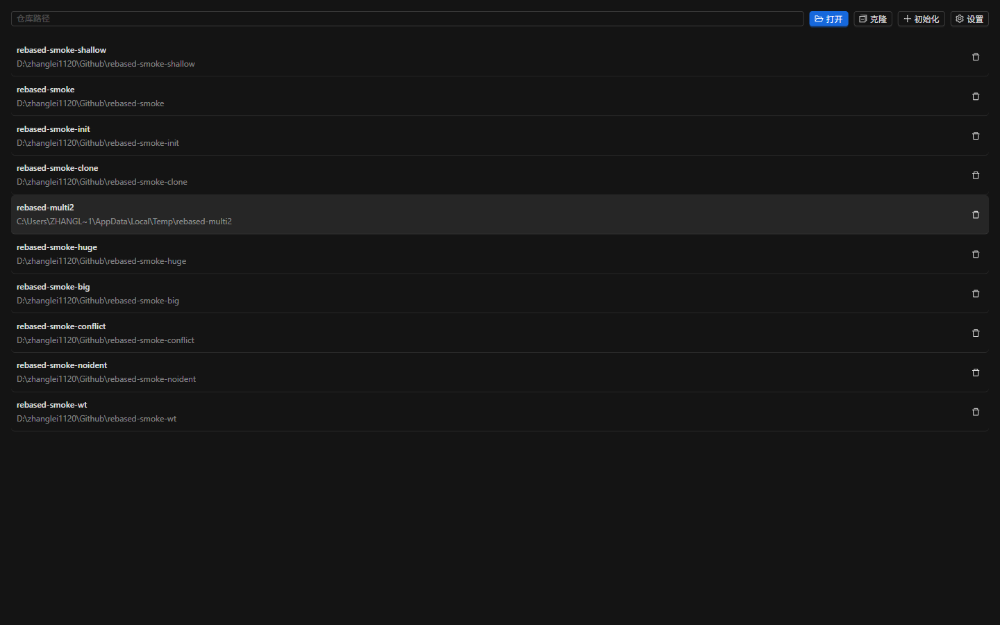

  ![最近仓库列表：首字母渐变头像 + 名称 + `[分支]` 后缀；末尾两行是路径已失效的条目](./shots/repo-page-15.png)

  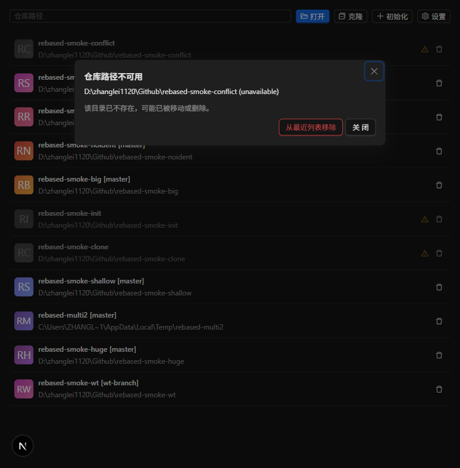

  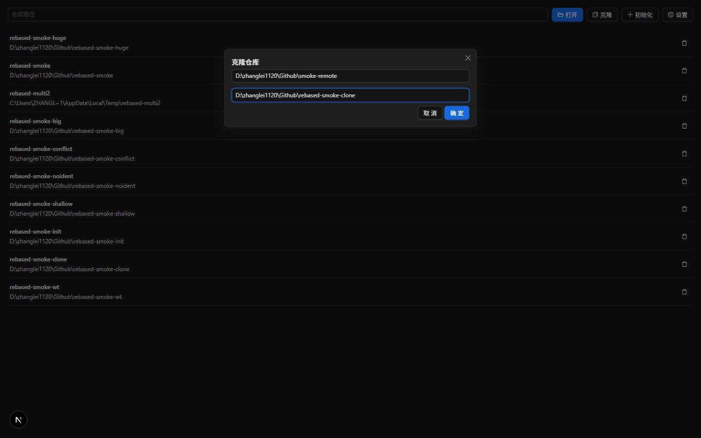

| 功能 | 用途与场景（解决什么） | 如何使用 |
|------|------------------------|----------|
| 打开仓库（F-001） | 把磁盘上任意 Git 仓库接进来：校验、登记、直接进日志页 | 在「仓库路径」输入目录（可带 `~`；填仓库内的子目录也行，会自动向上找到仓库根），回车或点「打开」→ 成功跳该仓库日志页；不是 Git 仓库或路径不存在时，右上角红字「不是 git 仓库：你输入的路径」，停在首页 |
| 最近仓库列表（F-002） | 常去的仓库不必再敲路径；顺序就是最近使用顺序 | 打开成功的仓库自动排到最上面，列表按最近打开时间倒序；同一路径再次打开复用原条目（不产生重复行）；点列表行任意位置即打开该仓库（路径已失效的行除外，见下方「失效条目标记与确认」），行内显示转圈与「打开中…」，期间忽略再次点击 |
| 显示名（F-003） | 一眼认出是哪个仓库，不必去读长路径 | 主文本取仓库根目录名（如 `rebased-smoke`），打开时自动确定，不能手改 |
| 列表项头像与分支后缀（F-003 扩展） | 列表里一眼分清哪个仓库、各自停在哪条分支，省得逐个打开确认 | 每行左侧是首字母渐变头像（色号按仓库路径固定分配，同一仓库的颜色不会变；明亮/暗色主题各取一套色值）；仓库名后面跟该仓库 HEAD 的分支名，形如 `rebased-smoke  [main]`（两个空格分隔）；仓库处于游离头指针状态或读不到 HEAD 时不显示这一段；刚初始化、还没有提交的空仓库同样显示分支名 |
| 失效条目标记与确认（F-002 扩展） | 仓库目录被移走或删掉后一眼看出来，点错也不会撞上打不开的页面 | 路径已不存在的条目整行变暗、仓库名后出现警示图标（悬停气泡写明该行路径 + `(unavailable)` + 一句「该目录已不存在，可能已被移动或删除」）；点这一行**不尝试打开**，只弹「仓库路径不可用」确认框，里面可选「关闭」或「从最近列表移除」（移除只清列表条目，不动磁盘）；目录恢复后刷新首页即变回正常行 |
| 路径副文本 `~/` 相对化（F-004） | 主目录下的路径短一截、更好认 | 路径在当前用户主目录内时副文本显示成 `~/Github/rebased-smoke`；其余原样显示绝对路径（如 `D:\zhanglei1120\Github\rebased-smoke`）；主目录的 8.3 短名写法（`ZHANGL~1`）不会相对化 |
| 列表上限 50（F-005） | 列表不会无限变长，最近用过的始终在最前 | 最多显示最近 50 个；更早的记录自动不再出现，仓库本身与磁盘内容不受影响 |
| 移除仓库（F-006） | 清掉不用或已移动的条目，免得下次点了报错 | 行尾垃圾桶图标 → 确认气泡「移除该仓库？」→「确定」→ 该行消失；只移出列表，不删磁盘上的仓库；该行正在打开时移除按钮禁用；被移除的仓库再次打开会重新登记 |
| 克隆仓库（F-007） | 新项目直接从远端仓库开工，不必先去终端敲 git clone | 点「克隆」→ 填「仓库 URL（https/ssh/本地路径）」与「目标目录（父目录须存在，git clone 语义）」→ 两项都非空才能点「确定」→ 成功则仓库出现在列表并跳日志页；失败按「git clone … 退出码 N：原因」提示 |
| 初始化仓库（F-008） | 从零开始一个新项目，不用先建好目录再开终端 | 点「初始化」→ 填「仓库目录（不存在时创建）」→「确定」→ 目录不存在会创建并初始化，成功后跳日志页（空仓库显示「暂无提交」） |

- **边界与提示**：
  - 不存在的路径与不是 Git 的目录给的是同一句提示「不是 git 仓库：你输入的路径」，提示里的路径原样回显；路径框为空时点「打开」不发请求、不报错。
  - 克隆的目标父目录必须已存在，且一次克隆超过 30 秒会被中止（提示里带 git 的退出信息）。
  - 克隆与初始化对话框关闭后输入会清空，取消再打开不残留上次内容。
  - 列表条目可能已失效（目录被移动或删除）：这类行整体变暗并带警示图标，点它**不尝试打开**，只弹「仓库路径不可用」确认框（关闭 / 从最近列表移除），因此不会撞上打不开的空白页。目录恢复后刷新首页即回到正常行。
  - 顶部「设置」按钮进的是应用设置页（全局项，与仓库无关），不是首页自己的仓库设置。

### 4.2 提交日志页 LogPage（/repos/:repoId）

- **用途**：仓库主页——看提交图与每一笔提交，并从这一页进入其它所有页面。
- **解决什么问题**：不用 `git log --graph --oneline` 再靠肉眼对齐分支线、不用背哈希去 `git show`：分叉与合拢画在图上，点一行就出详情，「拉取 / 推送 / 变基 / 分支 / 标签」等入口都收在本页顶栏。
- **入口**：首页「最近仓库」点仓库名（「打开 / 初始化 / 克隆」成功后也自动进本页）／任意子页的回边（冲突页「完成合并」后自动回等）／溯源页右栏操作条「日志定位」、文件历史页条目、提交搜索页结果点一下（带 `?select=<哈希>` 回来）。
- **界面构成**：自上而下三块——顶栏（左：「首页」链接 + 仓库名 + 分支状态条 + 进行中操作条；右：7 个图标入口）、过滤与分页行（作者 / 路径输入、「标签」开关、「折叠线性分支」「展开线性分支」两个按钮、「分支过滤」入口、右端「加载更多」）、提交图主区（行高 24，只渲染视口内的行）；点中某行后右栏出现 320px 宽的提交详情面板，窄屏改为上下堆叠。
- **配图**：
  
  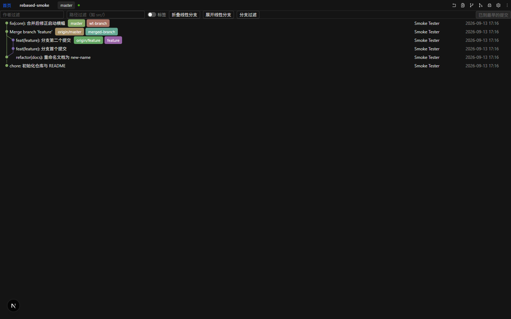
  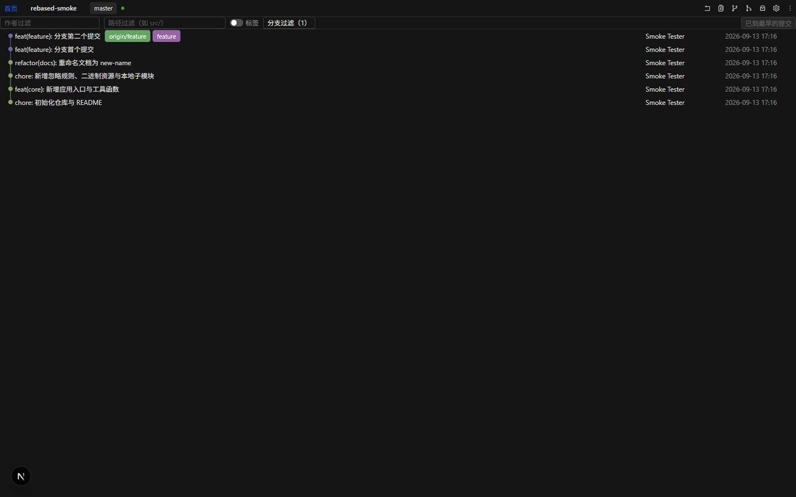
  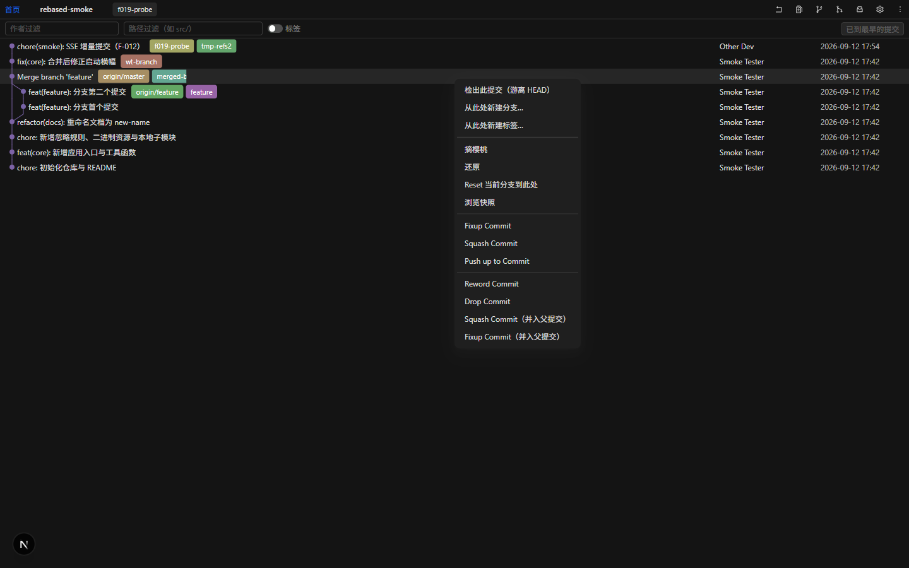

| 功能 | 用途与场景（解决什么） | 如何使用 |
|------|------------------------|----------|
| 提交图真图渲染（lane/边路由）（F-009） | 分支分叉与合并一眼看到，不用盯 `--graph` 的字符画数竖线 | 打开仓库即见；每行左侧画本行线段与圆点，合并处向下岔出两条线再合拢，图列宽度随本行实际画到的车道自动加宽，跨行长线不会被裁断 |
| 分支着色（ref 名 hash → HSB 色板）（F-010） | 同一条分支的图线与行尾 chip 恒为同一个颜色，跨行追分支不靠位置猜 | 无需设置；颜色由分支名算出，`origin/xxx` 等远程分支各自独立配色；标签 chip 固定橙色 |
| 虚拟滚动（固定行高窗口渲染）（F-011） | 上万条提交的仓库也能流畅滚动，不会一次渲染几万行卡住浏览器 | 直接滚动即可；行高恒 24px，只有视口内的行在页面上，滚动中不出现白屏 |
| 首屏快照 + SSE 增量渲染 + hash 去重（F-012）；取消链路并入（F-013） | 在终端或 IDE 里提交、检出后，页面不用刷新就跟着变 | 无需操作：先取一屏快照，再有新提交就实时追加到顶部，重复哈希自动去重；中途离开页面即断开这条推送，不会留下后台进程 |
| 行默认列 Subject + Author + Date（F-014） | 对齐 IDE 的默认三列，主题在左、作者与日期靠右，省掉一列哈希 | 默认即三列；主题过长显示省略号；要看完整哈希用右侧详情面板的复制按钮 |
| refs chips（分支默认开 / tag 默认关）（F-015） | 在行上直接看到这一笔被哪些分支、标签指向，省得 `git branch --contains` | 分支 chip 默认显示（含 `origin/xxx`）；过滤行的「标签」开关默认关，打开后行上追加橙色标签 chip（如 `v1.0`，该开关只影响列表行，详情面板的标签 chip 恒显示）；空间不够时 chip 自身省略号，悬停显全名 |
| 行点击 → 提交详情面板（F-016） | 点一行看这一笔的全貌，不用 `git show` | 点任意行 → 右栏展开：短哈希 + 复制按钮、「作者 on 日期 at 时间」、加粗的主题、蓝色分支 chips 与橙色标签 chips、父提交短哈希（合并提交有多个）；再点别行即切换；不选中时右栏不占位 |
| 选中写回地址栏（刷新不丢）（F-016 扩展） | 挑中某一笔后刷新、把链接发给自己、或用后退键回来，选中还在原处，不用在图里重新找 | 无需操作：点任意行即把该提交哈希写进地址栏 `?select=`（替换当前历史，不是新增一步——连点几十行也不会把浏览器历史塞满，后退键仍是离开本页）；刷新或重新打开该链接，该行仍是选中底色、右栏详情面板直接展开 |
| 详情面板操作按钮（F-017） | 最常用的提交操作就在详情旁边，不用回右键菜单 | 五个按钮：「浏览快照」就地展开该版本的文件树与内容（是开关，再点一次收起，只管文件树那一族）；「查看变更集」展开右栏里的「变更集（N）」标签（同样是开关，再点一次收起，只管变更集那一族）；「摘樱桃」确认后把改动移植到当前分支；「还原」生成一笔反向提交；「Reset 当前分支到此处」打开「重置到」对话框 |
| 查看变更集（LogPage → 快照栏标签） | 一次提交动了哪些文件、每个文件改了什么，全在日志页原地看完，不用 `git show --stat` 再 `git diff`，也不被弹窗盖住页面 | 详情面板「查看变更集」→ 右栏（未展开则这次点击即展开）里出现「变更集（N）」标签并切过去：逐行列状态徽标 + 文件名（重命名显示「旧 → 新」）→ 点某个文件，**在同一标签栏**开它的差异标签（以该提交与其父提交为两端，行内呈现为默认、可切并排；路径栏右端「上一个 / 下一个」在这批文件里前后翻）；根提交与重命名文件按差异页同口径只给提示行。变更集看的是当前选中提交：换选中提交时它保留并自动换成新提交的变更集，已开的差异标签只在路径仍属于新变更集时保留 |
| 顶栏状态条（分支名 + 徽标）（F-018） | 一眼看出现在在哪个分支、与上游差几笔 | 顶栏仓库名右侧是分支 chip；本地领先显示绿点（outgoing），远端领先显示蓝点（incoming），可同时出现；悬停给出「N incoming and M outgoing commits」；游离头指针状态 chip 显示 `(detached)`（仓库连 HEAD 都还没有时显示 `(detached HEAD)`） |
| 状态变更自动刷新（事件驱动）（F-019） | 在终端检出分支、新建提交后，顶栏与列表自己跟上，不用手按刷新 | 无需操作；分支名 chip 与徽标自动更新（新分支没有上游时徽标随之消失），行上的 refs chips 同步变化 |
| refs.changed 订阅（F-020） | 在别处新建 / 删除 / 移动分支或标签后，行上的 chips 自动跟上 | 无需操作；在终端建分支或删分支后等几秒，chips 自动出现或消失（实测 6~7 秒内），全程不刷新页面 |
| `?select=<hash>` 深链（F-021） | 从其它页面精确落到某一笔提交，不用自己在图里找 | 地址栏加 `?select=<完整哈希>` 打开：该行带选中底色，右侧详情面板同时展开；溯源页右栏操作条「日志定位」、文件历史页条目、提交搜索页结果、对比视图行点击都走这条深链（溯源页「逐行注解」里点行只在本页内换选中，不跳日志页）；目标提交不在首批 50 条内时会自动接着翻页（最多约 6 页 / 1750 条）直到把它找出来 |
| 顶栏入口（F-022） | 仓库主页就是枢纽：最常用的页面一键直达 | 顶栏右侧图标按钮（悬停即显示名称）：「变更」→ 变更状态页、「分支」、「合并」、「贮藏」、「设置」（该仓库的 git 配置与签名）；另外还有「撤销最近提交」（确认后回退一次提交，改动保留在暂存区）与「更多」 |
| 「更多」菜单 18 项（F-023） | 不常用的页面与远程操作都收进一个下拉，顶栏不再堆按钮 | 点顶栏最右的「更多」（⋮ 图标）→ 依次为 溯源、历史、已提交、搜索、变基、标签、拉取、推送、更新项目、远程管理、补丁、搁置、控制台、忽略、工作树、子模块；配置了 GitHub / GitLab 远程时另有「GitHub 面板」「GitLab 面板」两项（无托管远程时共 16 项） |
| OperationStatus 操作条（kind + 中止）（F-024） | 合并 / 变基 / 摘樱桃 / 还原卡在冲突时，页头明确告诉你「有操作没做完」，并给一键中止 | 操作进行中顶栏出现彩色标签（「合并中」「变基中（第 1/2 步）」「拣选中」「还原中」）+ 红「中止」；点「中止」→ 确认框「确定中止当前操作？工作区将回到操作前状态」→ 工作区回到操作前；合并中另有「去解决冲突」链接回冲突页 |
| 远程操作认证重试回路（F-025） | 推送 / 拉取因凭据缺失或过期失败时，就地补凭据并自动重试，不用把对话框重填一遍 | 远程操作返回需要认证 → 弹出「需要认证」（主机只读预填）→ 填账户名与访问令牌 → 「保存并重试」：凭据存到本机，并自动重放刚才那次操作；取消即放弃该次操作 |
| 按需加载更早提交（页大小 ≤500 + skip 游标）（F-026） | 大仓库不必一次拉全部历史，滚下去就自动接着加载，直到仓库第一条 | 首屏 50 条；滚到列表底部附近（或已加载内容填不满窗口）自动追加下一页，页大小按 50 → 100 → 200 → 400 → 500 阶梯放大；也可点过滤行右端的「加载更多」手动兜底；到仓库第一条后按钮变「已到最早的提交」并置灰 |
| 过滤（author / path）（F-027） | 只看某个作者或某条路径的提交，省掉 `git log --author` 与 `git log -- <路径>` | 过滤行填「作者过滤」（姓名或邮箱片段）或「路径过滤（如 src/）」→ 按回车、或点页面别处（失焦）才生效，首尾空格自动去掉；点输入框的清除按钮并失焦即恢复全量 |
| 线性折叠 / 展开线性分支 | 一条没有分叉的长链折成一行，大仓库里少滚很多屏，又不用改查询条件 | 过滤行「折叠线性分支」把图里所有可折叠的线性链收起（链中间的提交暂时不显示，两端之间画一条虚线）；点那条虚线即展开该链，或点「展开线性分支」一次全展开（没有折叠时它是灰的）。也可以直接在图上操作：点提交行的圆点、或点两行之间的实线边折叠该链（链短于 3 行折不动，点了没反应）；鼠标悬停圆点会高亮它所在的那条链。点图元不会改变当前选中的提交——选提交仍然只认行正文。折叠只是显示状态：被折叠的提交仍在仓库里，刷新页面即回到未折叠；折叠只对**已加载**的提交生效（还没加载进来的历史本来就不在图里） |
| 分支过滤 | 只想看某条分支的历史线，不被别的分支的提交干扰 | 点过滤行「分支过滤」→ 弹窗里本地分支与远程分支分两组，点分支名即选中（行首出现 ✔，按钮上显示已选条数）；底下还有「全选」（一次选中全部可选项）与「清空」（恢复全量视图）→ 图里只留下所选分支可达的提交。选中后「折叠线性分支 / 展开线性分支」两个按钮**整组消失**（不是置灰）——过滤状态下不能折叠，原有折叠也会被清空，清空过滤后按钮回来。被过滤掉的提交只是不显示，仓库内容不受影响；若还有更早的提交没加载进来，过滤行会提示「部分分支的提交尚未加载，将继续加载」 |
| 行右键菜单形态：检出与新建（F-028） | 从历史上的某一点开分支、打标签，或临时看那一版 | 在提交行上右键，第一组：「检出此提交（游离 HEAD）」（确认后进入游离状态，不移动任何分支）、「从此处新建分支…」（弹窗填名字，确定即创建并检出）、「从此处新建标签…」（标签名必填，附注留空则为轻量标签）、「在浏览器中打开」（仅配置了 GitHub / GitLab 远程时出现） |
| 行右键菜单形态：摘樱桃 / 还原 / Reset / 浏览快照（F-028） | 这些操作在光标处就能完成，不必先点中那一行 | 右键第二组：「摘樱桃」「还原」各生成一笔新提交（出现冲突则跳冲突页）、「Reset 当前分支到此处」同面板按钮、「浏览快照」就地展开该版本文件树与内容 |
| 行右键菜单形态：历史改写（F-028） | 把手头的草稿改动并进历史某一笔，或直接改写、删除历史提交 | 先在变更状态页把改动暂存 → 右键「Fixup Commit」或「Squash Commit」生成 `fixup!`/`squash!` 提交折入该提交；「Push up to Commit」把远程分支推进到该提交（需 force，不可恢复）；「Reword Commit」（弹窗预填原主题，确定按钮在留空时禁用）、「Drop Commit」、「Squash Commit（并入父提交）」、「Fixup Commit（并入父提交）」直接改写历史，确认框会写明后果 |
| 空态与首屏加载 | 分清「正在加载」「这个仓库还没有提交」「过滤没命中」三种空白，不误判成仓库坏了 | 首屏拉取中显示骨架屏，「加载更多」同时转圈；确实为空或过滤无命中时显示空态：「暂无提交」+ 副文案「该仓库还没有任何提交，或当前过滤条件没有匹配结果」（刚初始化的空仓库即此态） |
| 分支对比视图（`?compare=<分支>`） | 看两条分支各自多了哪些提交，不用把 `A..B` 与 `B..A` 各敲一遍 | 分支页某分支行点「比较」→ 打开「与分支 xxx 比较」视图：左卡片「分支独有（N）」、右卡片「当前独有（N）」，行内为短哈希 + 主题 + 作者 + 日期；点某行跳回日志页并选中该提交；「退出对比」返回日志页（当前分支自己那一行的「比较」是禁用的） |

- **边界与提示**：
  - `?select=` 要用**完整 40 位哈希**。目标提交不在首批 50 条内时，日志页会自己接着翻页（最多约 6 页 / 1750 条）把它找出来并展开详情；哈希写成不存在的值、或提交在 1750 条之外，则翻到上限就停，页面照常显示列表，只是没有选中行与详情面板（不会把整个历史翻到底）。
  - 恢复出来的选中行**不会自动滚到眼前**：选中态与详情面板是对的，但列表仍停在顶部，要用右侧详情面板确认选中的是哪一笔（滚下去能看到那一行的选中底色）。
  - 详情面板里的父提交短哈希是可点链接：点击即在提交图中选中那个父提交（父提交已在当前加载的提交里时立刻切换；不在则自动翻页去找，见上一条）。合并提交有多个父提交，逐个可点。
  - Reset 对话框默认 mixed（保留工作区、重置暂存区）；选 hard 后必须勾选「我了解 hard 将丢弃未提交改动」才能点「确定」。
  - 大仓库翻页加载到一半直接换页或回首页是安全的：已发出的加载会被断开，不会留下卡死的后台进程，也不会把半截结果写进仓库。
  - 一旦填了过滤条件或加载了更多页，列表切到快照模式：新提交不再实时出现在顶部，清空过滤（回到默认视图）后恢复。
  - **折叠**只对已加载的提交生效，且只折「没有分叉的直链」：一条链短于 3 行（没有中间提交可隐藏）时折不动，点了没反应；分支过滤激活期间不能折叠（两个按钮整组消失、原有折叠被清空），清空过滤后恢复；折叠不改选中（点图元不改变选中的提交），刷新页面即回到未折叠。
  - **分支过滤**是「隐藏」而不是「换查询」：未被选中分支可达的提交只是不显示，仓库内容不受影响；若所选分支的提交还没加载进来，先按过滤行的提示继续加载（滚到底会自动接着翻页），期间该分支可能暂时看不到内容。

### 4.3 差异页 DiffPage（`/repos/:id/diff`）

- **用途**：逐行查看一个文件在两个版本之间的差异。
- **解决什么问题**：没有它时要在终端敲 `git diff`、自己记着「跟哪一侧比」、在长文件里用肉眼找改动；本页把「跟哪一侧比」做成开关，增删行直接高亮，还给出只展开改动附近的视图。
- **入口**：状态页双击文件名（已暂存组的行自动进入暂存对比）／状态页行「三版本」／日志页快照栏「变更集」标签里的文件行／已提交页的变更文件／历史页的行双击／溯源页右栏操作条「差异页」／分支页行菜单「与工作树差异」弹窗里的文件行。除日志页那个入口（在快照栏里就地开差异标签）外，其余入口一律在**新标签页**打开（不顶掉来源页，可同时开多个文件并排对照）；进了差异页后页内「‹ 上一个 / 下一个 ›」切同组文件仍在本标签页内换。
- **界面构成**：顶行是文件路径（同组多文件时带「‹ 上一个 1/3 下一个 ›」），第二行是呈现工具条（并排/行内、工作区/已暂存、忽略空白、自动换行、空白字符、上下文行数），下方整屏是左右两栏只读编辑器；三版本模式换成上下两段对比。
- **配图**：

  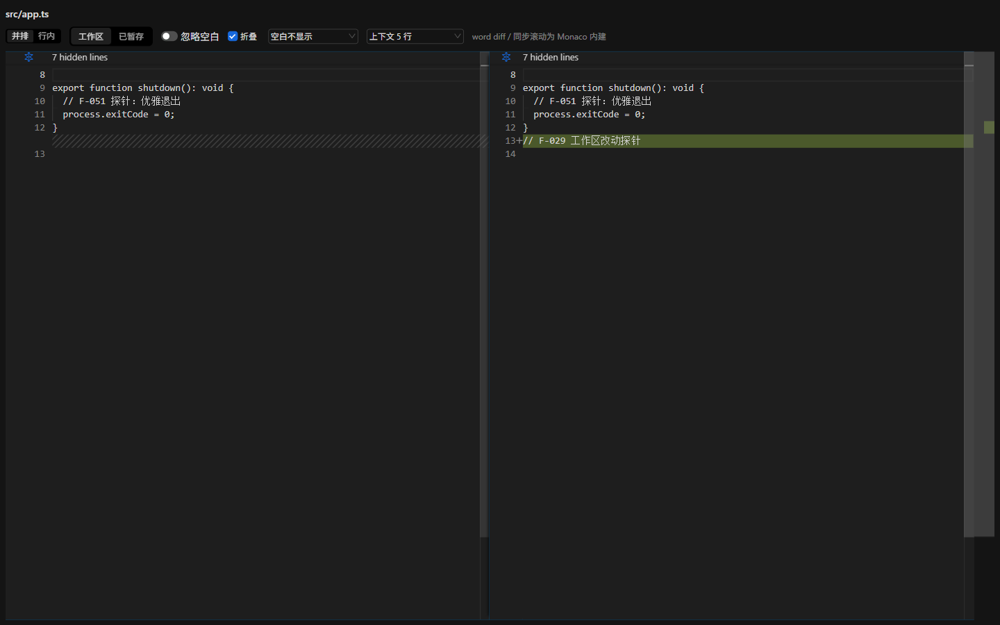

  

  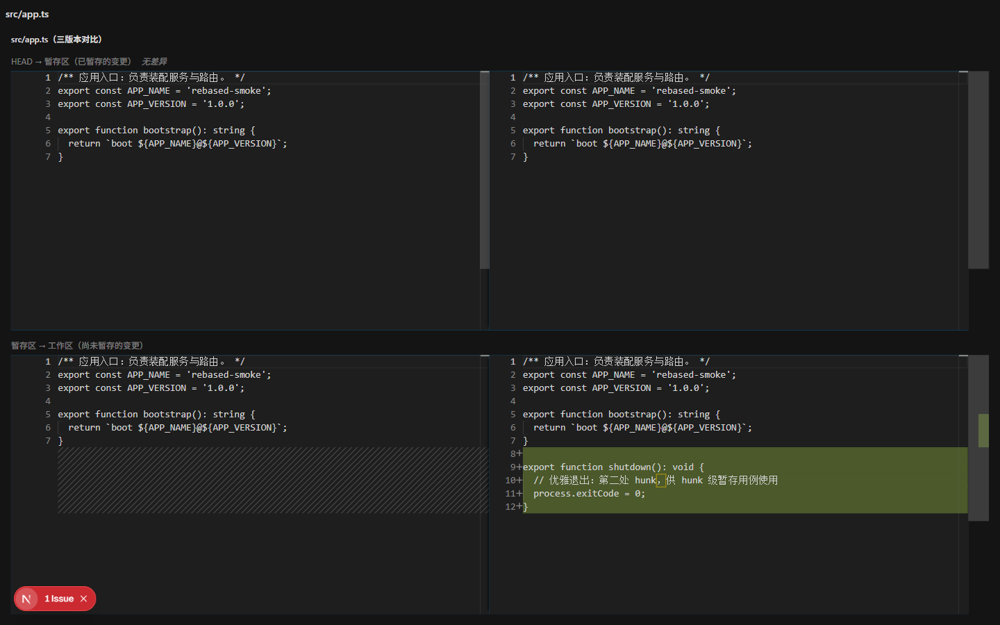

| 功能 | 用途与场景（解决什么） | 如何使用 |
|------|------------------------|----------|
| Monaco DiffEditor 只读渲染（F-029） | 两侧逐行对照，行号与语法高亮齐全；不用开编辑器就能核对改动 | 从状态页或已提交页双击文件打开本页；两栏都不可编辑，要改内容回编辑器改文件 |
| 并排 / 行内切换（F-030） | 宽屏并排看上下文；改动集中或窗口窄时行内更省横向空间 | 工具条最左「并排 / 行内」分段：默认「并排」（左右两栏）；切「行内」改成单栏里成对显示增删行 |
| 忽略空白（F-030） | 缩进或行尾空格被重排时，噪声淹没真实改动 | 「忽略空白」开关默认关；打开后缩进与行尾空白的改动不计入差异（同一文件实测由 6 增 1 删变为 5 增 0 删） |
| 自动换行 | 长行代码在窄栏（尤其快照栏）里要左右拖着看 | 「自动换行」开关默认关；打开后过长的行按词边界折到栏宽内显示，不必横向滚动 |
| staged / 工作区切换（F-031） | 分清「已加入暂存区的内容」和「还没暂存的工作区改动」 | 「工作区 / 已暂存」分段：默认「工作区」= HEAD 对工作区；切「已暂存」= HEAD 对暂存区；从状态页已暂存组的行双击进来时默认已是「已暂存」 |
| 未变更区折叠（上下文行数）（F-036） | 长文件里只看改动附近，不用滚上千行 | 「上下文」下拉是这件事的唯一控件：选数值 = 把两侧都没变的段落收缩成一段、只展开改动区前后各 N 行（默认 5 行）；选「全部显示」= 不折叠、整文件展开。**没有单独的「折叠」勾选框**——那是 Monaco 的**代码折叠**（行号槽里收起函数/括号块），与这里的「未变更区折叠」不是一回事，且本仓没有折叠区提供者（语言服务被关，实测画面无任何折叠槽），故已删除；「空白字符」下拉默认「空白不显示」，切「空白显示」把空格与制表符标成可见符号 |
| word diff / 同步滚动（F-036） | 一行里只改了几个字也看得出来；两栏滚动不会看串行 | 引擎内建：行内词级高亮 + 左右联动滚动，工具条右侧标有「word diff / 同步滚动为 Monaco 内建」，无需开关 |
| 任意两版本对比（F-032） | 想知道某个历史提交对它的父提交到底改了什么 | 已提交页点某个变更文件（或日志页快照栏「变更集」标签里的文件行，就地开差异标签）进入；此模式比的是两笔固定提交，故「工作区 / 已暂存」分段不出现 |
| 新增/删除/重命名文件渲染（F-033） | 文件只有一侧存在时不报错，也不会把重命名误读成全新增 | 新增文件左栏为空、删除文件右栏为空；重命名文件不做伪对比，只显示提示行「该变更涉及重命名：旧路径 → 新路径（改名前的历史请到「历史」页查看）」 |
| 根提交提示 | 仓库第一笔提交没有父版本可比 | 打开根提交的文件时，差异页提示「该提交为根提交（无父版本），无法按父级对比变更；文件内容即该提交引入的初始内容」；溯源页右栏「差异页」出口（`root=1`）落到这一页，而溯源页自己的「本文件改动」与日志页变更集的差异标签给的是同类提示行（末尾分别指向「逐行注解」与「文件（N）」标签） |
| 大 diff 分块流渲染（F-035） | 大文件全文来得慢，先看已经到达的部分 | 全文未就绪时先渲染分块文本（只读、按 diff 语法着色），状态行显示「分块加载中…（渲染截至当前进度）」；全文到达自动换成标准两侧视图；断流显示「分块加载中断」、失败显示「分块加载失败」并附具体报错 |
| 三版本对比（F-037） | 一次看清「已经暂存了什么」与「还没暂存什么」 | 状态页行「三版本」→ 页面标题为「文件（三版本对比）」，上下两段分别是「HEAD → 暂存区（已暂存的变更）」与「暂存区 → 工作区（尚未暂存的变更）」；某段两侧内容相同会标「无差异」 |
| 多文件上一个 / 下一个 | 一次提交或一次对比常涉及多个文件，来回退回列表太麻烦 | 从变更集、「与工作树差异」等入口进来时页头出现「‹ 上一个」「1/3」「下一个 ›」：切到同组相邻文件，并保留当前对比设置；新文件的全文到达前先留在上一个文件的对照上（工具条、路径头与两侧全文一起留着，本地 git 通常几百毫秒），到达后整块切过去、不闪回分块视图，这段取数期间再点同一个方向不会连跳；到组首/组尾按钮禁用，只有 1 个文件时不显示。日志页快照栏的差异标签同样有这组按钮——切文件 = 在同一标签栏开/切那个文件的差异标签 |
| unified diff 文本视图（F-034） | 需要原样的补丁文本（贴给评审、存档） | 本页给的是两侧全文；同一文件的原样补丁在状态页行内补丁预览里看（含 @@ 头、上下文行与 +/- 行） |
| 与分支比较（F-038） | 想知道两条分支各自独有的提交 | 分支页行「比较」→ 跳到日志页对比视图，分「分支独有」与「当前独有」两区；当前分支自己的「比较」按钮禁用；文件级的 hunk 应用/回退在状态页补丁预览里做 |

- **边界与提示**：
  - 本页只读、也没有返回按钮：改内容回编辑器改文件；回上一页用浏览器后退。
  - 「已暂存」与两版本对比互斥：from 与 to 成对时该分段不出现；只给单侧引用（分支页「与工作树差异」）时分段仍在，点「已暂存」会被服务端拒绝、整页只剩错误提示，这种对比保持「工作区」即可。
  - 二进制文件没有专门提示：两侧按文本解码显示（可能是乱码），补丁预览里只有 git 的一行「Binary files … differ」。
  - 重命名与根提交只给提示行、不做伪对比：重命名两侧文件名不同，硬比会显示成全新增。
  - 分块加载阶段没有工具条与路径头：并排/行内、忽略空白等开关要等全文到达后才有；**翻文件时**不走分块视图（保留上一个文件的完整对照），故这一条只适用于首次进入。

### 4.4 变更状态页 StatusPage（`/repos/:id/status`）

- **用途**：工作区与暂存区的改动总览，逐文件暂存、看补丁、写提交。
- **解决什么问题**：没有它时要在终端记 `git status`、`add`、`restore`、`clean` 的用法，放弃改动与删除未跟踪文件还容易误伤；本页把「已暂存／工作区／未跟踪」分开呈现，危险操作一律先确认。
- **入口**：顶栏「变更」图标按钮（任何仓库页同一入口，本页时该按钮高亮）／顶栏「日志」回日志页。
- **界面构成**：页头一行工具（「管理列表」「搁置」「存入贮藏」），左列三张分组卡片（已暂存／工作区／未跟踪），右列「补丁预览」，最下方「提交」卡片。
- **配图**：

  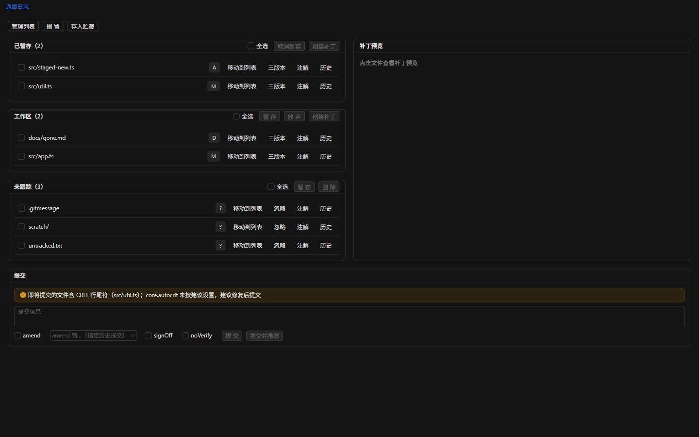

  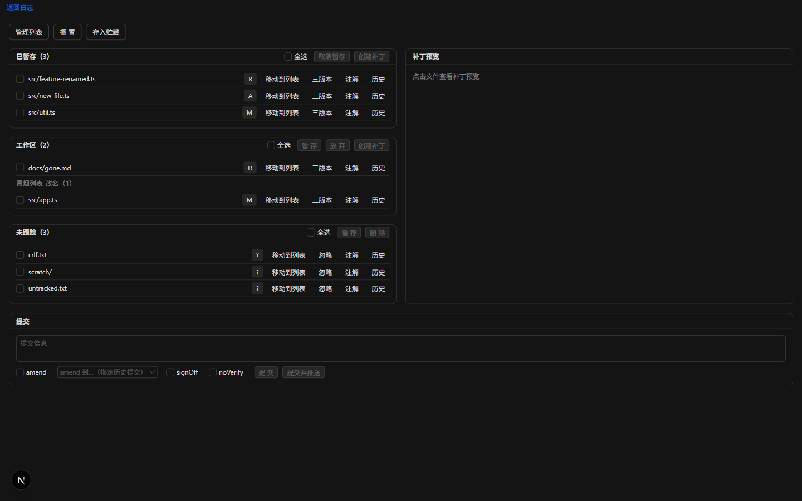

  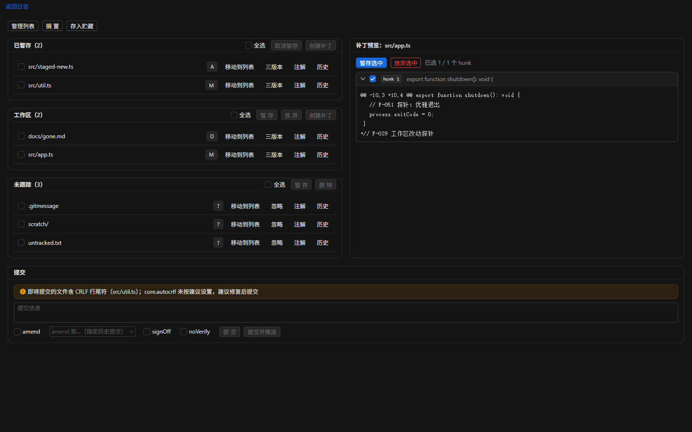

| 功能 | 用途与场景（解决什么） | 如何使用 |
|------|------------------------|----------|
| 变更分组列表（F-039） | 一眼分清「已加入暂存区」「改了还没暂存」「git 还没跟踪」 | 打开页面即按 git 状态分三组，组标题带数量（如「工作区（2）」）；被 .gitignore 命中的文件不展示；空组显示「无变更」 |
| 变更列表子分组与管理（F-040） | 把改动按功能分组，提交时不容易混在一起 | 「管理列表」→「新建列表」填名（非空才能确定）；行内「移动到列表」把文件指派到别的列表；非默认列表以「列表名（数量）」子标题分组，默认列表条目平铺；菜单里可「重命名」「设为默认」「删除」，默认列表的后两项禁用，删除列表后其文件回默认列表 |
| 暂存/取消暂存/放弃修改（F-041） | 挑选要提交的内容；试验代码不要了要能干净回退 | 每行左侧勾选框，组头「全选」勾整组（未勾选时组级按钮为灰）：工作区或未跟踪组勾选后点「暂存」把改动放进暂存区；已暂存组勾选后点「取消暂存」把改动退回工作区（内容不丢）；工作区组勾选后点「放弃」→ 确认框「放弃选中修改？不可恢复」→ 文件回到上次提交的样子；未跟踪组勾选后点「删除」→ 确认框「删除选中未跟踪文件？不可恢复」 |
| hunk 级暂存（F-042） | 一个文件里只想提交一部分改动（例如只提交修 bug 的那几行） | 在补丁预览里勾选要处理的 hunk（标签为「hunk 1」「hunk 2」…）：工作区预览下点「暂存选中」只把选中 hunk 加进暂存区，或点「放弃选中」（确认「放弃选中 hunk 的修改？不可恢复」）丢掉它的工作区改动；已暂存预览下点「取消暂存选中」把选中 hunk 退回工作区；按钮旁显示「已选 1 / 2 个 hunk」 |
| 行内补丁预览（F-043） | 不跳页就能看 unified 补丁文本，确认暂存的到底是哪几行 | 单击文件行 → 右列「补丁预览：<路径>」按 hunk 折叠显示 @@ 头与 +/- 行（展开后正文区域可滚动）；暂存或提交后自动重取；未选文件时提示「点击文件查看补丁预览」 |
| 提交框（F-044） | 把暂存区内容落成一个提交 | 底部「提交」卡片填写提交信息（必填，为空时按钮灰）→ 点「提交」→ 成功后整页重挂载：提交信息、行勾选、amend/signOff/noVerify 全部复位、已暂存组清零（普通提交不弹成功提示，表单清空即成功）；提交范围恒为暂存区，amend/signOff/noVerify 等选项见 4.5 |
| 跳 DiffPage（F-045） | 提交前想逐行核对某个文件 | 双击该行文件名在**新标签页**打开差异页（已暂存组的行进入后默认「已暂存」对比；本页留在变更列表上）；行内没有单独的「差异」按钮，单击只是选中看右侧补丁预览 |
| 未跟踪行「忽略」一键入口（F-046） | 临时文件、日志不想再出现在未跟踪列表里 | 未跟踪行点「忽略」→ 确认框「忽略文件?」（内容为「将给 .gitignore 追加 /路径 行」）→ 确定后该行消失，.gitignore 自身变成一条待提交改动；重复忽略同一路径不会写重复行 |
| 三版本对比（F-047） | 想同时看「已暂存」与「未暂存」两段差异 | 已暂存组或工作区组的行点「三版本」→ **新标签页**打开差异页两段对比（未跟踪行没有这个按钮，它没有三个版本可比） |
| Create Patch from changes（F-048） | 把改动导出成 .patch 交给同事或留档 | 在组内勾选至少 1 个文件 → 组级「创建补丁」→ 弹窗填「补丁名（必填）」，弹窗会写明「对勾选的 N 个文件创建补丁（工作区 diff / 暂存区 diff）」→ 跳到补丁页；已暂存组导出暂存区 diff，工作区组导出工作区 diff |
| Shelve Changes（F-049） | 手头改动要先让路，又不想提交也不想丢弃 | 页头「搁置」→ 填「搁置名（必填）」→ 整份工作区+暂存改动被保存成搁置并跳到搁置页；搁置是快照复制，保存后工作区改动原样不动 |
| Stash Files（F-050） | 用 git 原生的 stash 暂时收起全部改动 | 页头「存入贮藏」→ 填「贮藏信息（可空，留空由 git 按当前分支生成）」→ 跳到贮藏页；已跟踪的改动被收起，未跟踪文件不受影响 |
| Annotate / Show History（F-051） | 想知道某一行是谁改的、这个文件改过几次 | 行「注解」→ 该文件的溯源页（带上文件路径，进页默认停在「本文件改动」，要看逐行归属点右栏「逐行注解」）；行「历史」→ 该文件的提交历史页 |

- **边界与提示**：
  - 分组按 git 的两列状态码：同一个文件可能同时出现在「已暂存」和「工作区」（改了、暂存、又改一次），这是正常现象。
  - 「放弃」「删除」「放弃选中 hunk」都不可恢复，也不进 git 历史；未跟踪文件的「删除」是直接从磁盘删掉。
  - 变更列表只是本应用的簿记，不影响提交内容；已提交或已还原的路径会自动从列表里剔除；默认列表不能删除也不能再设为默认，删除其它列表后其文件回默认列表。
  - 未跟踪文件没有工作区 diff：选中它时补丁预览是空的，先「暂存」才有行级内容与 hunk 操作。
  - 在终端里改工作区也会同步：外部改动经事件推送回写，列表自动更新，不会停在旧状态。

### 4.5 提交框 CommitDialog（等效形态；状态页底部）

- **用途**：状态页底部的内嵌提交框，承担提交动作与提交前的各项检查。
- **解决什么问题**：不必记 `git commit` 的 `--amend`、`--signoff`、`--no-verify` 等参数，也不必回忆「上次提交的哈希」；身份没配、行尾符有问题这两类坑会在提交前被拦下并给出改法。
- **入口**：日志页顶栏「变更」→ 状态页底部「提交」卡片。
- **界面构成**：一张卡片，自上而下是 CRLF 内联警告（涉事时才出现）、提交信息输入框、一行选项（amend 复选框、「amend 到…」下拉、signOff、noVerify）与两个按钮「提交」「提交并推送」。
- **配图**：

  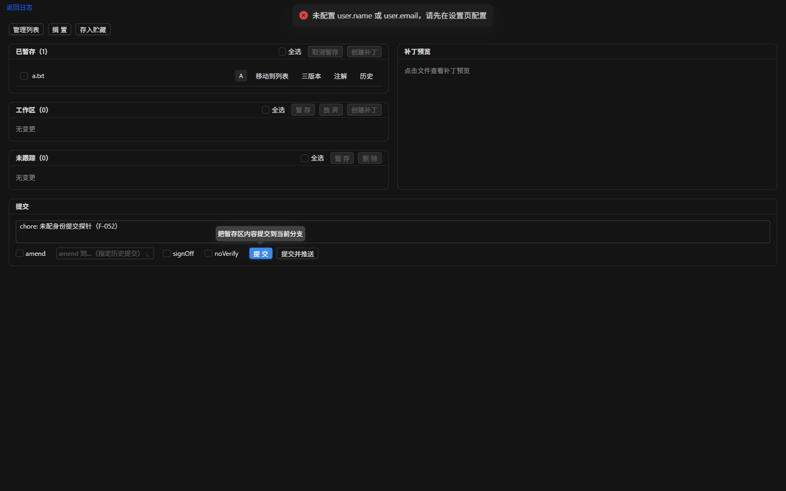

  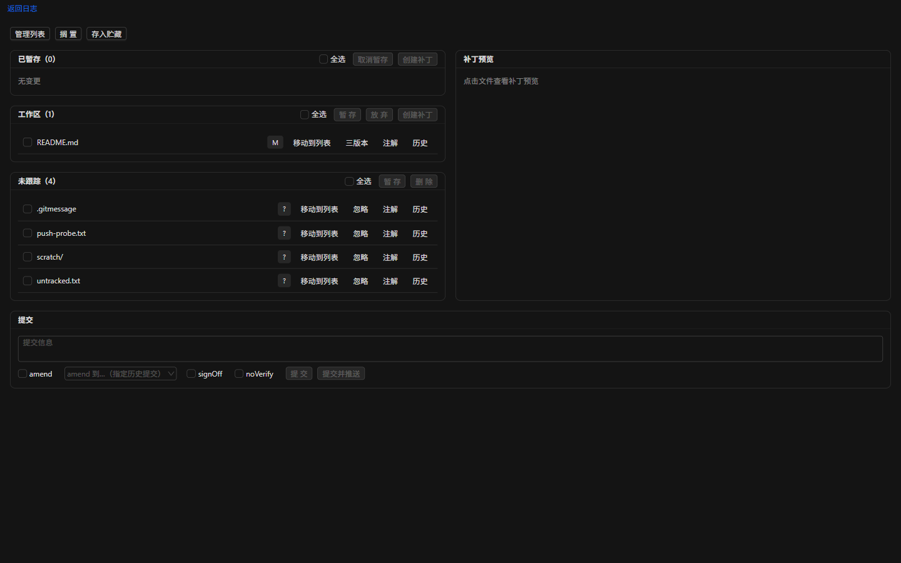

  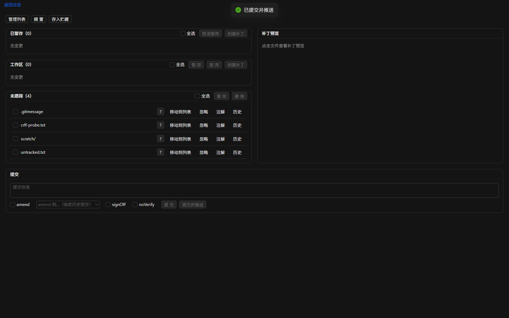

| 功能 | 用途与场景（解决什么） | 如何使用 |
|------|------------------------|----------|
| 提交（信息必填/身份预检）（F-052） | 把暂存区内容落成一个提交，并在提交前确认作者身份可靠 | 在「提交信息」框输入（占位「提交信息」）→ 点「提交」；信息为空时按钮灰、悬停提示「提交信息为空：填写提交信息后即可提交」；仓库未配置 user.name/user.email 时提交被拒绝并弹红字「未配置 user.name 或 user.email，请先在设置页配置」，仓库不会多出提交 |
| amend（改上次提交）（F-053） | 上次提交漏了文件或提交信息写错了 | 勾「amend」→ 必须重新填写提交信息（占位变成「修改上一次提交的提交信息」，不会沿用原信息）→ 点「提交」：不产生新提交，暂存的改动并入上一次提交 |
| sign-off / 跳过 hooks（F-054） | 项目要求 DCO 原创声明；或本地钩子挡住了本该提交的改动 | 勾「signOff」→ 提交信息末尾自动追加 Signed-off-by 行；勾「noVerify」→ 本次提交跳过 pre-commit / commit-msg 等钩子；不勾时被钩子拒绝会提示「提交被 Git hook 拒绝（pre-commit/commit-msg 等）…」且不留新提交 |
| amend 历史提交 / reword（F-055） | 想把改动并进更早的某笔提交并改写它的信息 | 「amend 到…（指定历史提交）」下拉选目标（候选为未推送到任何远程的非合并提交、不含 HEAD、遇到合并提交即止、最多 20 条，显示为「Amend <提交标题>」）→ 填新的提交信息 → 点「提交」：目标提交的信息被重写、其后各笔提交逐笔重放（哈希全变）；选中目标后「amend」复选框锁定、「提交并推送」禁用，点下拉的清除按钮可改回普通提交 |
| GPG 签名 / commit template（F-056） | 团队要求签名提交或统一提交信息模版 | 在设置页读写 commit.gpgsign、user.signingkey、commit.template 等键；置位后提交链路自动生效（本机没有可用 gpg 时签名提交会失败并原样报错，到设置页关掉 commit.gpgsign 即可正常提交） |
| CRLF 提示（F-057） | Windows 上 CRLF 混入库，日后整个文件都显示成改动 | 在 Windows 上暂存了含 CRLF 的文件、且 core.autocrlf 未按建议设置时：提交卡片先出现黄色内联警告并列出涉事文件名，点「提交」弹「检测到 CRLF 行尾符」三选：「修复并提交」（写入建议值 core.autocrlf 后提交）／「原样提交」（CRLF 原样入库）／「取消」（本次不提交） |
| commit & push（F-058） | 提交完顺手推上远端，省一次「推送」操作 | 填信息 → 点「提交并推送」：提交先落盘，再推当前分支的上游；回执三态为「已提交并推送」／「已提交（远端已是最新）」／「远端有更新的提交，请先拉取/变基」（被拒时提交已成功、只有推送没发生） |

- **边界与提示**：
  - 提交范围恒为暂存区：工作区与未跟踪的改动不会被提交，先到上方分组里「暂存」。
  - 勾「amend」或选中「amend 到…」目标时提交信息同样必填，留空点不动按钮；两种 amend 模式互斥。
  - 「提交并推送」要求当前分支已有上游：没有上游时 git 会报错，此时提交已经落盘、推送没有发生（该组合执行器不保证两步一起成功）。
  - 「amend 到…」会重写历史：目标之后的提交哈希全变，已推送过的提交尽量不要选作目标；中途遇到冲突会自动跳到冲突页，此时中止可能在分支顶端留下一笔临时提交，需要自己到日志页 Reset 处理。
  - CRLF 的「修复并提交」写的是全局配置（`git config --global`），会影响本机所有仓库，不只当前仓库。

### 4.6 重置对话框 ResetDialog（提交日志页内嵌模态）

- **用途**：把当前分支指针移到某个历史提交，并决定那些改动怎么处置。
- **解决什么问题**：`git reset` 的三种模式差别难记、用错就丢改动；本对话框把三种后果写成中文选项，最危险的 hard 还要求你亲手勾一次确认才放行确定。
- **入口**：日志页点选一条提交 → 详情面板「Reset 当前分支到此处」；或在该提交行上**右键** → 菜单项「Reset 当前分支到此处」（两处打开的是同一个对话框）；撤销最近提交走日志页顶栏的撤销按钮（一个回退箭头图标，悬停提示「撤销最近提交」）。
- **界面构成**：一个标题为「重置到」的小模态——顶部一行只读的「目标：」引用、中间三选重置模式、hard 模式下多出一个确认勾选框，底部「确定」「取消」。
- **配图**：
  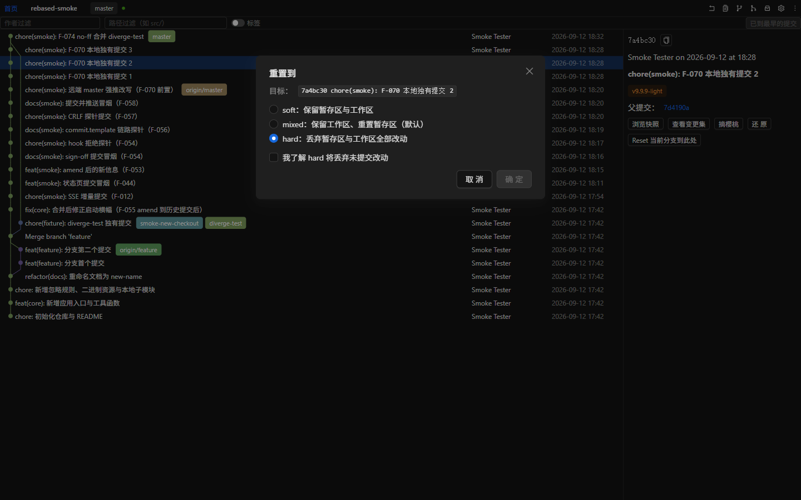
  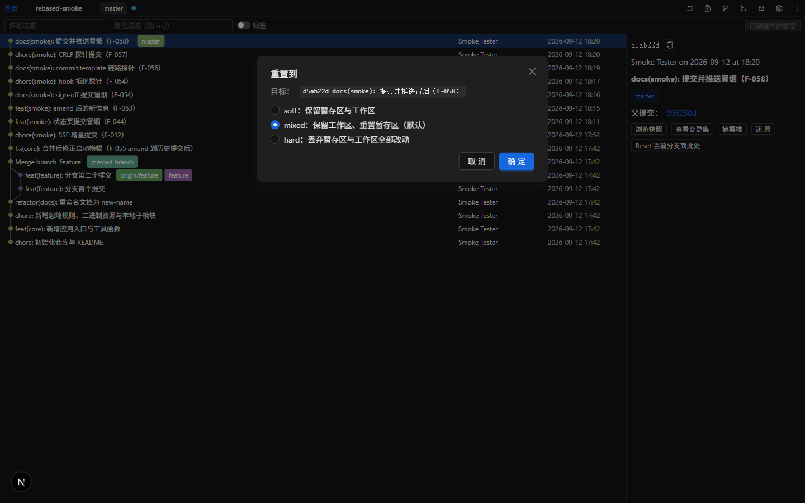
  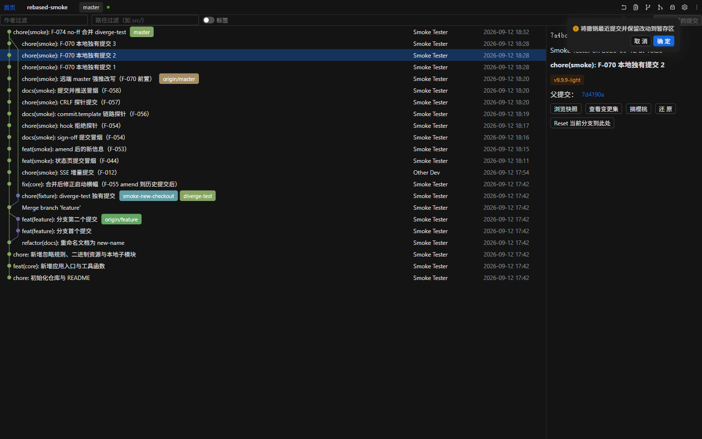

| 功能 | 用途与场景（解决什么） | 如何使用 |
|------|------------------------|----------|
| Reset soft / mixed / hard（F-059） | 决定「提交之后那些改动怎么处置」：留暂存、留工作区、还是全丢 | 选中提交 →「Reset 当前分支到此处」→ 在「重置到」里选一个模式 →「确定」；soft「保留暂存区与工作区」，提交退回但改动原样留着可重新提交；mixed「保留工作区、重置暂存区」是默认项，改动留在工作区但不再暂存；hard「丢弃暂存区与工作区全部改动」须先勾「我了解 hard 将丢弃未提交改动」，否则「确定」不可点 |
| Reset Current Branch to Here（F-060） | 从页面发起重置，免去回终端敲 reset 并记表达式 | 详情面板按钮或提交行右键的同一菜单项 → 弹出「重置到」：目标以「短哈希 + 提交信息」只读展示（过长自动截断，悬停看全文），随你选中的提交而变；选模式后确定，成功提示「已重置」，日志与状态随之刷新 |
| Undo Commit（F-061） | 提交信息写错或漏文件时，一口气撤回最近一次提交又不丢改动 | 顶栏撤销按钮 → 确认框「将撤销最近提交并保留改动到暂存区」→「确定」：提交记录少一笔，被撤销的改动回到暂存区（等价 `git reset --soft HEAD~1`），提示「已撤销最近提交」 |

- **边界与提示**：hard 会永久丢弃未提交改动，确认勾选只是防误点、不是撤销键；目标引用不可手输，它是只读文本、来自你选中的提交，想换目标就改选另一条提交；重置作用于当前分支的 HEAD，执行前先确认顶栏显示的当前分支；引用无效会报「引用不存在或不是提交：…」，此时不会改动任何文件；仓库还没有提交（或当前是根提交）时撤销会报「没有可撤销的提交」。

### 4.7 分支页 BranchPanel（/repos/:id/branches）

- **用途**：一屏查看四组分支，并在页内完成检出、建删改名、清理与比较。
- **解决什么问题**：分支一多，命令行列表就难读——哪条已合并、本地比远端多几个提交、上次在哪儿检出，全靠自己比对；本页把这些做成标记与徽标，破坏性操作（删除、批量清理、强推后修复）都带确认和后果说明。
- **入口**：顶栏「分支」图标按钮（任何仓库页同一入口，本页时该按钮高亮；悬停提示「打开分支页：查看本地/远程分支并执行新建、检出、合并等操作」）。
- **界面构成**：顶部一行工具条（新建分支、过滤框、「仅看已合并」、「显示最近检出」、「显示标签」、「清理已合并（N）」、「Fetch」），下面从上到下是卡片组：最近检出 → 本地分支 → 远程分支 → 标签。
- **配图**：
  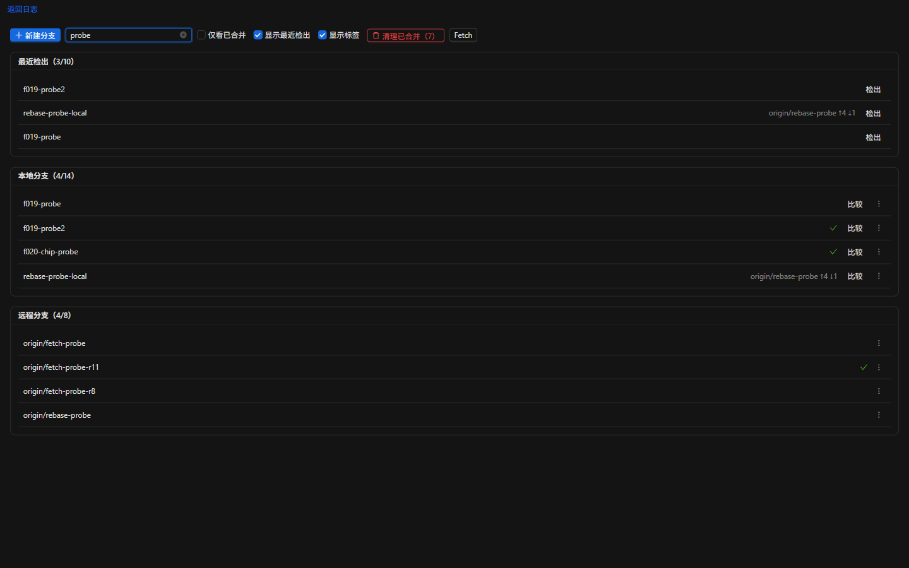
  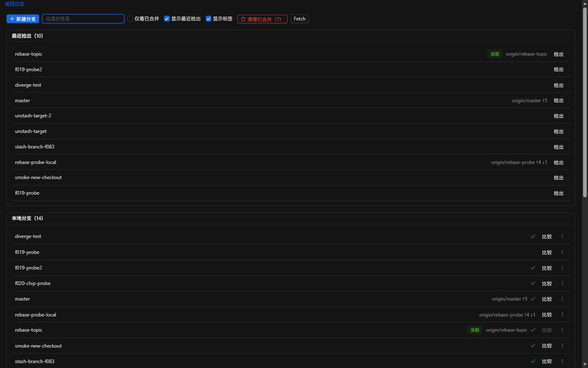
  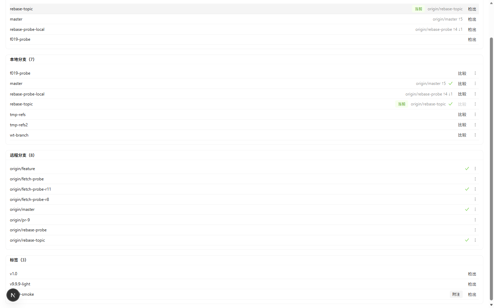

| 功能 | 用途与场景（解决什么） | 如何使用 |
|------|------------------------|----------|
| 分组（本地/远程 + 最近检出 + 标签）与过滤（F-062） | 四组各带计数，想找哪条分支不用滚长列表 | 进页即见四组；在「过滤分支名」里输入子串（大小写不敏感），四组共用同一关键字，命中数少于总数时标题显示「命中/总数」；某组一条都没命中时，最近检出与标签两组整组不渲染，本地与远程两组改为显示「无匹配的本地分支」「无匹配的远程分支」占位；勾「仅看已合并」只筛本地与远程两组，只留已并入 HEAD 的分支；「显示最近检出」「显示标签」是页面级开关，默认都开，关掉即隐藏对应组 |
| 行内信息：current 标记 / 上游与 ahead-behind 徽标 / 已合并图标（F-063） | 一眼看出「我在哪、离远端差几笔、这条是否已经合过」 | 每行右侧依次为：绿色「当前」标签（只有当前分支有）、上游名加 ↑n 或 ↓n 徽标（数值为 0 的那一侧不显示箭头，没有上游则整段不显示）、绿色对勾（悬停提示「已合并」，表示已并入当前 HEAD） |
| 创建 / 删除 / 重命名 / 设上游（F-064） | 分支的日常增删改，不必回终端记 -d 与 -D 的区别 | 工具条「新建分支」→ 填名称（必填）、填起始点（可空，留空取当前 HEAD，也可填分支名或提交哈希）、按需勾「创建后检出」→「确定」；行菜单「重命名」填新名；行菜单「设上游」填上游（如 origin/main）；行菜单「删除」→ 确认框：已合并的问「确定删除分支 X？」，未合并的提示「该分支未合并，删除将使用强制删除」（走强删，该分支独有提交不可恢复） |
| 检出：既有分支 / 新建并检出 / detached（标签）（F-065） | 三种「切过去」的场合：回旧分支、开新分支干活、只看某个标签的版本 | 最近检出行或本地行菜单「检出」＝切到既有分支；工具条「新建分支」勾上「创建后检出」（或在日志页该提交行右键「从此处新建分支…」）＝新建并检出；标签组行内「检出」＝以游离头检出该标签、只读查看某版本，此时界面不出现「当前」标记 |
| 查找已合并 / 清理已合并（F-066） | 合并完留下一堆已并入的分支，逐个删太烦 | 先用「仅看已合并」确认范围，再点「清理已合并（N）」→ 确认框「清理 N 个已合并分支？不可恢复」→「确定」，完成后提示「已清理 N 个已合并分支」；候选口径为已并入 HEAD、不是当前分支、未被任何工作树检出、且没有领先自己上游的未推送提交（后三种 git 会拒绝删除或会丢提交，故不计入）；计数为 0 时按钮禁用 |
| 与当前分支比较（F-067） | 想知道两条分支各自多出哪些提交，又不想检出或动工作区 | 非当前分支行点「比较」→ 进入对比视图：左卡「分支独有（N）」、右卡「当前独有（N）」，各列短哈希、主题、作者、日期，点某行跳到日志页定位该提交；「退出对比」回日志页；当前分支那行的「比较」是灰的（自己比自己恒为空） |
| 与工作树差异（F-068） | 把手上没提交的改动和另一条分支对照，判断能不能干净切过去 | 行菜单「与工作树差异」→ 弹出该分支与当前工作树的文件清单（含未提交改动，重命名显示为「旧名 → 新名」）→ 点某个文件在**新标签页**打开差异页：左侧取该分支、右侧取当前工作树；当前分支该项禁用 |
| 弹窗 Fetch（F-069） | 别人推了新分支，不切终端也能看到远端最新情况 | 工具条「Fetch」→ 拉取全部远程引用 → 完成后提示「已拉取远程引用」并重读分支列表（远程组出现新分支、已合并勾随之更新）；耗时取决于远端 |
| force-push 后修复（F-070） | 远端被强推改写，本地与上游分叉、普通更新已经无法收场 | 只有当前分支与上游「分叉」（ahead 与 behind 同时非零）时，当前分支行才出现红色「force-push 修复」；点击 → 确认框说明「重置到上游 + 重放本地独有提交」→「确定」后提示「已重置并重放 N 个本地提交」；没有本地独有提交时提示「已同步到上游（无本地独有提交）」 |
| 检出并变基到当前（F-071） | 把一条分支接在当前分支的最新进展上再切过去，省去先检出再变基两步 | 本地行菜单同名项直接执行；远程行菜单同名项先弹「本地分支名」输入框（预填去掉 origin/ 前缀的名字，可改）→「确定」；完成后提示「已检出 X 并变基到当前分支」，冲突则转冲突页 |
| 检出并更新（F-072） | 换分支干活前顺手把它更新到最新，避免用旧代码开工 | 本地行菜单「检出并更新」→ 先检出该分支，再拉取它的跟踪分支并按默认策略更新；已同步时提示「已检出 X（已是最新）」，有更新时提示「已检出并更新 X」，冲突则转冲突页；当前分支、没有上游的分支该项禁用 |

- **边界与提示**：删除未合并分支与批量清理都不可恢复，确认前先看分支行有没有绿色已合并对勾；被其他工作树检出的分支删不掉（git 会拒绝），「清理已合并」的候选已自动排除它们；「仅看已合并」只影响本地/远程两组，最近检出与标签组只受文本过滤影响；行菜单项按状态禁用——当前分支不能删除、不能比较、不能「与工作树差异」，无上游的分支不能「检出并更新」；检出前确认工作区干净（有未提交改动时可能被拒绝），在终端里检出或重命名当前分支后本页的「当前」标记会自行更新。

### 4.8 合并页 MergeDialog（/repos/:id/merge）

- **用途**：把另一条分支的提交并入当前分支，一次选定合并方式。
- **解决什么问题**：`--no-ff`、`--squash`、`--no-commit` 各自改变历史形态，勾错就得回滚；本页把选项摊成勾选框、确认即执行，撞上冲突直接把你送到冲突页。
- **入口**：日志页顶栏的「合并」图标按钮（悬停提示「打开合并页：把选定的分支或提交并入当前分支」）。
- **界面构成**：整页就是一个常驻打开的「合并分支」对话框——一行「合并到当前分支：」加分支选择器（分两组），下面三个选项勾选框和一行「合并信息（可选）」。
- **配图**：
  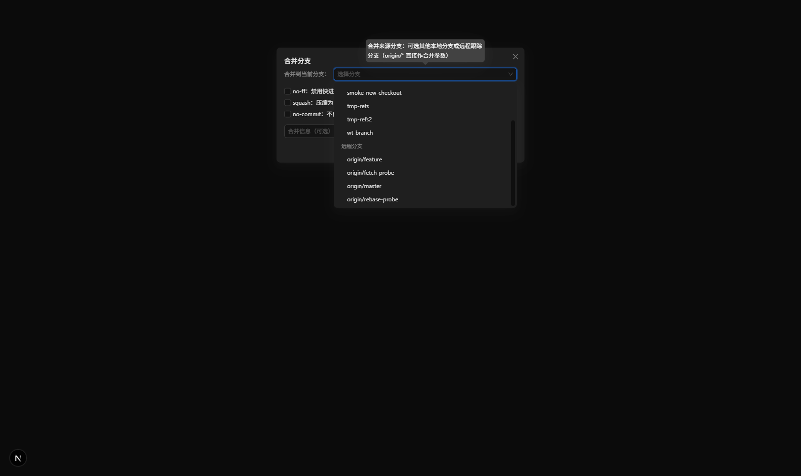
  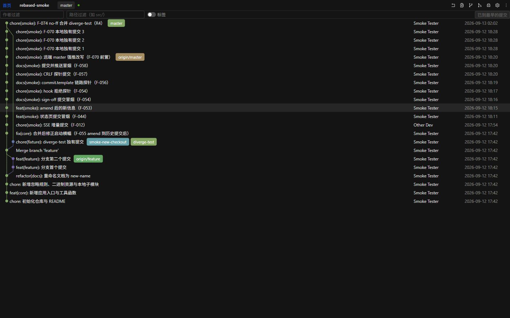
  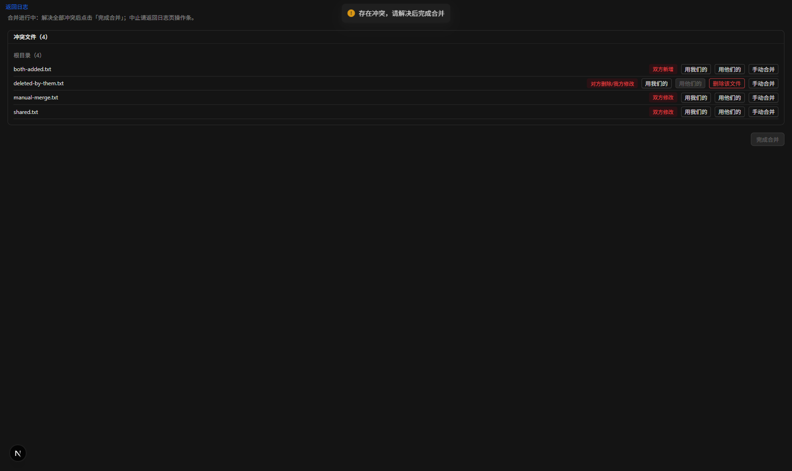

| 功能 | 用途与场景（解决什么） | 如何使用 |
|------|------------------------|----------|
| 合并方向选择（F-073） | 选定「把谁合进来」，本地与远程分支都在一处可选 | 在「合并到当前分支：」的选择器里挑一条：第一组「本地分支」已排除当前分支，第二组「远程分支」直接列 origin/xxx 引用名；没选分支时「确定」不可点 |
| merge 策略 / commit 选项（F-074） | 决定这次合并留下什么形态的历史，避免事后回滚 | 勾选可叠加：「no-ff：禁用快进」（即使能快进也生成合并提交，留下「曾经合并过」的历史）、「squash：压缩为单提交」（把合进来的改动压成一笔停在暂存区，需另行提交）、「no-commit：不自动提交」（只写工作区与暂存区，由你提交）；「合并信息（可选）」留空则用 git 默认的合并信息，仅在有合并提交时生效 |
| 进行中状态联动（中止入口、冲突跳转）（F-075） | 合并出冲突时不至于卡在半路，随时能接着做或退回去 | 执行后看提示：已是最新 →「已是最新」并留在本页可改选；成功 →「合并完成」并回日志页；有冲突 →「存在冲突，请解决后完成合并」并自动跳冲突页（冲突清单已预填，无需等待加载）；合并进行中日志页顶栏出现「合并中」操作条，带「中止」（确认「确定中止当前操作？工作区将回到操作前状态」）与「去解决冲突」两个出口 |

- **边界与提示**：本页的「取消」与右上角关闭都等于返回日志页，不会产生任何合并；同一时间只能有一个进行中的操作，已有合并/变基/摘樱桃在进行时会报「已有进行中的操作，请先完成或中止」；squash 不产生合并提交，合进来的改动停在暂存区，要去变更状态页提交；合并信息只在真的生成合并提交时生效，快进或 squash 时填了也看不到；合并自己无意义，选择器的本地组里已排除当前分支。

### 4.9 变基对话框 RebaseDialog（提交日志页内嵌模态）

- **用途**：把当前分支的提交搬到新基底上重放，可整体搬也可逐条编辑。
- **解决什么问题**：变基既要记 onto 表达式、又要手写待办清单文件；本套界面把两种情况都做出来了——简单模式只填一个目标，交互模式给一份能改动作、能调顺序的清单，基准写错会直接报错而不是给出一份误导性的空清单。
- **入口**：日志页顶栏「更多」→「变基」；整理单条提交（Reword / Drop / Squash / Fixup）与 auto-squash 的入口不在这里，而在日志页提交行的右键菜单。
- **界面构成**：一个「变基」模态，顶部「简单 / 交互」二选一；简单＝一个「目标（onto）」输入框 +「开始」；交互＝「基准（base）」输入框 + 待重放提交清单（每行：短哈希、主题、动作下拉、上移/下移两个箭头）。
- **配图**：
  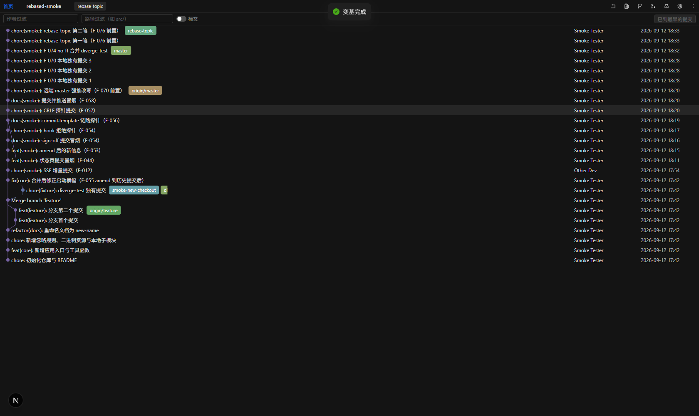
  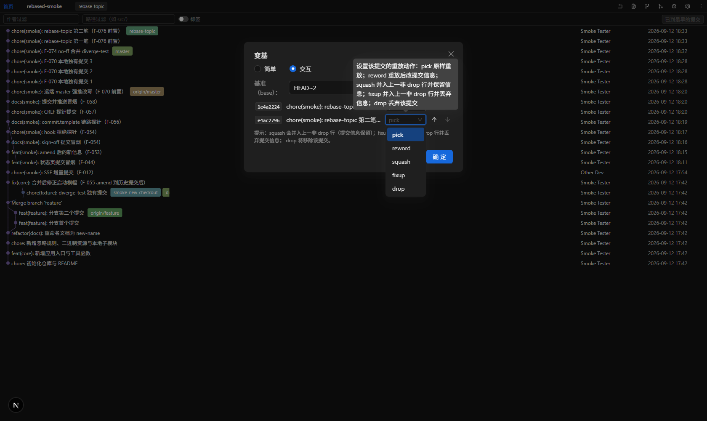
  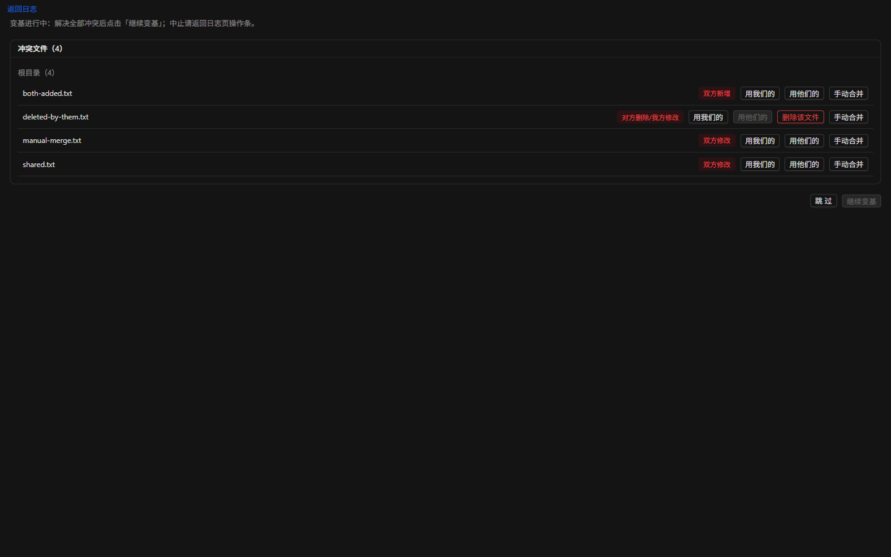

| 功能 | 用途与场景（解决什么） | 如何使用 |
|------|------------------------|----------|
| rebase onto（目标基选择）（F-076） | 分支从旧基底挪到最新进展之上，不想逐条编辑时一把搬完 | 打开「变基」留在「简单」→ 在「目标（onto）」里填分支名、HEAD~n 或提交哈希（占位提示「如 main、HEAD~2 或提交哈希」）→「开始」；完成后提示「变基完成」，已经在该基底之上时提示「已是最新」 |
| 交互式列表：pick/reword/squash/fixup/drop + 上移/下移（F-077） | 整理本地提交：改顺序、合并、丢弃、改信息，一次编排完再执行 | 切到「交互」→ 填「基准（base）」（占位提示「如 main（base..HEAD 的提交将重放）」）→ 清单立即拉取并在加载期间禁用确定；每行动作可选 pick（原样重放）、reword（重放后改提交信息）、squash（并入上一非 drop 行并保留信息）、fixup（并入上一非 drop 行并丢弃信息）、drop（丢弃该提交）；箭头「上移/下移」调整顺序，清单**首行的上移与末行的下移是灰的**，禁用态随位置移动；base 无效时列表位置显示红色报错（git 原文），不是空清单；base..HEAD 为空时提示「无待重放提交（base..HEAD 为空）」；全部行都设为 drop 时确定不可点；确定按钮在简单模式写「开始」、交互模式写「确定」 |
| continue / abort / 冲突联动（F-078） | 变基撞上冲突时有个明确的接续路径，而不是把仓库停在半路 | 冲突后自动跳冲突页：解决完点「继续变基」接着重放；某一笔不想要就点「跳过」（确认「跳过当前提交（其变更将被丢弃）？」，该提交被丢弃、变基继续）；整个变基作废则在日志页顶栏操作条点「中止」（确认「确定中止当前操作？工作区将回到操作前状态」）；结束时提示「变基完成」，冲突时提示「变基存在冲突，请解决后完成」 |
| auto-squash / fixup、squash by subject（F-079） | 「刚才那笔改动应该并进上一条提交」——补一笔并自动折入目标提交 | **入口在提交日志页的行右键菜单，不在本对话框**：先在变更状态页把改动暂存，再到目标提交行右键 →「Fixup Commit」或「Squash Commit」→ 确认框标题即动作名、正文说明「将以暂存内容创建 fixup!/squash! 提交并折入选中提交（历史将被重写）」→「确定」；折入后目标提交带着你的改动、提交信息保持目标原文；没有暂存内容会提示「没有暂存的变更，请先在状态页暂存要折入的内容」 |
| 单提交编辑直通（reword/drop/squash/fixup）（F-080） | 只想动一条提交，不想为此开一份待办清单 | **入口同样在日志页行右键菜单**：「Reword Commit」弹多行输入框（预填该提交当前信息首行，留空时「确定」禁用），确定后重写信息；「Drop Commit」删除该提交（其变更一并丢弃）；「Squash Commit（并入父提交）」把改动与信息并入父提交（提交数 -1）；「Fixup Commit（并入父提交）」只并入改动、保留父提交信息；四者都会重写其后的提交哈希，确认框正文会写明后果与「冲突时可在冲突页解决」 |

- **边界与提示**：变基会重写提交哈希，已推送过的提交之后推送需要强推，已推送到受保护分支的提交会被直接拒绝（提示「目标提交已推送到受保护分支，不可重写」）；执行前确认工作区干净，有未提交改动时容易失败；交互模式只能改动作与顺序，不能增删提交，提交集合与仓库实际不符会被拒绝（提示「提交清单与仓库实际不符」）；简单模式的 onto 无效会报「引用不存在或不是提交：…」，提交失败时对话框保持打开、你的编辑不会丢，可改参重试；待重放区间内含合并提交时单提交编辑会被拒（提示先处理该合并提交）。

### 4.10 贮藏页 StashPanel（/repos/:id/stashes）

- **用途**：把未提交的改动收进贮藏列表，之后再取回工作区。
- **解决什么问题**：改到一半要切分支、要拉取，却不想提交半成品——以前得手敲 `git stash`／`pop` 并自己记 `stash@{n}` 序号；本页把保存、取回、转分支、看补丁全部按钮化，序号由列表直接给出。
- **入口**：顶栏「贮藏」图标按钮（任何仓库页同一入口，本页时该按钮高亮）／变更状态页页头「存入贮藏」（弹窗只收一句说明，不含本页的两个勾选，保存后提示「已存入贮藏」并跳到本页）。
- **界面构成**：上方一张「保存贮藏」卡片表单（说明输入框 + 两个勾选 + 「保存」），下方一张「贮藏列表（N）」卡片，每行是 `stash@{序号}` 徽标 + 说明 + 时间 + 六个操作按钮；另有转分支、Unstash As、查看差异三个弹窗。
- **配图**：
  - 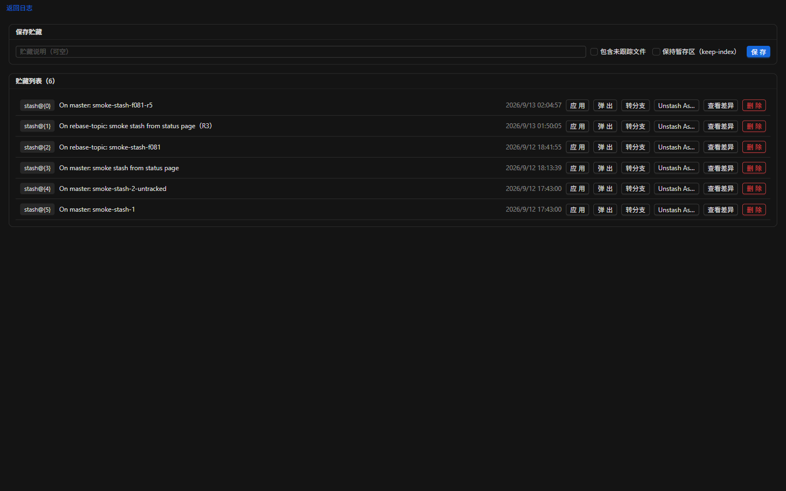
  - 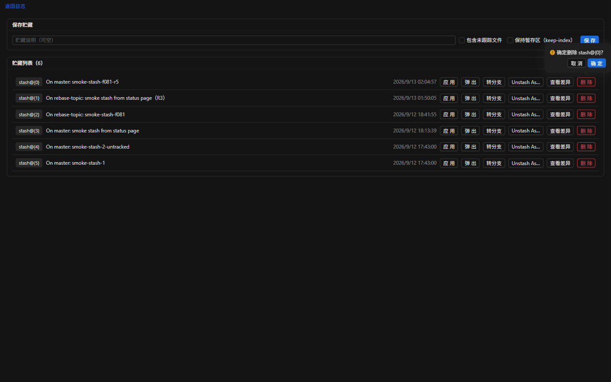

| 功能 | 用途与场景（解决什么） | 如何使用 |
|------|------------------------|----------|
| stash save（F-081） | 把当前工作区改动存成一个贮藏条目，工作区随即变干净；切分支/拉取前的临时收尾 | 「保存贮藏」卡片 → 填说明（可空；留空则该贮藏以 git 默认的 WIP 说明命名）→ 按需勾「包含未跟踪文件」（把新建但没 add 的文件一并存入）与「保持暂存区（keep-index）」（只回退工作区，已 add 的内容仍留在暂存区）→ 点「保存」；成功后条目出现在列表顶部、输入框与勾选复位。变更状态页页头的「存入贮藏」是同一动作的快捷入口，只收说明、两个选项一律不生效 |
| pop / apply（F-082） | 把贮藏内容放回工作区：「应用」保留条目，「弹出」应用后同时移除条目 | 行「应用」＝立即应用、条目保留；行「弹出」→ 确认框「确定弹出 stash@{N}？弹出后将移除该贮藏」→ 确定；两者成功后工作区出现改动，冲突时提示「应用贮藏存在冲突（N 个文件…），请到冲突页解决后完成」 |
| drop（F-082） | 丢弃不再需要的贮藏条目，让列表保持干净 | 行「删除」→ 确认框「确定删除 stash@{N}？」→ 确定；只从列表移除，不改动工作区，删除后无法恢复 |
| stash as branch（F-083） | 贮藏的内容想独立成一条分支继续做（例如它本来就属于另一个任务） | 行「转分支」→ 弹窗「贮藏转分支：stash@{N}」→ 填新分支名（必填，留空时「确定」禁用）→ 确定；新分支被创建并检出、内容落盘，**该贮藏被消费**（从列表消失） |
| Unstash As 对话框（F-084） | 把贮藏应用到一个**已有**分支上，且不想失去这条贮藏（可与「转分支」二选一对照使用） | 行「Unstash As…」→ 弹窗「Unstash As：stash@{N}」→ 在「选择本地分支」里选目标分支（只列本地分支，远程分支不在选项中）→ 确定；先检出目标分支再应用贮藏，**贮藏保留在列表**，成功提示「已检出 X 并应用贮藏」 |
| 查看差异（F-085） | 取回之前先确认这条贮藏到底改了什么，避免盲 apply 弄脏工作区 | 行「查看差异」→ 弹窗「贮藏差异：stash@{N}」以等宽字体展示该贮藏的完整 unified 补丁（可滚动，最高 480）；纯查看，不动工作区；补丁为空说明该贮藏没有文本差异 |

- **边界与提示**：没有可贮藏的改动（或只有未跟踪文件而没勾「包含未跟踪文件」）时保存会被拒，提示「没有可贮藏的工作区改动」；变更状态页的「存入贮藏」不带「包含未跟踪文件」与「保持暂存区」两个选项，把未跟踪文件也一起收走请回到本页操作；条目按 `stash@{序号}` 定位，弹出/删除后列表整体前移、序号会变，按钮上的序号以当前列表为准；贮藏只存在本仓库本地，不会随推送共享给他人；「转分支」成功后该贮藏被消费，要保住条目请用「Unstash As」；在终端里直接 drop 贮藏不会实时反映到本页（其余操作会），重进或刷新页面即同步。

### 4.11 标签页 TagPanel（/repos/:id/tags）

- **用途**：查看、新建、删除标签，并把标签推到远程。
- **解决什么问题**：打版本标记以前要分清轻量标签与附注标签的两套参数，删远程标签还得写出「推送空引用」这种反直觉命令；本页把创建、删除、推送做成行内按钮，附注与否只看一个输入框是否填写。
- **入口**：顶栏「更多」→「标签」（任何仓库页同一入口，本页时「更多」高亮）；日志页提交行右键「从此处新建标签…」（以该提交为起点打标，不跳本页）。
- **界面构成**：顶部一条工具条（「新建标签」／「推送全部」），下方「标签列表（N）」卡片；每行是标签名 + 「附注」徽标（轻量标签没有）+ 附注首行 + 「推送」／「删除远程」／「删除」；新建标签是一个三输入框弹窗。
- **配图**：
  - 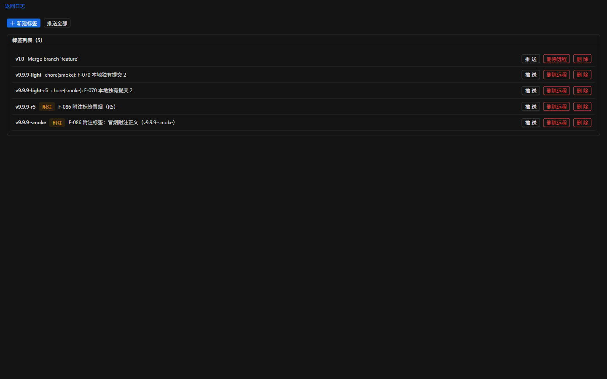
  - 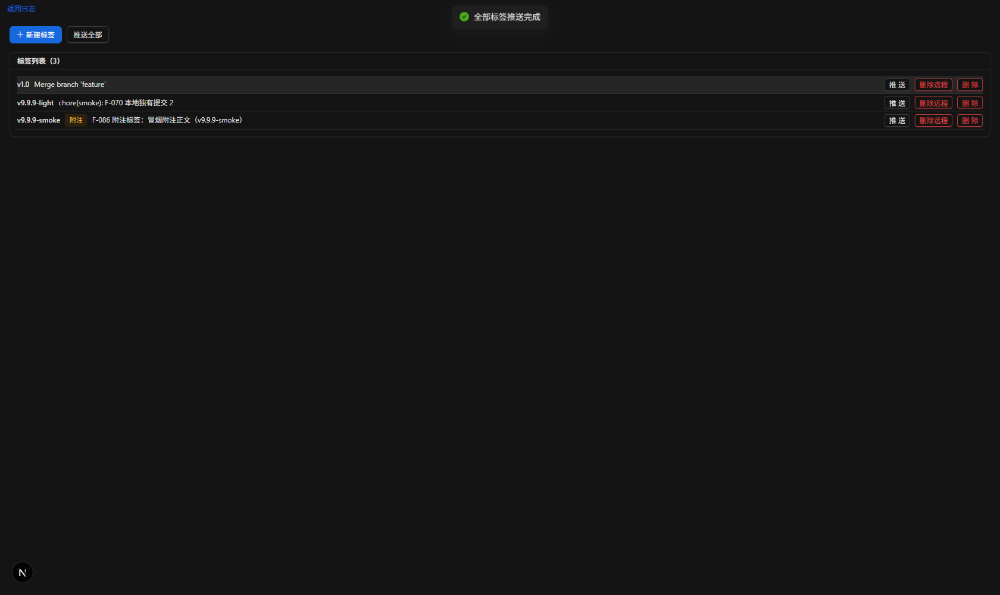

| 功能 | 用途与场景（解决什么） | 如何使用 |
|------|------------------------|----------|
| 创建标签（含附注）（F-086） | 给发布点、里程碑打标记；需要带说明的正式发布用附注标签，临时记号用轻量标签 | 顶栏「新建标签」→ 弹窗「新建标签」：填「标签名（必填）」（留空时「确定」禁用，重名会被拒并提示「标签已存在：X」）、按需填「引用（可空，默认 HEAD）」（也可填分支名或提交号）、按需填「附注信息（可空；非空即附注标签）」→ 确定；填了附注信息的在列表带金色「附注」徽标并显示附注首行 |
| 删除标签（本地）（F-087） | 打错名字、标错提交时的清理 | 行「删除」→ 确认框「确定删除标签 X？」→ 确定；只删本地标签，远程同名标签不受影响（要用「删除远程」单独清理） |
| 删除标签（远程）（F-087） | 误推到远程的标签需要撤回 | 行「删除远程」→ 确认框「确定从远程删除标签 X？」→ 确定；本质是向远程推送空引用删除对端标签，本地标签保留，成功提示「已删除远程标签 X」 |
| 推送标签（单个）（F-088） | 把某个正式版本标签发布给协作者 | 行「推送」→ 确认框「推送标签 X 到远程仓库？」→ 确定；成功后提示「标签推送完成：X」；不点名远程时按「当前分支上游 → origin → 唯一远程」解析，仓库没有远程时报「仓库未配置远程，无法执行标签传输操作」 |
| 推送标签（全部）（F-088） | 一次性把本地所有标签同步到远程（例如接手仓库、迁移后补推） | 页头「推送全部」→ 确认框「推送全部标签到远程仓库？」→ 确定；等价 `git push --tags`，标签多时耗时较长，成功提示「全部标签推送完成」 |

- **边界与提示**：附注标签与轻量标签的唯一判据是「附注信息」是否非空（首尾空白会被去掉）；远程已存在同名但指向不同的标签时 git 会拒绝该次推送，界面不会额外标红、仍以完成提示收尾，需要自己核对远端结果；推送与删除远程都走同一套凭据回路——该主机已在应用设置页「账户」卡片里存过令牌就自动注入，否则会红字提示「认证失败，请配置该主机的访问令牌」，去那里补一条账户即可；外部命令行建删标签会实时刷新本页列表；删除操作没有回收站，本地标签删掉后只能重新创建。

### 4.12 远程管理页 RemotePanel（/repos/:id/remotes）

- **用途**：管理远程仓库地址、拉取远程更新、补齐浅克隆的历史。
- **解决什么问题**：改错地址或换协议时，以前要分别确认 fetch 与 push 两条地址；浅克隆仓库取不到完整历史时，还得记住 `fetch --unshallow` 只对某个远程生效——本页把地址维护、拉取与解除浅克隆集中成按钮。
- **入口**：顶栏「更多」→「远程管理」（任何仓库页同一入口，本页时「更多」高亮）。
- **界面构成**：顶部一条工具条（「添加远程」／「Fetch 全部」／「定制 Fetch…」），下方「远程列表（N）」卡片：每行是远程名 + 地址 + 「Fetch」／「编辑」／「删除」，浅克隆仓库在卡片顶部多一行橙色徽标与「解除浅克隆」；添加、编辑、定制 Fetch 各是一个弹窗。
- **配图**：
  - 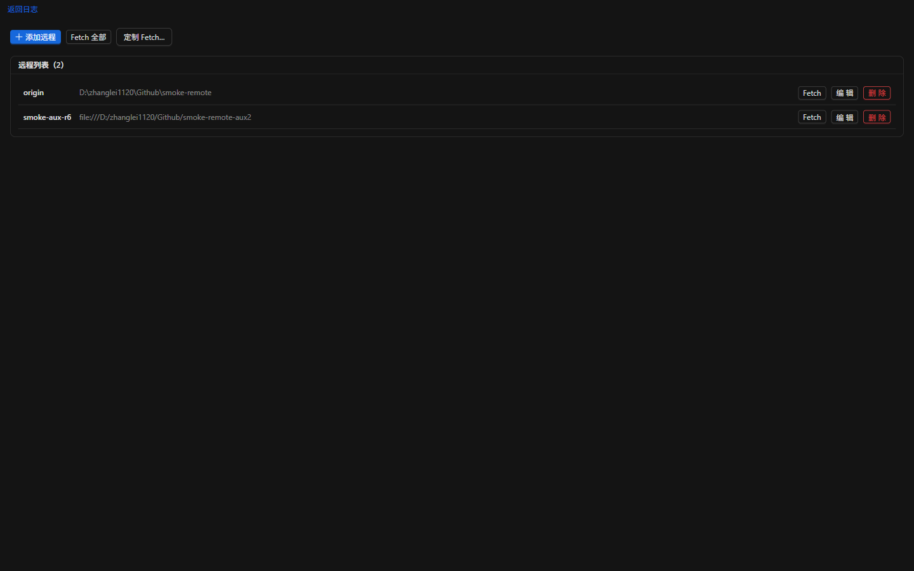
  - 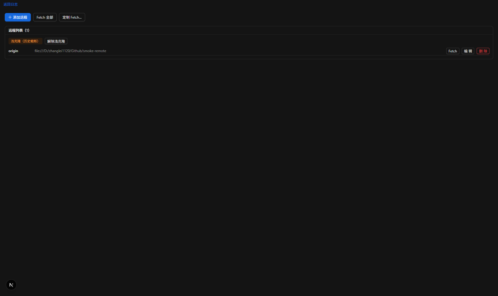

| 功能 | 用途与场景（解决什么） | 如何使用 |
|------|------------------------|----------|
| 远程添加（F-089） | 首次接入一个远端，或补加一个备用远端（镜像、上游仓库） | 顶栏「添加远程」→ 弹窗「添加远程」：填「远程名（如 origin）」与「远程 URL」（任一为空时「确定」禁用）→ 确定；新远程同时作为 fetch 与 push 地址，重名会提示「远程已存在：X」 |
| 远程编辑（F-089） | 仓库搬迁、协议从 https 换成 ssh 时改地址，不必删掉再建 | 行「编辑」→ 弹窗「编辑远程：X」已预填当前地址 → 改完 → 确定；保存后 fetch 与 push 地址一起改写，不影响已有提交与分支 |
| 远程删除（F-089） | 远端下线或不再需要该镜像时清理配置 | 行「删除」→ 确认框「确定删除远程 X？」→ 确定；只从本仓库配置里移除该远程，不触碰远端仓库本身 |
| Fetch 全部（F-090） | 想知道远端有哪些新提交、想在推送前先对齐引用，又不想改动工作区 | 顶栏「Fetch 全部」→ 完成后提示「fetch 完成，更新 N 个引用」；只更新远程跟踪引用，不合并、不改工作区 |
| 单远程 Fetch（F-090） | 多远程仓库里只关心其中一个（例如只看上游仓库） | 行「Fetch」→ 只拉该远程；没有新引用时提示「fetch 完成，更新 0 个引用」 |
| 定制 Fetch（refspec）（F-090） | 拉取默认规则覆盖不到的引用，例如评审别人的 PR 分支 | 顶栏「定制 Fetch…」→ 弹窗「定制 Fetch（refspec）」→ 选远程（必选）+ 填 refspec（如 `+refs/pull/9/head:refs/remotes/origin/pr-9`）→ 确定；两项缺一「确定」禁用，成功同样提示更新了几个引用 |
| shallow 识别 / unshallow（F-091） | 浅克隆仓库只有截断的历史，看提交图、查历史、溯源都会缺内容 | 打开远程页，卡片顶部的橙色「浅克隆（历史截断）」徽标即是提示 → 点「解除浅克隆」→ 对列表里的第一个远程执行历史补齐，耗时较长，成功后提示「已解除浅克隆（历史已补全）」且徽标立即消失 |
| HTTPS 认证对话框 / token 存储（F-092） | 私有远端要求凭据时的统一入口：不必在终端里反复输账号 | 日志页的拉取／推送／更新项目因 401 被拒 → 弹窗「需要认证」：主机只读展示，填「账户名」与「访问令牌（token）」（任一为空时「保存并重试」禁用）→ 点「保存并重试」即把凭据存到该主机并**自动重放刚才的操作**；仍失败会在弹窗内提示「认证失败，请配置该主机的访问令牌」，可换凭据再试，点「取消」即放弃原操作；凭据也可在应用设置页「账户」卡片用「添加账户」预先填好 |

- **边界与提示**：添加/编辑只写地址、不做连通性校验，URL 写错会在之后的拉取/推送时才报错；远程名不可改，改名要删除后重建；「解除浅克隆」只作用于列表里的第一个远程，多远程的浅克隆仓库需自行确认对象；本页自身的 Fetch 遇到 401 只会红字提示、不在本页弹认证对话框——到日志页做一次「更多 → 拉取/推送」（或先在应用设置页「账户」里添加凭据）即可完成认证；远程配置不属于引用类状态，在终端里改远程不会实时刷新本页，重进页面即同步。

### 4.13 推送对话框 PushDialog（日志页内嵌模态）

- **用途**：把当前分支（或其他本地分支）的提交推送到远程。
- **解决什么问题**：不必记住远程名与 `-u`／强推参数；最常遇到的「推送被拒」不再是让人去查文档的红字错误，而是自动接上更新流程。
- **入口**：日志页「更多」→「推送」；日志页提交行右键「Push up to Commit…」（把该提交推到当前分支对应的远端分支）。
- **界面构成**：单个弹窗：「推送到远程：」下拉 + 「分支：」输入框 + 两个勾选框；由提交行右键进入时标题变「推送（Push up to Commit）」，分支框锁定为当前分支，且不再显示上游选项。
- **配图**：
  - 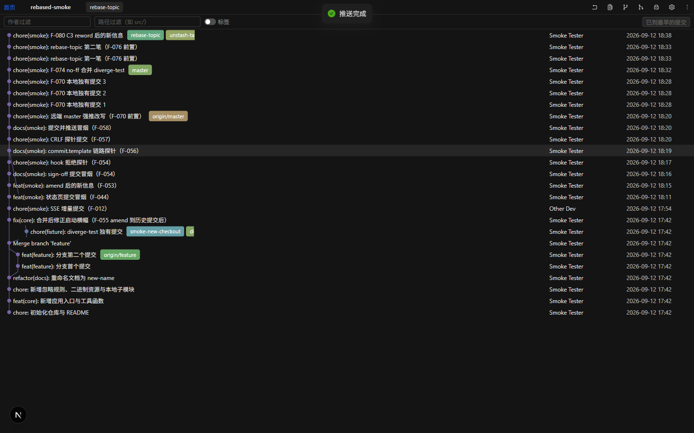
  - 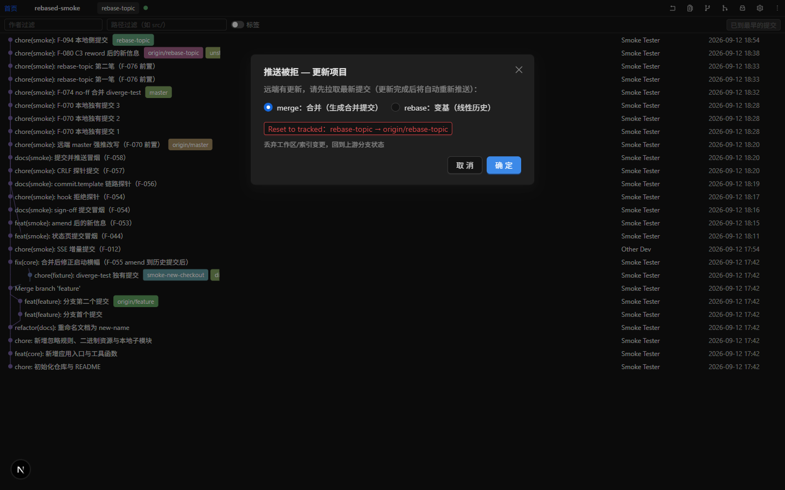

| 功能 | 用途与场景（解决什么） | 如何使用 |
|------|------------------------|----------|
| push（F-093） | 把本地提交发布到远端；新分支首次推送时顺手建立上游 | 「推送到远程」默认预选 origin（没有 origin 时预选唯一远程，多远程且无 origin 时不预选）；「分支」已预填当前分支，可改成其他本地分支（清空则推当前分支）；两勾选默认态：「set-upstream：设为上游（-u，首次推送时建议勾选）」**默认勾选**，「force-with-lease：安全强推（可能覆盖远程提交，慎用）」**默认不勾**（这行是红色警示文案）→ 确定；成功提示「推送完成」，远端没有新内容时提示「已是最新」 |
| rejected push → 自动 Update 联动（F-094） | 远端已有别人推的提交，普通推送必然被拒——这里直接把你送去更新再自动续推 | 推送被拒时先提示「远端有更新的提交，请先拉取/变基」，并**自动弹出**「推送被拒 — 更新项目」对话框（说明「远端有更新，请先拉取最新提交（更新完成后将自动重新推送）」）→ 选 merge（默认）或 rebase → 确定 → 更新成功后自动重推原推送体，提示「更新并推送完成」；若再次被拒仍回到该对话框（提示「推送仍被拒绝，请再次更新」）；更新出现冲突时不续推，改为到冲突页解决。注：变更状态页的「提交并推送」是另一条通道，被拒时只给同一条警告提示，不会弹出本联动 |
| push tags / force-push 后修复（F-095） | 两条相关的覆盖/发布通道：标签整批发布、远端被强推后把本地提交接回去 | 标签通道在标签页：行「推送」与页头「推送全部」（见 §4.11）；远端被他人强推后的修复在分支页行内「force-push 修复」。本对话框承担的是**安全强推**：勾「force-with-lease：安全强推」后确定，只有远端自你上次拉取后没有新提交时才推成功（用于 amend、变基后的覆盖），否则仍被拒 |
| Push up to Commit（F-093） | 把远端分支推进到某个历史提交为止（恢复被误推的远端、回退远端到指定点） | 提交行右键「Push up to Commit…」→ 弹窗标题为「推送（Push up to Commit）」并显示目标提交短哈希，分支锁定为当前分支、不提供上游勾选 → 确定；需要覆盖远端较新提交时勾 force-with-lease；分离头指针状态下会被拒（提示先检出分支） |

- **边界与提示**：「确定」不做必填校验，远程与分支都可留空——留空时由 git 按当前分支上游解析，仓库没配远程或分支没有上游就会报错；「推送被拒」是正常业务结果而不是故障，所以它一定引导到更新对话框，不会只弹红字；force-with-lease 只是比强制推安全，仍可能覆盖队友的提交，共享分支上慎用；set-upstream 默认勾选会写上游配置，推一条已有上游的分支且不想改写上游时可取消勾选；更新流程里点「取消」或关闭对话框即放弃这次续推。

### 4.14 拉取对话框 PullDialog（日志页内嵌模态）

- **用途**：从远程拉取最新提交并合入当前分支。
- **解决什么问题**：以前要先 fetch 再自己决定 merge 还是 rebase；现在一个弹窗完成拉取，并可选让历史保持线性。
- **入口**：日志页「更多」→「拉取」。
- **界面构成**：只有一个弹窗：「从远程拉取：」下拉 + 一个勾选「使用 rebase 而非 merge」。**对话框里没有分支选择器**——分支取自当前分支的上游跟踪关系，要拉别的分支请先在分支页检出它。
- **配图**：
  - 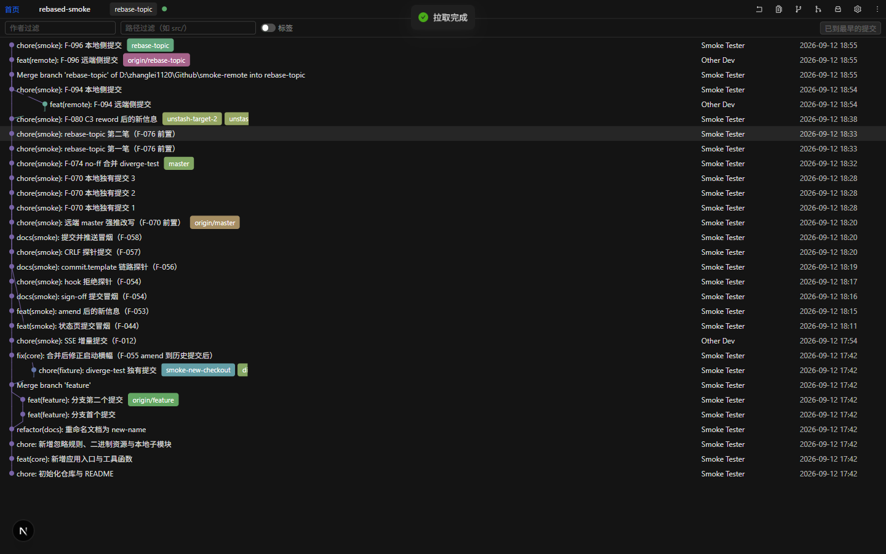
  - 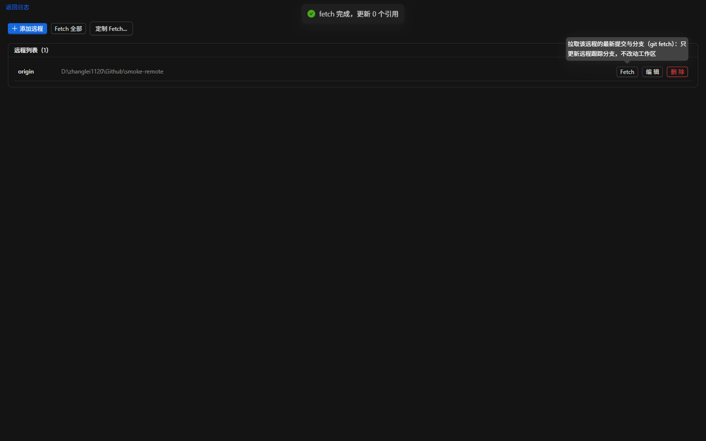

| 功能 | 用途与场景（解决什么） | 如何使用 |
|------|------------------------|----------|
| pull（F-096） | 把远端新提交合入当前分支；想避免多出一条合并提交时改用 rebase | 打开弹窗：「从远程拉取」默认预选 origin（没有 origin 时预选唯一远程；不选则由服务端取当前分支的上游）；需要线性历史时勾「使用 rebase 而非 merge」（默认不勾，勾选后本地提交被重放到远端之上、不生成合并提交）→ 确定；成功提示「拉取完成」，远端无新内容时提示「已是最新」，出现冲突时提示「拉取存在冲突，请解决后完成」 |
| fetch 全远程 / fetch spec 定制（F-097） | 只想更新远程跟踪引用、暂不合并（例如先看看远端有什么），或要按指定 refspec 拉某个引用 | 通道在远程管理页顶部：点「Fetch 全部」拉取全部远程，提示「fetch 完成，更新 N 个引用」；点「定制 Fetch…」按 refspec 拉取指定引用（如 `+refs/pull/9/head:refs/remotes/origin/pr-9`）——两者都只更新引用、不动工作区（见 §4.12） |

- **边界与提示**：拉取的分支无法在弹窗里选择，跟随当前分支的上游；当前分支没有上游（从未推送过）时这一步会以 git 的报错结束，先推送一次建立上游；勾 rebase 会重写本地独有提交（哈希变化），多人共享的分支上要谨慎；出现冲突时对话框直接关闭且只给警告提示，**不会自动跳到冲突页**——自行打开冲突页用「完成合并」或「中止」收尾；「Fetch 全部 / 单远程 Fetch」与「拉取」的区别是前者只更新引用、后者才会合入工作区。

### 4.15 更新项目 UpdateProjectDialog（日志页内嵌模态）

- **用途**：一次完成「拉取全部远程 + 按策略合入当前分支」，并给出结果汇总。
- **解决什么问题**：以前要分三步做（fetch 全部、选 merge 还是 rebase、再看合没合上），多远程仓库里还容易漏掉某个远端；本对话框把三步合成一步并回报结果，同时提供把本地分支拉回上游的补救入口。
- **入口**：日志页「更多」→「更新项目」；推送被拒时会自动弹出（标题变为「推送被拒 — 更新项目」）。
- **界面构成**：单个弹窗：一句说明 + 两个策略单选项 + （有结果时的）「更新结果」面板 + 左下角的红色「Reset to tracked」按钮；结果态下底部按钮变为「关闭」。
- **配图**：
  - 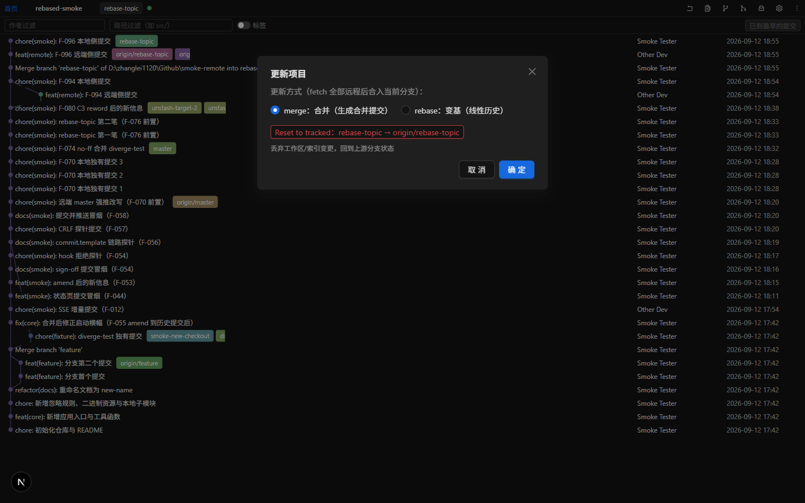
  - 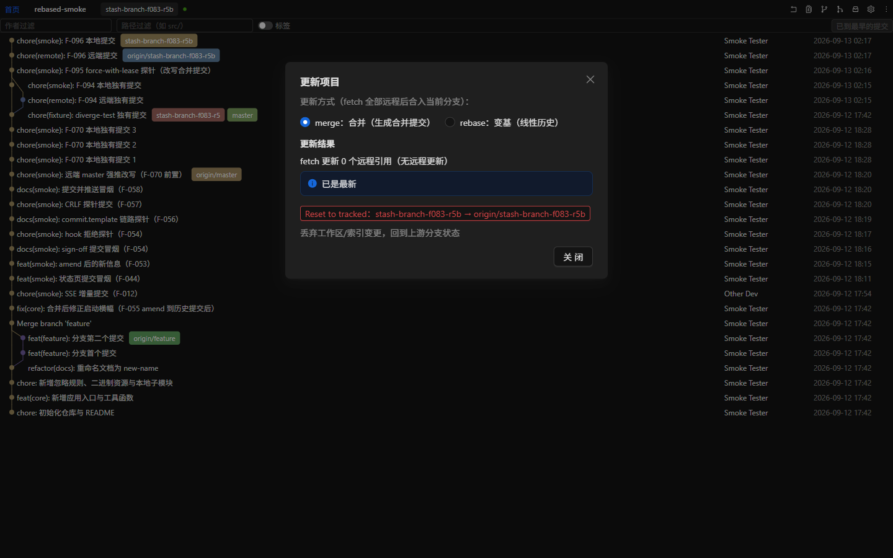

| 功能 | 用途与场景（解决什么） | 如何使用 |
|------|------------------------|----------|
| merge/rebase 策略选择（F-098） | 决定远端提交怎么合进来：想保留分叉痕迹用合并，想要直历史用变基 | 打开弹窗（说明「更新方式（fetch 全部远程后合入当前分支）」）→ 二选一：「merge：合并（生成合并提交）」**默认选中**，「rebase：变基（线性历史）」→ 确定；选定后先拉取全部远程，再按所选策略合入当前分支 |
| 更新会话（进度/结果汇总）（F-099） | 更新完想知道「到底拉到了什么、合上了没有」，而不是只看一条一闪而过的提示 | 常规更新完成后对话框保持打开并显示「更新结果」：一行「fetch 更新 N 个远程引用」（列出最多 3 个引用名，更多以「等」收尾；N=0 时写「（无远程更新）」）+ 状态条——绿「已合入当前分支」／蓝「已是最新」／黄「更新存在冲突」并附「请到冲突页解决后完成（继续/中止）」；底部只留「关闭」，读完点它关闭 |
| Reset to tracked（F-100） | 本地分支被改乱、工作区也脏了，想一键回到上游分支的状态 | 弹窗左下红色按钮「Reset to tracked：<本地分支> → <上游>」（**只有当前分支配置了上游时才出现**；分离头指针或没有上游的仓库不渲染该按钮）→ 点击后弹危险确认「Reset 到上游分支？」+「将丢弃 X 的工作区/暂存变更，硬重置到 origin/X；此操作不可恢复」→ 确定 → 分支硬重置到上游，成功提示「已重置到 X」 |

- **边界与提示**：「更新项目」固定先 fetch **全部**远程再合入当前分支，无法只更新其中一条（只想拉某一个远端请用远程管理页的行内「Fetch」）；rebase 策略会重写本地独有提交的哈希，已推送过的分支之后需要强推；当前分支没有上游（从未推送过）时合入这一步会以 git 报错结束，先推送一次建立上游；Reset to tracked 是硬重置，工作区与暂存改动全部丢弃且不可恢复，确认前请核对按钮上的分支名与上游名；更新出现冲突时对话框不会自动跳走，需自行到冲突页用「完成合并」或「中止」收尾；由「推送被拒」自动打开时说明文案会换成远端更新口径，且更新成功后自动续推、不停留在结果面板，续推成功提示「更新并推送完成」。

### 4.16 文件溯源 BlameWorkbench（/repos/:id/blame）

- **用途**：一屏看清「这个文件每一行最后由谁改成现在这样」，以及「它改过几次、每次改了什么」——左栏挑文件，中栏挑提交，右栏看改动与逐行归属。
- **解决什么问题**：追「这行代码谁写的、什么时候改的」，平时得在终端跑溯源命令，再拿短哈希一个个去查提交；而只看逐行归属，也答不了「那次提交到底改了什么」「这文件还改过几次」，于是要在溯源、差异、历史三个页面之间来回跳。本页把三件事并成三栏：选文件、选提交、看变更与注解在一屏内闭环；页内动作都写回地址栏，链接可以分享，刷新与前进后退都回到同一视图。
- **入口**：日志页顶栏「更多」→「溯源」（不带文件，进页后在左栏树里选文件，或直接在路径框里输入）；变更状态页文件行的「注解」（带上该文件，进页默认停在「本文件改动」标签）；文件历史页条目右侧的「Annotate」（带上该文件与那一次提交，直接落在「逐行注解」标签，见 4.17）；也可用带 `?file=&select=&view=` 的链接直达（见 3.5）。
- **界面构成**：仓库顶栏导航（「更多」高亮）+ 文件路径输入框与「确定」，下面三栏：
  - **左栏（文件）**：该仓库最新提交（HEAD）的文件树——挑文件的地方，当前文件那一行带选中底色；目录行点一下展开/收起（顶层目录默认展开）；子模块条目带「子模块」徽标、点了不切文件，符号链接带「链接」徽标。树**固定看最新版本，不跟随中栏选中的提交**。
  - **中栏（提交记录）**：当前文件的提交清单（`git log --follow`，改名之前的提交也在，最新在最上面），每行是短哈希 + 提交标题 + 作者 + 日期；**单击整行 = 选中该提交**（选中行带底色），行内没有按钮——四个出口都收在右栏操作条上。
  - **右栏（变更内容）**：顶上一行操作条（左边是当前文件的路径，右边是「日志定位」「差异页」「受影响」「文件历史」四个按钮，「差异页」在父提交未知时不渲染），下面是三个标签：「本文件改动」（默认）、「与最新版本差异」、「逐行注解」。还没选文件时右栏只给引导空态「在左侧选择一个文件，或直接输入路径」。
- **配图**：

  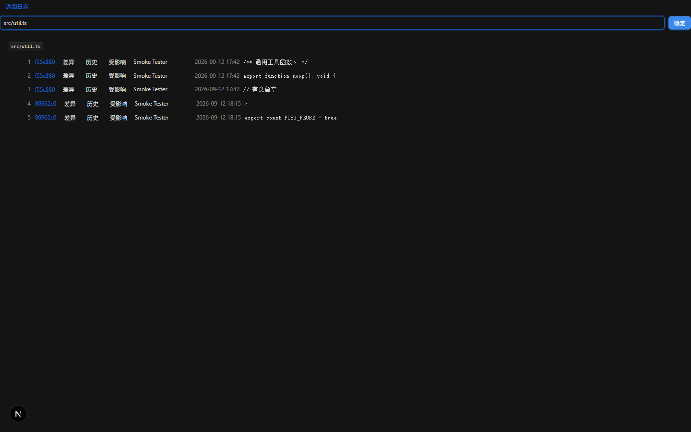

  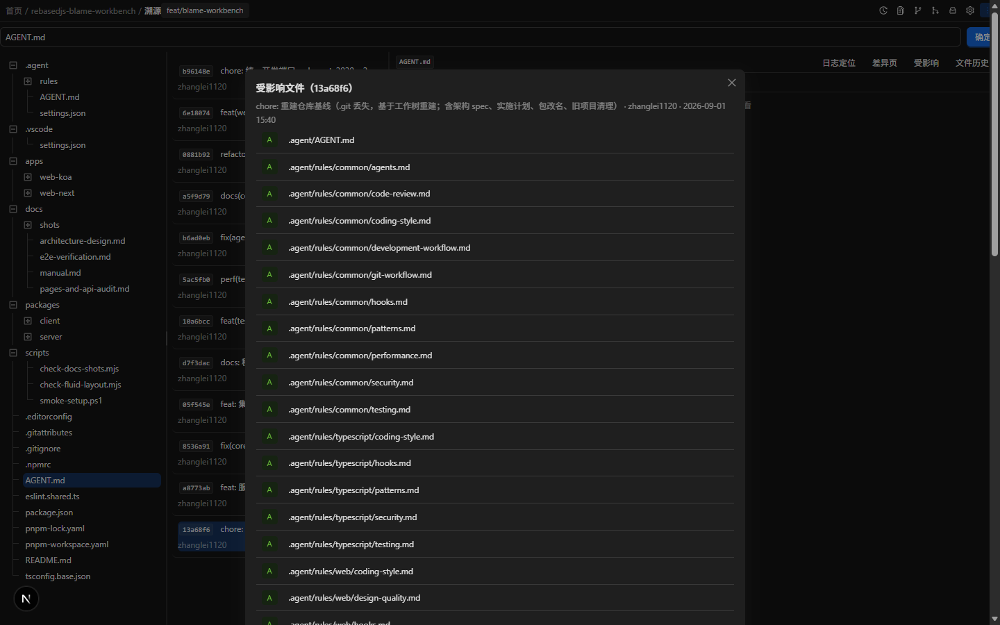

| 功能 | 用途与场景（解决什么） | 如何使用 |
|------|------------------------|----------|
| 左栏文件树选文件 | 换文件不必手打路径：在目录里点着走，顺带看清仓库里有什么 | 点左栏树里的文件行即切到该文件（那一行带选中底色）；目录行点一下展开/收起（顶层目录默认展开）；子模块带「子模块」徽标、点了不切文件。换文件会把选中提交回落成该文件最新一条（中栏第一行） |
| 路径输入框（回写地址） | 已知路径直接粘进来更快；地址栏同时变成可以发给别人的链接 | 在「输入文件路径（相对仓库根目录，如 src/main.ts）」里填路径 → 回车或点「确定」（输入为空时「确定」不可点）。提交后地址栏立刻变成 `?file=<路径>`，复制整条链接即可分享；刷新、前进后退都回到同一视图 |
| 中栏提交清单选中 | 「这个文件改过几次、每次谁改的」扫一眼就有；选中哪条，右栏三个标签就换到哪一版 | 点中栏任意一行（短哈希 + 标题 + 作者 + 日期，含改名之前的提交，最新在最上）→ 该行带选中底色，右栏随之换版本；一次都不点时自动选中最上面那条（不写进地址栏）；清单为空（未跟踪文件、空仓库）显示「该文件暂无提交记录」 |
| 本文件改动（默认标签） | 「这次提交到底把这个文件改成了什么」——不必新开差异页 | 选中一条提交 → 右栏默认停在「本文件改动」：对比「该提交 vs 它的父提交」，增删行高亮；呈现工具条与差异页同款（并排/行内、忽略空白、自动换行、空白字符、上下文行数），默认按「行内」开场（呈现偏好记在本机，改一次之后都按它） |
| 与最新版本差异（新） | 「这一版和现在工作区里的差多少」——把还没提交的改动一并算进来 | 点「与最新版本差异」标签：拿该提交的那一版与**当前工作区版本**对比，未提交的改动也体现在差异里 |
| 逐行注解·逐行归属（F-101、F-104） | 整个文件的逐行责任归属一次看全：每行的行号、提交短哈希、作者、日期与内容；追责、找「是谁引入的这行」时用 | 点「逐行注解」标签 → 按选中提交那一版逐行列出；文件多少行就列多少行，不分页不截断；文件改过名也不影响（按当前路径查即可，行归属会落到改名前后各自的提交上） |
| 逐行注解·点行选中它的提交（新） | 追责主链路：看到这行是谁写的，接着就要看那次提交改了什么 | 点注解里的任意一行 = 选中该行归属的提交（中栏同步高亮，右栏另两个标签也跟着换到那一版）；行也够得到键盘：Tab 停在行上、回车或空格选中 |
| 逐行注解·未提交行 | 工作区里改了还没提交的行不属于任何一次提交，别误点 | 这类行的短哈希是全 0（0000000），旁边标「未提交」，点了没有反应（不进入选中态） |
| 注解点击联动·「日志定位」（F-102） | 想知道这次提交的完整信息、它在历史里的位置 | 点右栏操作条「日志定位」→ 回日志页并自动选中该提交（只做导航，不动工作区） |
| 注解点击联动·「差异页」（F-102） | 想在新标签页里并排看这次提交对该文件的改动，同时把本页留在原处 | 点「差异页」→ **新标签页**打开差异页，对比「该提交 vs 它的父提交」；根提交（没有父版本）改开 `root=1` 的提示页；父提交还没取到时这个按钮**不渲染**（不猜，也不打开一张说错话的页面） |
| 注解点击联动·「文件历史」（F-102） | 这个文件的其他改动在哪几次提交里 | 点「文件历史」→ 该文件的提交历史页（含改名之前，列表说明见 4.17） |
| Show All Affected（受影响文件，F-103） | 这次提交一共动了哪些文件，别漏看同批改动 | 点「受影响」→ 弹出「受影响文件（提交短哈希）」框：抬头是提交标题 · 作者 · 时间，下面是该提交全部变更文件（A 新增 / M 修改 / D 删除 / R 重命名，重命名写成「原名 → 新名」）；合并提交默认不列文件，只提示去日志页看合并结果 |
| Show All Affected·清单里点文件（F-103） | 一次提交改了很多文件时逐个看差异 | 在受影响文件框里点某个文件 → **新标签页**打开该文件在这次提交里的差异页（与「差异页」同一对比基准；清单留在原页） |
| 深链与分享（`?file=&select=&view=`） | 把「我在看这个文件的这一版、这个标签」整条发给别人，或存进书签 | 地址栏 `?file=<路径>` 是文件、`?select=<完整哈希>` 是选中的提交、`?view=changes\|latest\|annotate` 是右栏前台的标签；缺省的不写进地址（没有 `?select=` 时自动选中中栏最新一条，没有 `?view=` 就是「本文件改动」） |
| 旧 `?rev=` 链接兼容 | 文件历史页「Annotate」之类早先发出去的链接不能失效 | 带 `?rev=<哈希>` 打开会规范化成 `?select=<哈希>&view=annotate`（等价于「选中该提交 + 逐行注解」），地址栏随即只剩新写法；应用自己不再写出 `rev` |
| 三栏宽度（拖拽 + 记本机） | 差异与注解都需要宽度，谁宽谁窄各人偏好不同 | 拖动栏与栏之间的分隔条即调宽：左栏、中栏是像素宽（记在本机，刷新后保持），右栏吃剩下的宽度；窗口变窄时三栏按比例收缩、各栏自己滚动，不改成上下堆叠 |

- **边界与提示**：
  - 路径必填（相对仓库根，如 src/util.ts）：输入为空时「确定」不可点；路径不存在提示「文件不存在：xxx」，路径越界提示「非法的文件路径」——错误文案落在**出错的那一栏**（左树、中栏、右栏各显各的），不再是一处错误整页红字。
  - 左栏树固定看最新提交（HEAD）的目录，不跟随选中的提交：选一条老提交不会把树切回那一版；要看某一版的整棵文件树，用日志页详情面板「浏览快照」。
  - 「不给伪 diff」的三种情形只给提示行，且**连请求都不发**：「本文件改动」遇到根提交（无父版本）提示「该提交为根提交（无父版本），无法按父级对比变更；该文件的初始内容可在「逐行注解」标签查看」，遇到重命名提示「该变更涉及重命名：旧 → 新（改名前的历史请到「文件历史」查看）」，遇到该提交里没有这个路径提示「该提交的版本里没有这个路径（可能当时它叫别的名字，或还没有这个文件）」；「与最新版本差异」只在最后一种情形给提示行（同句 +「，无法与当前版本对比」）。
  - 「与最新版本差异」比的是**当前工作区版本**（不是 HEAD）：工作区里还没提交的改动也会算进差异。
  - 陈旧或被改写过的 `?select=`（例如改名之前的提交、被强推掉的哈希）：中栏不高亮任何行，右栏照这个哈希取数——父提交取自该提交的变更集，所以三种降级判据仍然准确，也不会悄悄改写你的链接。
  - 刚开始还没选文件时：左树照常可用，中栏与右栏各给自己的引导空态（中栏「该文件暂无提交记录」，右栏「在左侧选择一个文件，或直接输入路径」）。
  - 该文件没有任何提交（未跟踪文件、空仓库）时中栏给空态，右栏整块只显示「暂无提交可查看」——不渲染操作条与三个标签。
  - 空文件没有可展示的行，显示「暂无溯源信息」；二进制文件不做拦截，会照样按行列出不可读内容，别当文本看。
  - 「逐行注解」是三个标签里唯一没有「这一版没有此路径」判据的：跟着文件历史页的「Annotate」进到改名**之前**的提交时，它仍会显示 git 的英文报错（那一版里只有旧文件名），而两个差异标签此时给的是中文提示行。另外 blame 与文件历史接口只认**工作区现存文件**，把旧路径填进路径框只会得到「文件不存在：旧路径」。
  - 受影响文件框底部没有按钮，关闭用右上角 ×、点框外或 Esc；页内动作（选文件、选提交、切标签）用**替换**当前历史记录的方式写地址，连点几十下也不会把浏览器后退键塞满；「日志定位」是离页导航，会正常新增一步。

### 4.17 文件历史 HistoryPanel（/repos/:id/history）

- **用途**：查单个文件的历次改动记录（含改名之前的历史）。
- **解决什么问题**：想知道「这文件一共改过几次、每次是谁为什么改」，平时要记住并手敲带重命名跟随的日志命令，还得自己抄哈希；本页把记录列成一串，点一条就能定位提交、看那次差异或那版溯源。
- **入口**：日志页顶栏「更多」→「历史」；变更状态页文件行的「历史」；溯源页右栏操作条「文件历史」（后两个会带上文件路径）。
- **界面构成**：仓库顶栏导航（「更多」高亮）+ 文件路径输入框与「确定」；下面一张「文件历史（N）」卡片，每条一行：短哈希 + 提交标题 + 作者 + 时间 +「Annotate」按钮。
- **配图**：

  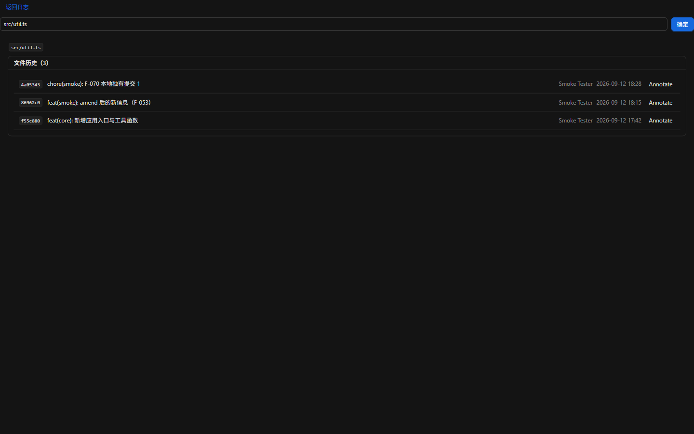

  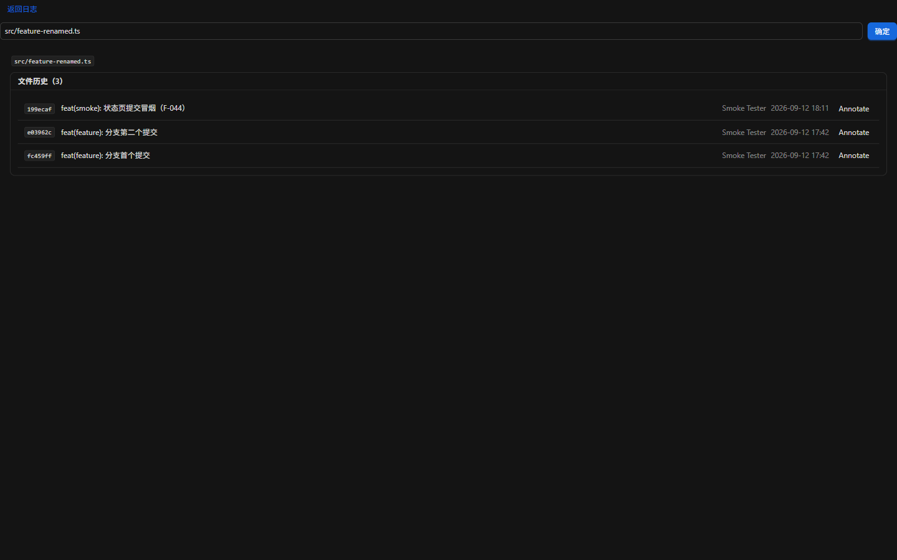

| 功能 | 用途与场景（解决什么） | 如何使用 |
|------|------------------------|----------|
| 文件历史列表（F-105） | 一个文件近期动过什么，扫一眼就知道；不必先翻整仓日志再过滤 | 填路径 → 回车或点「确定」（也可用带 `?file=` 的链接进入）；卡片标题「文件历史（N）」给出条数，每条一行 = 提交短哈希 + 提交标题 + 作者 + 时间，最新在最上 |
| 重命名跟随（F-106） | 文件改过名也不丢历史，追责能追到改名之前 | 直接用改名后的新路径查即可；列表靠下的旧提交就是改名前的记录，标题里的 N 含改名前的提交数 |
| 版本 diff 联动·单击条目（F-107） | 想看这次提交的前后上下文与完整提交信息 | 点条目任意位置 → 回日志页并选中该提交（只导航，不改工作区） |
| 版本 diff 联动·双击条目（F-107） | 想看这次提交到底把这个文件改成了什么样 | 双击条目 → **新标签页**打开差异页（历史列表留在原页），对比「该提交 vs 它的父提交」；根提交（无父版本）只显示提示行 |
| 版本 diff 联动·「Annotate」（F-107） | 想看**在那一次提交时**这个文件每行归谁 | 点条目右侧「Annotate」→ 打开溯源页并直接落在「逐行注解」标签（同时选中该次提交）：行数与内容按那一版显示（可能与当前版本不同，见到行数变差别慌） |

- **边界与提示**：
  - 路径必填，且只认工作区现存文件：已删除（只存在于历史里）的文件会提示「文件不存在：xxx」。
  - 改名**之前**的条目点「Annotate」会落到溯源页的「逐行注解」标签并显示 git 的英文报错（那一版里只有旧文件名；三个标签里只有它没有「这一版没有此路径」的判据）；注意 blame 与文件历史接口只认**工作区现存文件**，把旧路径填进溯源页只会得到「文件不存在：旧路径」。
  - 一次提交只有真的改了这个文件才会出现；纯改名也会作为一条记录列出。
  - 行上单击与双击并存：单击定位提交、双击看差异，别连点。
  - 页内输入不回写地址栏；分享链接请带 `?file=`。

### 4.18 已提交 CommittedChangesPanel（/repos/:id/committed）

- **用途**：按提交逐条浏览「已提交的变更」——左边点提交，右边看它改了哪些文件。
- **解决什么问题**：想看「上上次提交动了什么」，平时要先翻日志、再敲查看变更的命令、还要自己找文件路径；本页一左一右：列提交、展开目录树、点文件直接进差异。
- **入口**：日志页顶栏「更多」→「已提交」。
- **界面构成**：仓库顶栏导航（「更多」高亮）；下方左右两栏——左栏「提交列表（N）」卡片（底部可能带「加载更多」），右栏「变更文件（N）」卡片（目录树）。
- **配图**：

  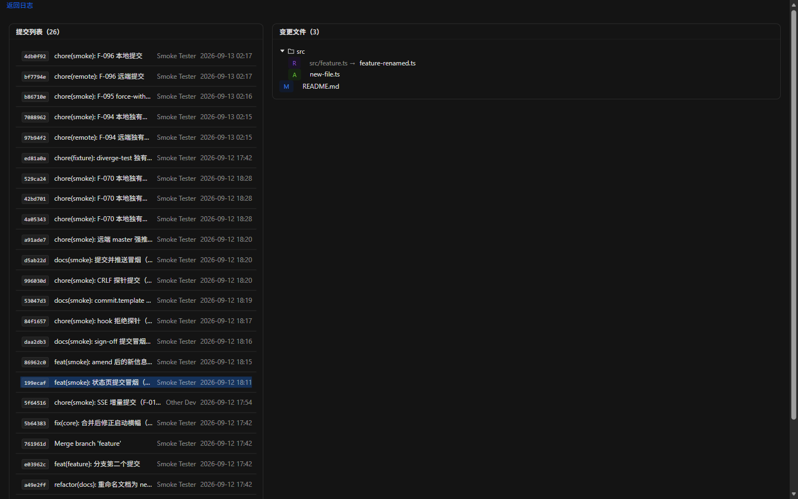

  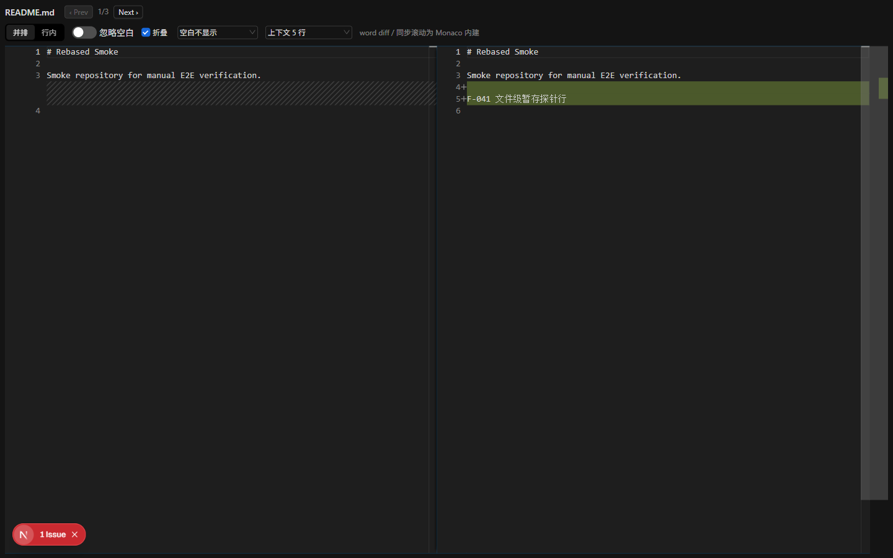

| 功能 | 用途与场景（解决什么） | 如何使用 |
|------|------------------------|----------|
| 按提交浏览已提交变更（F-108） | 按时间倒着回顾提交及其变更集，不用一条条去日志页点开 | 打开页面即自动加载第一页：左栏「提交列表（N）」按时间从新到旧列出短哈希 + 提交标题 + 作者 + 时间，一次 50 条；点底部「加载更多」再追加 50 条（按钮只在还有更多提交时出现，加载时按钮转圈、已有列表不清空）。点某行即选中，选中行带底色高亮 |
| 目录树组织变更文件（F-109） | 变更集按目录组织，一眼看清这次提交在哪个目录动了什么 | 选中提交后右栏「变更文件（N）」列出目录树：目录排在文件前、同级按名称排序，点目录行收起、再点展开（只影响显示）；文件前的徽标：A 新增、M 修改、D 删除、R 重命名（写成「原名 →」）、C 复制、T 类型变更 |
| 与 diff 查看器联动（F-110） | 想确认这次提交到底改了什么内容 | 点目录树里的文件 → **新标签页**打开差异页（已提交列表留在原页）对比「该提交 vs 它的父提交」；同一提交有多个文件时，差异页头部出现「‹ Prev 1/3 Next ›」可在这批文件间前后翻（页内切换，不再另开标签）。重命名文件不做两侧对比，改为提示「该变更涉及重命名：原名 → 新名」并引导去历史页；根提交（无父版本）显示「无父版本」提示行 |

- **边界与提示**：
  - 还没选提交时右栏显示「选择一个提交查看变更文件」；仓库一条提交都没有时整页显示「暂无提交记录」。
  - 合并提交默认不列文件变更，右栏显示「合并提交」说明（要看合并结果请到日志页）。
  - 目录树默认**全部展开**；折叠某个目录后再选别的提交，折叠状态仍保留。
  - 「加载更多」是追加式的，只增不减；换到别的仓库才回到第一页。
  - 本页只看已提交的内容；工作区与暂存区的改动请去变更状态页。

### 4.19 提交搜索 SearchPanel（/repos/:id/search）

- **用途**：按提交信息或代码内容，在整个仓库历史里搜提交。
- **解决什么问题**：只记得「提交说明里写过某个词」或「某行代码是某次提交加进来的」，平时要分别用两种日志搜索命令、还得拼参数；本页一个开关切两种模式，结果点一下就落回日志页。
- **入口**：日志页顶栏「更多」→「搜索」。
- **界面构成**：顶部「分支快速搜索」卡片；下面一行关键词输入框 +「搜索」按钮，再一行模式开关「信息 grep / 内容 pickaxe」；最下面是「搜索结果（N）」卡片。
- **配图**：

  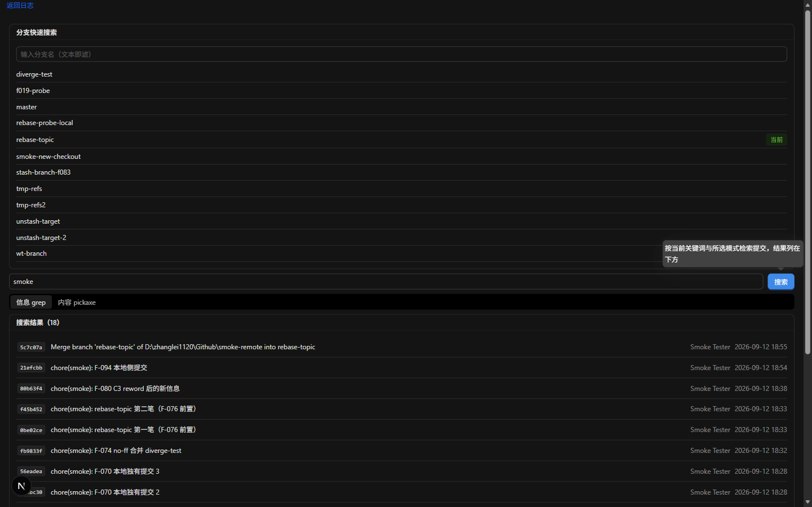

  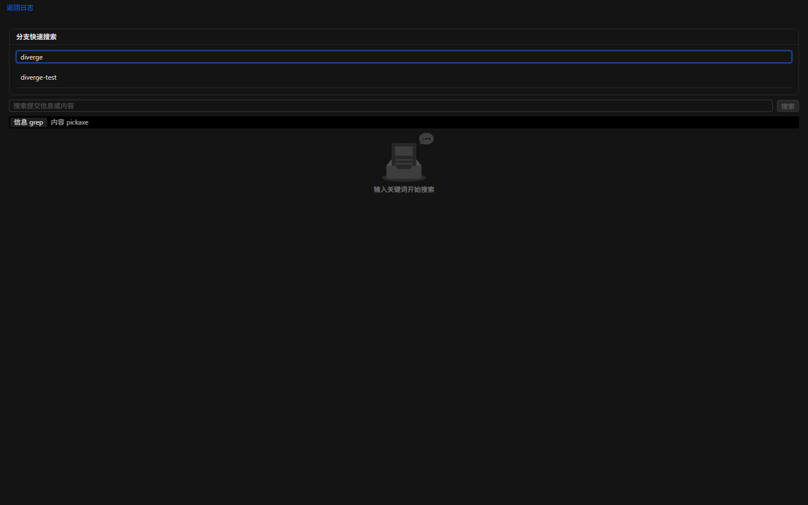

| 功能 | 用途与场景（解决什么） | 如何使用 |
|------|------------------------|----------|
| 提交搜索·信息 grep（F-111） | 在提交说明（标题与正文）里找关键词，适合「记得提交说明里提过 xxx」 | 保持模式为「信息 grep」（默认），输入关键词 → 回车或点「搜索」；匹配不区分大小写、关键词按正则解释；结果最多 50 条，最新在最上 |
| 提交搜索·内容 pickaxe（F-111） | 找「哪次提交加过或删过这一串内容」，适合「这行代码是哪次加进来的」 | 把模式切到「内容 pickaxe」，输入要追的那串内容 → 点「搜索」；按字面量整串比对（不是正则），切换模式不会自动重搜，要再点一次 |
| 提交搜索·非法表达式提示（F-111） | 正则写错时不至于一头雾水，也不会把 git 的英文报错甩给用户 | 「信息 grep」下关键词写错（如 `[unclosed`）→ 面板红字「搜索表达式不是合法的正则表达式：[unclosed」，结果列表保持不变；「内容 pickaxe」按字面量比对，不会因正则而报错 |
| 结果 → 日志页（F-112） | 命中后要落到那次提交看上下文 | 点结果卡片里的任意一行（短哈希 + 提交标题 + 作者 + 时间）→ 回日志页并选中该提交 |
| 分支快速搜索（F-113） | 记不住分支全名时不用去分支页翻，也不用敲检出命令 | 在「分支快速搜索」输入框里打分支名的一段 → 列表即时过滤（纯前端过滤、不发请求；清空恢复全部，无结果显示「无匹配分支」）→ 点某一行：检出该分支并回到日志页，提示「已检出 <分支名>」；当前分支行带绿色「当前」标签 |

- **边界与提示**：
  - 关键词为空时「搜索」按钮不可点；回车等同点「搜索」。
  - 搜索范围是提交信息与代码内容，不含文件名；查某文件的历次改动请用文件历史页。
  - 结果上限 50 条，命中太多时请收窄关键词。
  - 分支快速搜索只列本地分支（远程分支不出现）；点当前分支不会改动任何东西（HEAD 不变），但同样会提示「已检出」并回到日志页。
  - 搜索与分支过滤都是只读操作，不改动仓库与工作区。

### 4.20 冲突页 ConflictsPanel（`/repos/:id/conflicts`）

- **用途**：集中解决未合并的冲突文件，并在收尾时把合并/变基/摘樱桃/还原真正做完。
- **解决什么问题**：有冲突时 Git 只丢下一堆未合并文件，得回终端记 `--ours/--theirs`、翻 `<<<<<<<` 标记、再逐个 `git add`；本页把「哪些文件冲突、属哪一类、该采哪边、怎么手改、什么时候能收尾」摆在一屏。
- **入口**：产生冲突的操作完成后自动跳入（日志页「合并」、日志页「更多 → 变基」、日志页「更多 → 拉取」、状态页「更新项目」、日志页详情面板「摘樱桃」/「还原」）／日志页顶栏操作条在「合并中」旁出现的「去解决冲突」。
- **界面构成**：顶部仓库顶栏导航（本页无高亮——冲突页不在导航内）与一行进行中提示；主体是「冲突文件（N）」卡片（按目录分组，每行＝路径 + 冲突类型徽标 + 行内按钮）；右下角是收尾按钮。
- **配图**：

  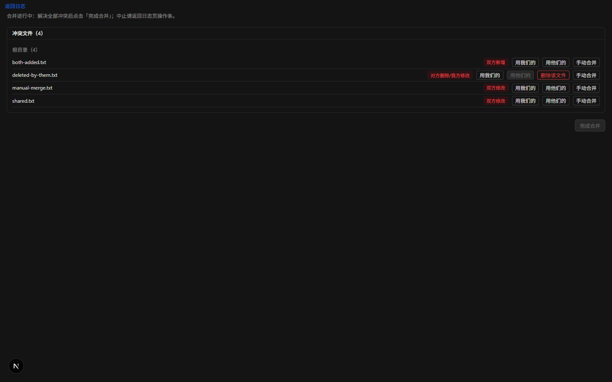

  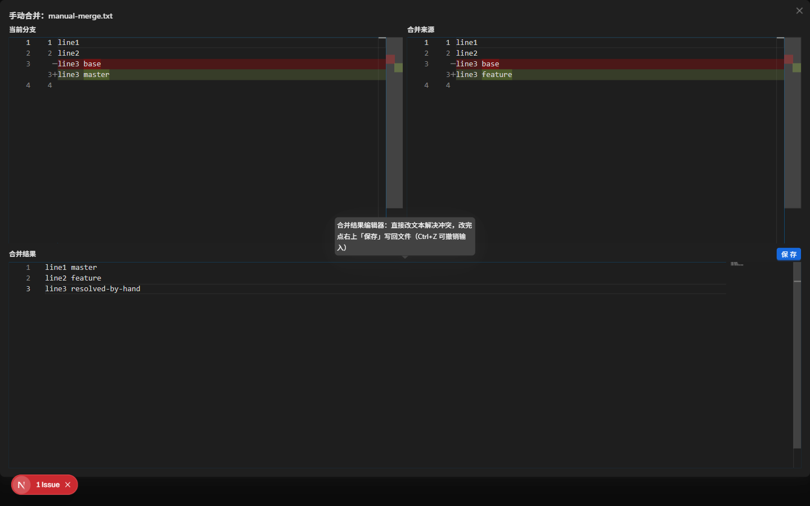

| 功能 | 用途与场景（解决什么） | 如何使用 |
|------|------------------------|----------|
| 冲突文件列表 + 类型徽标 + 目录分组（F-114） | 一眼看清有几个文件冲突、各属哪一类；按目录归堆，避免大改动时排成一条长串。 | 打开本页即见卡片标题「冲突文件（N）」；每个目录一段小标题——根目录文件归「根目录（N）」，子目录归「目录名（N）」，目录按键名排序、组内按路径排序。每行右侧红色徽标给出类型：「双方修改」（两边改了同一处）、「双方新增」（两边各建了同名文件）、「对方删除/我方修改」、「我方删除/对方修改」；徽标决定该行能点哪几个按钮。 |
| 整侧采纳：用我们的 / 用他们的（F-115） | 整份文件选一边，最快也最常见的解法（等价 `git checkout --ours/--theirs` 后再 `git add`）。 | 想留当前分支的内容点「用我们的」，想留要合进来那一方的内容点「用他们的」。点完即以所选版本落盘并标记已解决：该行从列表消失、计数减一，对侧改动随之丢弃（悬停按钮有后果提示）。 |
| 以删除解决冲突：删除该文件（F-115） | 处理「一边删了文件、另一边又改了它」——这类文件某一侧根本没有版本，采纳按钮点了必失败。 | 徽标为「对方删除/我方修改」或「我方删除/对方修改」的行，缺失那一侧的采纳按钮变灰（悬停说明原因），行内多出红色「删除该文件」；点它 → 确认「确认以删除解决该冲突？」→ 文件从索引与工作区移除，冲突消除。两侧都有版本的行不显示该按钮。 |
| 3-way 手动合并（F-116） | 两边改动都想要时，对照着挑，或直接在编辑器里写出最终内容。 | 点行内「手动合并」→ 全屏弹窗标题「手动合并：<文件路径>」；上排左「当前分支」（我方）、右「合并来源」（对方）是只读对照 diff，各自相对共同祖先标出增删；下方「合并结果」是可编辑区（初始内容优先取我方版本，我方没有这个文件时依次退到共同祖先、对方版本）。改完点右上「保存」→ 内容写回该文件并标记已解决，弹窗关闭、该行从列表消失。双方新增（没有共同祖先）时上排退化成两栏纯文本对照，不做逐行着色。 |
| 收尾：完成合并 / 继续变基 / 继续摘樱桃 / 继续还原（F-117） | 冲突全部解决后，把这次操作真正做完——不用回终端敲 `--continue`。 | 冲突列表清零后右下角主按钮才可点，文案随进行中的操作变化：合并→「完成合并」、变基→「继续变基」、摘樱桃→「继续摘樱桃」、还原→「继续还原」。点下后成功后提示「操作完成」并自动回日志页；未清零时按钮禁用，悬停提示「还有未解决的冲突」。 |
| 跳过当前提交（F-118） | 变基/摘樱桃/还原时，某个提交的改动不该要，直接扔掉它继续后面的流程。 | 只在变基/摘樱桃/还原冲突时出现（合并冲突没有该按钮），且在冲突清零后不可点。点「跳过」→ 确认「跳过当前提交（其变更将被丢弃）？」→ 该提交的改动被丢弃、流程继续并回日志页；被丢的改动不可恢复。 |
| 进行中状态提示与中止入口（F-119） | 知道自己在哪个流程里、还差什么，以及不想继续时去哪里退出。 | 页内顶部提示形如「合并进行中：解决全部冲突后点击「完成合并」；中止请返回日志页操作条。」（变基/摘樱桃/还原换成对应词）。日志页顶栏同时显示橙色状态标签（「合并中」/「变基中（第 1/3 步）」/「拣选中」/「还原中」）与红色「中止」，合并态旁边还多一个「去解决冲突」链接回到本页。中止要回日志页点「中止」→ 确认「确定中止当前操作？工作区将回到操作前状态」。 |

- **边界与提示**：
  - 冲突列表清零（显示「无冲突」）之前收尾按钮不可点，「跳过」相反在清零后才不可点，两种禁用悬停都有说明。
  - 一次解决请求进行中，所有行的按钮都禁用（不只刚点的那一行）；解决成功该行立即消失，想在终端复核可看 `git status` 的未合并项是否收缩。
  - 在终端里用 `git add` 标记已解决的文件，本页约 2 秒内自动从列表消失，不需要手动刷新。
  - 中止不在本页做：回日志页顶栏操作条点「中止」，已经完成的冲突解决不会保留。
  - 打开本页时若冲突已被清空，收尾按钮文案仍按最近一次进行中的操作显示；没有任何进行中操作时按「完成合并」显示，此时点它会被提示「当前没有可继续的操作」。

### 4.21 补丁页 PatchPanel（`/repos/:id/patches`）

- **用途**：把改动导出成补丁文件、把已存补丁套回工作区，并管理这些补丁。
- **解决什么问题**：想把「某几个文件」或「某两次提交之间」的改动拿去别处套用，过去得开终端写 `git diff HEAD > x.patch`、记 `--cached`/`HEAD~2 HEAD` 这些写法，套用时还得先自己 `--check` 才敢应用；本页用弹窗选范围生成、点一下就应用，失败会说明原因且不动你的文件。
- **入口**：日志页顶栏「更多」→「补丁」／状态页组级「创建补丁」（在「已暂存」或「工作区」组勾选文件后可用，生成后自动跳到本页）。
- **界面构成**：左上角「创建补丁」按钮；下方「补丁列表（N）」卡片，每行＝名称 + 大小 + 创建时间 +「应用」「导入搁置」「删除」。
- **配图**：

  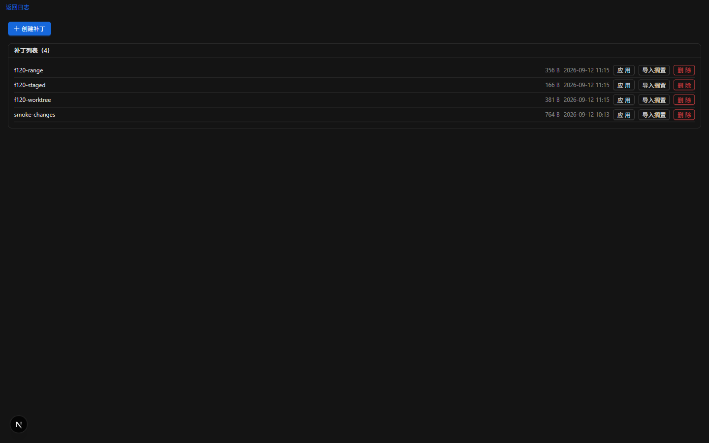

  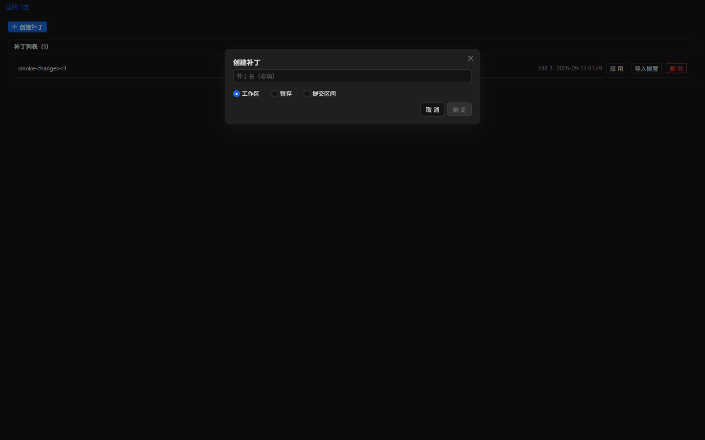

| 功能 | 用途与场景（解决什么） | 如何使用 |
|------|------------------------|----------|
| 创建补丁：工作区范围（F-120） | 把全部未提交改动（含已暂存内容）打包成一个补丁，拿去别的仓库或别的分支套用。 | 点「创建补丁」→ 填补丁名（必填，留空时「确定」禁用）→ 范围保持默认的「工作区」→「确定」。列表出现新条目，显示的大小就是补丁字节数（内容等价 `git diff HEAD`）。 |
| 创建补丁：暂存范围（F-120） | 只想导出已经暂存的那部分改动，工作区里还没暂存的内容不进补丁。 | 同上前两步 → 范围选「暂存」→「确定」（内容等价 `git diff --cached`）。 |
| 创建补丁：提交区间（F-120） | 导出两次提交之间的差异，例如把某条分支最近两步的改动整包给别人。 | 范围选「提交区间」→ 下方出现「起点」「终点」两个输入框（可填空，填分支名或提交号）→「确定」。留空的那一侧按 HEAD 取：只填终点＝HEAD 到终点，只填起点＝起点到 HEAD，两个都填＝这两点之间的差异。 |
| 应用补丁（F-121） | 把补丁里的改动写进当前工作区（不生成提交），用来套用别人的改动或取回自己早先存的改动。 | 行内点「应用」。成功后工作区文件按补丁改写，暂存区与提交历史都不动。失败会弹红字提示，形如「补丁无法应用：error: patch failed: README.md:9」；同一个补丁重复应用会因为内容已存在而失败。 |
| 补丁列表管理（F-122） | 看清存了哪些补丁、多大、什么时候建的，并清理不再需要的。 | 卡片标题给出总数，每行显示名称、大小（B/KB/MB）、创建时间。点「删除」→ 确认「确定删除补丁 <名>？」→ 条目消失。用已存在的名字创建补丁会被拒并提示「补丁已存在：<名>」，原补丁内容不会被覆盖。 |
| 导入补丁到搁置（F-123） | 把补丁转成搁置条目——先留档，之后再决定要不要落到工作区。 | 行内点「导入搁置」→ 提示「已导入搁置：<名>」并自动跳到搁置页；新条目与补丁同名，内容就是补丁全文（不含未跟踪文件）。 |

- **边界与提示**：
  - 补丁名必填；空名、`.`、`..` 或含 `/`、`\` 都会被拒（提示「补丁名不合法：…」）。
  - 点「确定」后弹窗立即关闭并清空输入；若创建被拒（重名等），需要重新打开弹窗再填一次。
  - 当前没有可导出的改动时照样能建补丁，得到 0 字节文件；应用这种空补丁不报错，也不改动任何文件。
  - 应用前会先做一次「能不能打上」的校验，校验不通过则工作区零变更，不会留下改到一半的文件。
  - 补丁存在应用的存档目录里，不在仓库工作区（不会被提交、也不随仓库一起复制）；删除即从磁盘移除、不可恢复。

### 4.22 搁置页 ShelfPanel（`/repos/:id/shelves`）

- **用途**：把当前工作区（含未跟踪文件）整份存成本地快照，需要时再取回。
- **解决什么问题**：活干到一半要去处理别的事，用贮藏（stash）会把工作区清空、未跟踪文件还容易丢；搁置是快照复制——原样存一份留着，工作区一动不动，未跟踪文件一并入档。
- **入口**：日志页顶栏「更多」→「搁置」／状态页页头「搁置」（存全部工作区 + 暂存改动，成功后跳到本页）。
- **界面构成**：左上角「保存」按钮；下方「搁置列表（N）」卡片，每行＝名称 + 创建时间 +「N 个未跟踪」+「恢复」「删除」。
- **配图**：

  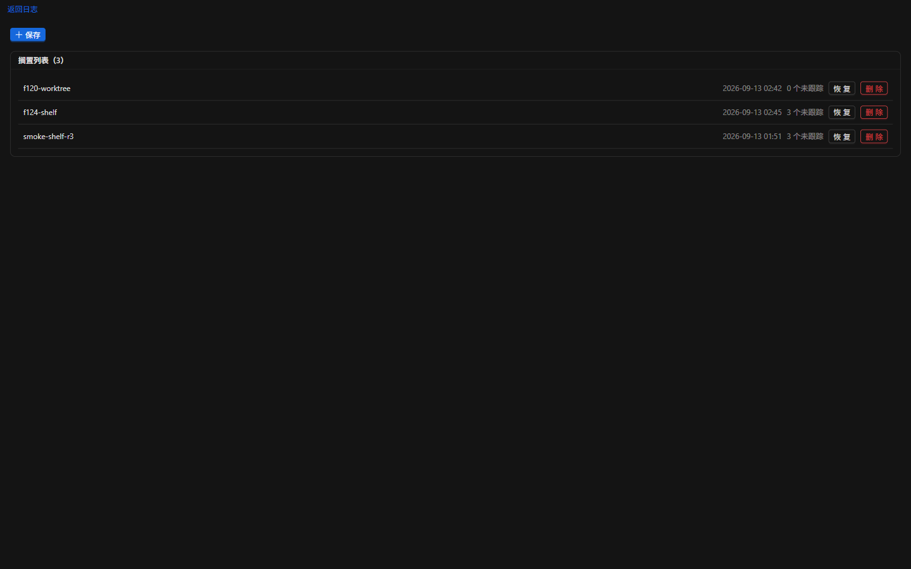

  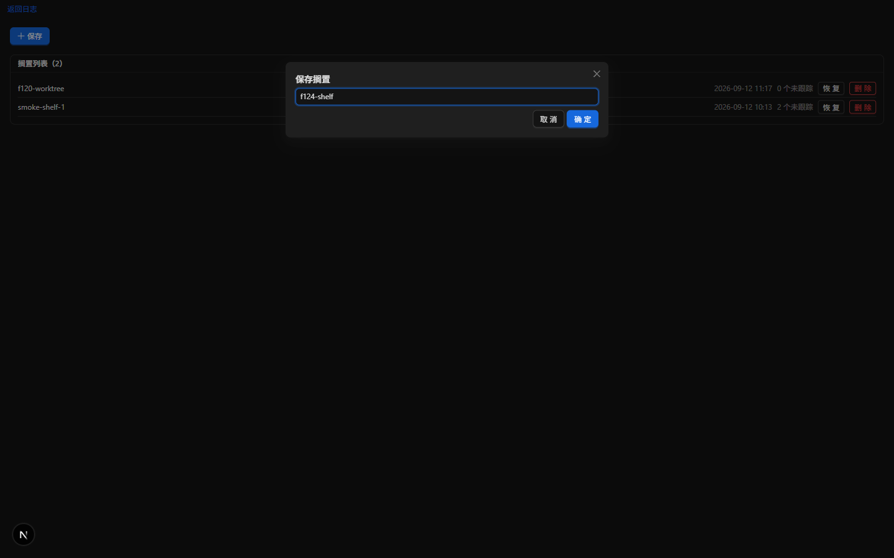

  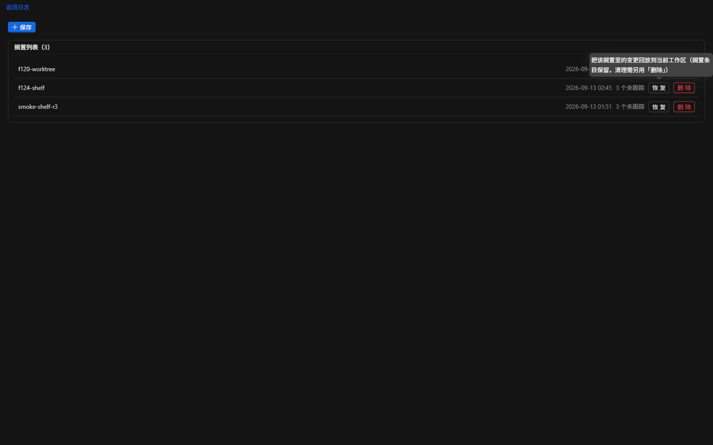

| 功能 | 用途与场景（解决什么） | 如何使用 |
|------|------------------------|----------|
| 保存搁置（F-124） | 把当前全部改动（工作区 + 暂存）连同未跟踪文件存成一个具名快照，留档后再从容干活。 | 点「保存」→ 填搁置名（必填，留空时「确定」禁用）→「确定」。列表出现新条目，第三列显示一起入档的未跟踪文件个数；保存是复制，工作区与暂存区保持原样。从状态页页头「搁置」走同一流程，成功提示「已搁置：<名>」并跳到本页。 |
| 恢复搁置（F-125） | 把搁置里的改动回放到当前工作区——换分支、清空后想找回现场，或把改动搬到别处继续。 | 行内点「恢复」→ 确认「确定恢复搁置 <名>？」→ 补丁部分回写工作区（记在未暂存改动里），未跟踪文件按需回拷。恢复不会删除搁置条目，想清理另点「删除」。 |
| 删除搁置（F-125） | 存档已经没用了，清掉以免列表越堆越长。 | 行内点「删除」→ 确认「确定删除搁置 <名>？」→ 条目从列表消失，工作区不受影响，删掉后无法再恢复。 |
| 恢复后状态页自动更新（F-126） | 恢复完不必手动刷新，状态页/日志页就能看到刚回放出来的变更。 | 在本页点「恢复」后切到变更状态页（或另开一个标签页停在状态页）即可看到新出现的工作区改动与未跟踪文件；服务端每 2 秒比对一次仓库状态并推送，跨标签页也会自动刷新，不用按 F5。 |

- **边界与提示**：
  - 同名搁置已存在会被拒（提示「搁置已存在：<名>」）；换个名字，或先把旧条目「删除」。
  - 搁置是快照——保存不清空工作区、不生成提交；恢复也不删条目，两件事互不影响。
  - 恢复会向工作区回放内容；若工作区已有同样改动导致套不上，会提示「补丁无法应用：…」并且一个文件都不改（先校验后写入），不会覆盖你的现场。
  - 未跟踪文件只补缺不覆盖：目标文件不存在才写入；你若在保存之后又改过同名文件，恢复时保留你当前的版本。
  - 搁置存在应用的存档目录里，不在仓库工作区（不会被提交、也不随仓库一起复制）；从补丁页「导入搁置」来的条目只含补丁里的改动，未跟踪计数为 0。

### 4.23 工作树 WorktreePanel（/repos/:id/worktrees）

- **用途**：把同一个仓库同时检出到多个目录（工作树），并集中管理这些检出目录。
- **解决什么问题**：想「一边修线上问题、一边继续开发」，过去只能先贮藏改动或再克隆一份，然后靠记忆分清哪个目录对应哪条分支；本页把同一仓库的全部检出目录连同分支、提交与状态列在一起，新建与移除都不动主目录。
- **入口**：`日志页顶栏「更多」→「工作树」`（任何仓库都有该项，无可用性门）。
- **界面构成**：仓库顶栏导航（「更多」高亮）+「工作树（N）」卡片；卡头三个按钮「刷新」「创建」「清理」，卡片内每个检出目录一行。
- **配图**：

  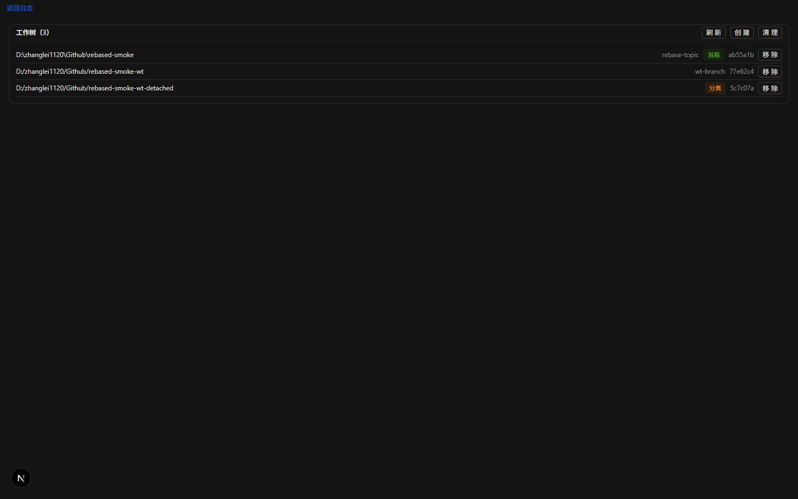

  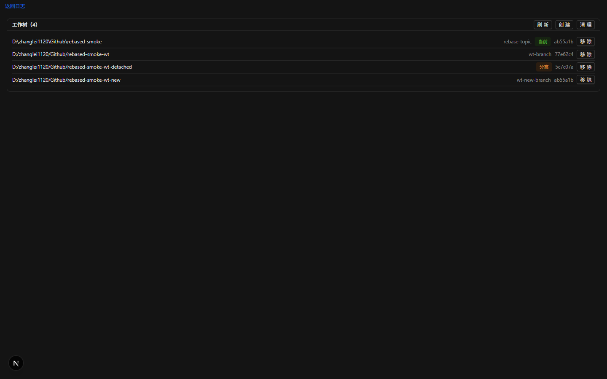

| 功能 | 用途与场景（解决什么） | 如何使用 |
|------|------------------------|----------|
| 工作树列表（F-127） | 一屏看清同一仓库有哪些检出目录、各自停在哪条分支/哪个提交；绿色「当前」标就是你现在打开的仓库目录。 | 打开页面即见；每行从左到右是目录路径、分支名、「当前」绿标（命中当前仓库目录时）或「分离」橙标（该目录处于分离 HEAD）、7 位短哈希、「移除」按钮；卡片标题里的数字是工作树总数。 |
| 工作树创建（F-128） | 不打断手头工作，另开一条并行开发线：同一个仓库、另一个目录、另一条分支。 | 卡头「创建」→ 填「工作树路径」（必填，绝对路径，指向一个尚不存在的新目录）→ 在「关联已有分支」与「创建新分支」两个互斥选项里选一个（默认「关联已有分支」，切换后下方输入框随之更换）并填分支名/新分支名 →「确定」；提示「工作树已创建」，列表立即多一行。 |
| 移除工作树（F-129） | 并行开发结束，注销不再需要的检出目录，回到单目录状态。 | 行内「移除」→ 确认框「确定移除工作树 …？」→「确定」；若该工作树有未提交改动，git 会拒绝并在提示里说明，此时在同一个确认框里勾上「强制移除（--force）」（默认不勾）再确认，其中的改动会一并丢弃；成功提示「工作树已移除」。 |
| 清理失效工作树（F-129） | 目录被手工删掉后，会留下「登记还在、目录没了」的失效条目，清掉它。 | 卡头「清理」→ 确认框「确定清理失效工作树？」→「确定」，提示「已清理失效工作树」；只清失效条目，正常的工作树不受影响。 |

- **边界与提示**：
  - 路径必须落在仓库目录之外：填成仓库内部、仓库的上级、或与仓库/其它工作树相互嵌套（含相对路径）都会被拒，提示「路径无效：…」，且不会残留半成品条目。
  - 不能移除当前正在打开的主工作树（提示「不能移除当前工作树」）；关联已有分支时分支名写错会提示「分支不存在：…」。
  - 路径与对应的分支名都填了，「确定」才可点；创建/移除/清理进行中，卡头三个按钮与行内「移除」全部置灰。
  - 主工作树的路径按仓库注册路径原样显示，其余条目按 git 输出显示，斜杠风格可能一正一反（`D:\…` 与 `D:/…` 混排）属正常。
  - 本页不把工作树登记成仓库；要在新工作树里干活，回首页用「打开」填它的目录。

### 4.24 子模块 SubmodulePanel（/repos/:id/submodules）

- **用途**：查看仓库里引用的子模块状态，并按记录把它们初始化或更新到位。
- **解决什么问题**：子模块「目录怎么是空的」「它怎么停在旧提交上」过去要跑 `git submodule status` 再对照配置文件才知道；本页用四个中文徽标直接说清状态，更新一次点完。
- **入口**：`日志页顶栏「更多」→「子模块」`（任何仓库都有该项；仓库没有子模块时列表为空态）。
- **界面构成**：仓库顶栏导航（「更多」高亮）+「子模块（N）」卡片；卡头「刷新」「递归更新」「更新全部」，卡片内每个子模块一行。
- **配图**：

  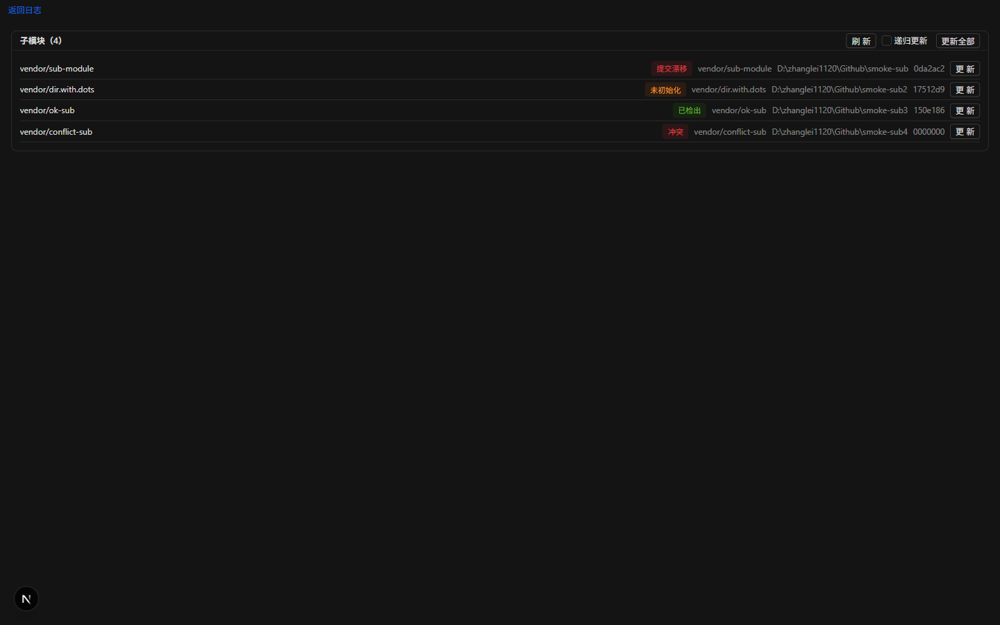

  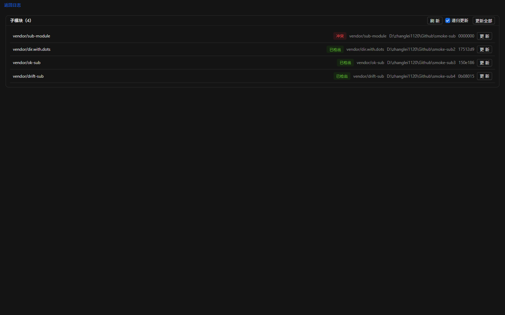

| 功能 | 用途与场景（解决什么） | 如何使用 |
|------|------------------------|----------|
| 子模块状态列表（F-130） | 一眼看出每个子模块能不能用、是否与主仓库记录的提交一致，不必进子模块目录翻 git 输出。 | 打开页面即见；每行是名称、四态徽标、路径、远端地址（名称可含空格与点号，照原样显示），记录里有分支与提交时再补上分支名与 7 位短哈希；徽标含义：「未初始化」橙（内容还没拉下来）、「已检出」绿（检出的提交与主仓库记录一致）、「提交漂移」红（检出的提交与记录不一致）、「冲突」红（合并把子模块指针弄成了冲突）。 |
| 行内更新（F-131） | 只把某一个子模块拉下来，或把它拉回主仓库记录的那个提交。 | 该行「更新」→ 等提示「子模块已更新」；未初始化的会初始化并检出（目录里出现文件），漂移的回到记录的提交，徽标随之变成「已检出」。 |
| 更新全部 + 递归更新（F-131） | 换机器、刚克隆完，或一次要对齐仓库里全部子模块时用。 | 先在卡头决定要不要勾「递归更新」（默认不勾：不勾只更新第一层；勾上连带更新子模块内部的嵌套子模块）→ 点「更新全部」→ 等提示「子模块已更新」与列表刷新；行内「更新」不带递归。 |

- **边界与提示**：
  - 「更新全部」不是点完立刻变：服务端要逐个真跑 git，子模块多时可能耗时数秒到十几秒，期间按钮置灰、列表仍是旧值，等提示出现后如仍未变可点「刷新」再确认。
  - 「冲突」态子模块更新解决不了：那是指针冲突，要在冲突解决页处理，更新后它依旧显示「冲突」。
  - 未初始化子模块行上显示的短哈希是**记录里的**那个提交，不代表目录里已经有内容。
  - 仓库里没有 `.gitmodules` 时列表为空，显示「无子模块 / 未检测到 .gitmodules」；`.gitmodules` 写坏时不会装成空列表，而是红字提示「子模块配置解析失败：…」。
  - 「刷新」只重新读取状态，不动任何子模块的工作区内容。

### 4.25 忽略配置 IgnoreDialog（/repos/:id/ignore）

- **用途**：编辑 `.gitignore` 或 `.git/info/exclude`，让某些文件与目录不再出现在变更列表里。
- **解决什么问题**：过去要自己找到那个忽略文件、记住 glob 写法、还要想清楚「这条规则该让团队共享还是只对自己生效」；本页把两个目标、现成模板与保存放在一个弹窗里。
- **入口**：`日志页顶栏「更多」→「忽略」`；另一个入口在变更状态页——未跟踪行的「忽略」按钮（一键，直接写 `.gitignore`）。
- **界面构成**：页面本身只有仓库顶栏导航（「更多」高亮）与「编辑忽略规则」两个元素，规则编辑全在「忽略配置」弹窗内：目标单选 + 模板下拉 + 10 行文本域。
- **配图**：

  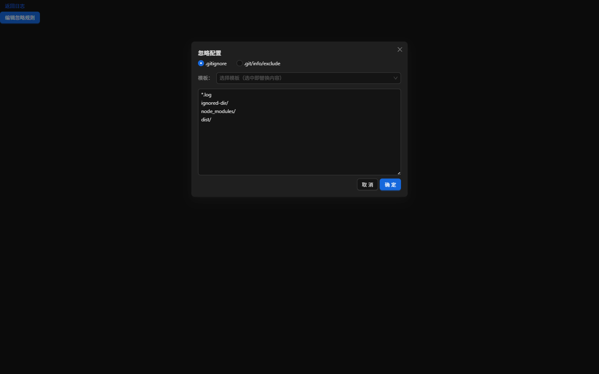

  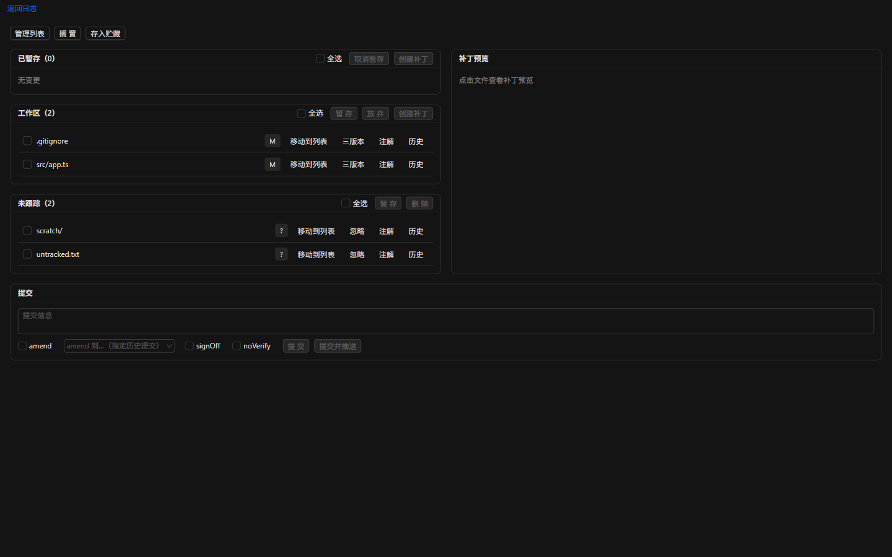

| 功能 | 用途与场景（解决什么） | 如何使用 |
|------|------------------------|----------|
| 双目标选择 .gitignore / .git/info/exclude（F-132） | 决定这套忽略规则给谁看：随提交共享给协作者，还是只在本机生效。 | 弹窗顶部单选切换：「.gitignore」写仓库根目录那个文件，可被提交、团队共享（构建产物、依赖目录等团队规则）；「.git/info/exclude」只在本机生效、不进版本库（个人临时文件、本机专属目录）；切换即换成对应文件的原文，两个目标互不影响。 |
| 模板替换预览（F-132） | 记不住忽略语法的常见套路，直接套一份现成的规则。 | 「模板」下拉选 Node.js（9 行：依赖目录、构建产物、日志、环境变量）、Python（13 行：字节码、虚拟环境、缓存）、通用（11 行：系统杂项文件与 IDE/编辑器目录）→ 文本域立即整体替换为该模板内容（是替换不是追加，原有内容会被顶掉），仍可继续手改；手改后模板选中态自动清空。 |
| 保存（F-132） | 把编辑结果落盘，之后 git 就按这套规则忽略。 | 点「确定」→ 当前所选目标的文件被整份写入（文件不存在则新建），成功即关窗；保存中「确定」按钮转圈并禁用；失败时弹窗不关、编辑内容保留供重试。 |
| 一键忽略未跟踪文件（F-133） | 变更列表里冒出来的临时文件，一键让它别再出现，不用先想规则怎么写。 | 变更状态页未跟踪行右侧「忽略」→ 确认框「忽略文件? 将给 .gitignore 追加 /文件路径 行」→「确定」；该行从变更列表消失，`.gitignore` 末尾多出一行 `/路径`；同一路径再点一次不会重复追加（幂等）。 |

- **边界与提示**：
  - 文本域是 10 行的纯文本框，没有行号与语法高亮；它显示的就是文件全文——保存等于整份覆盖，删掉的行是真删。
  - 选模板只改弹窗里的预览，不点「确定」不落盘；切换目标时未保存的编辑会丢（各目标各自显示自己的原文）。
  - 规则写法与文件一致：一行一条，支持 glob 与 `!` 取反；只给自己看的东西（本机编辑器目录等）放 `.git/info/exclude`。
  - 一键忽略固定写 `.gitignore`，没有选目标的余地；路径含换行或控制字符会被拒（「忽略路径不合法：…」）。
  - 保存后本页内容立即更新；变更状态页每 2 秒自动重读一次仓库状态，被忽略的文件会自己从未跟踪列表消失，无需手工刷新。

### 4.26 GitHub 面板 GitHubPanel（/repos/:id/github）

- **用途**：在仓库里完成 GitHub PR 的浏览、讨论、评审、合并与检出。
- **解决什么问题**：评审 PR 不必切到 GitHub 网页，也不用记「把某个 PR 取回本地」的命令；列表、逐行差异、讨论、合并与检出都收在同一个页面里。
- **入口**：顶栏「更多」→「GitHub 面板」（该仓库的远程是 github.com 形态时才出现这一项；任何仓库页同一入口，本页时「更多」高亮）／面板页顶栏「设置」去设置页。
- **界面构成**：上排状态页签「打开 / 已关闭」，下排左右两栏——左卡「拉取请求（N）」是 PR 列表，右卡「PR #N」是选中 PR 的详情（标题、元信息、评论输入框、操作按钮，以及「时间线 / 文件」两个页签）；没选中 PR 时右卡整块不出现。
- **配图**：

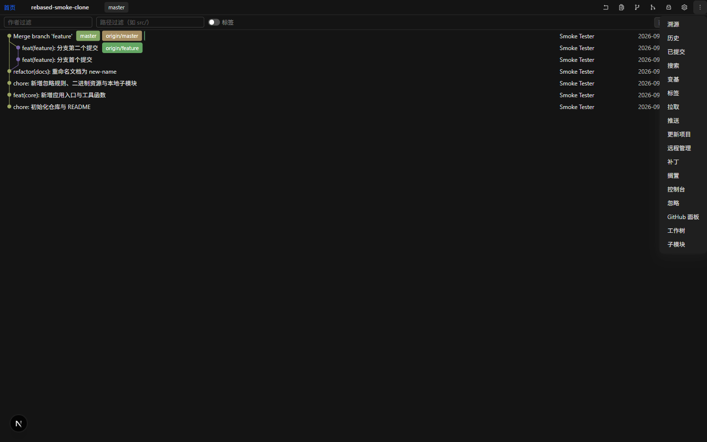

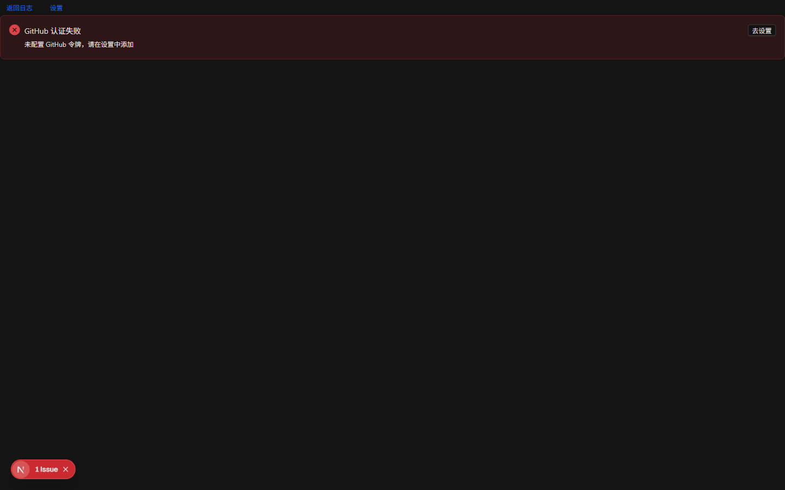

| 功能 | 用途与场景（解决什么） | 如何使用 |
|------|------------------------|----------|
| 面板入口与远程检测（F-134） | 只在真的是 GitHub 仓库里给入口，无关仓库不出现打不开的面板项 | 日志页顶栏「更多」→ 看有没有「GitHub 面板」一项；远程为 `https://github.com/拥有者/仓库[.git]` 或 `git@github.com:拥有者/仓库[.git]` 时出现，其它域名与本地路径不出现 |
| 令牌录入与认证降级（F-135） | 把个人访问令牌交给应用，PR 数据才能读；没配或配错时给出可执行的下一步 | 设置页 →「账户」卡 →「添加账户」：主机填 `github.com`（写 `https://github.com` 也会被规范化成主机名）、账户名、访问令牌三项都填才能「确定」，保存后账户行只显示掩码；缺令牌或令牌无效时，面板位置显示红卡「GitHub 认证失败」，描述取服务端原文（「未配置 GitHub 令牌，请在设置中添加」／「GitHub 认证失败：Bad credentials」），右侧「去设置」直达设置页 |
| PR 列表与状态页签（F-136） | 一屏看清编号、标题、作者、状态与更新时间，不用逐个开网页确认 | 页签「打开 / 已关闭」切换列表（缺省「打开」）；行内容 = `#编号`、标题、作者、状态徽标（open 绿 / closed 灰），已合并的再跟一个蓝色「已合并」徽标，末尾是更新时间；点行即选中并在右栏打开详情；左卡右上「刷新」重取列表与当前详情（不改选中项）；列表为空显示「暂无拉取请求」 |
| PR 详情（F-136） | 不离开客户端就能读到 PR 的说明、来源去向、评审结论与改动规模 | 列表点一行 → 右卡「PR #N」：标题、作者、`#编号`、`目标分支 ← 来源分支`（过长截断，悬停看全称）、评审结论徽标（APPROVED 绿 / CHANGES_REQUESTED 橙 / REVIEW_REQUIRED 红；没有结论时不显示）、`+新增` `-删除` 行数与正文（保留换行）；详情加载中显示转圈 |
| 时间线与发送评论（F-136） | 按时间顺序看这个 PR 上发生过什么，并就地回复，不用另开网页 | 详情下方「时间线」页签，条目按时间从旧到新：每行 = 「评论」或「审查」徽标（审查条目再带 APPROVED / CHANGES_REQUESTED / COMMENTED 结论徽标）+ 作者 + 时间 + 正文；在上方输入框写内容 → 「发送评论」；输入为空时按钮禁用（悬停提示「先输入评论内容：空内容不发送」），发送成功后输入框清空、时间线就地更新；无动态时显示「暂无动态」 |
| 审查：批准与要求修改（F-137） | 在客户端给出评审结论，省掉「Review changes」那套网页操作 | 「Approve」→ 确认框「批准该 PR？」→「确定」：记录一次批准，不附带评论内容；「Request changes」→ 确认框「要求修改该 PR？将附带上方的评论/说明内容」→「确定」：把上方输入框的文字作为评审说明一起提交（输入框为空时只提交「要求修改」这个结论）；完成后详情的评审结论徽标随之变化 |
| 逐 hunk 差异视图（F-138） | 按改动块逐段对照两侧代码，替代「在网页上从头滚一整份 diff」 | 详情「文件」页签：文件行 = 状态徽标（added 绿 / modified 蓝 / removed 红 / renamed 紫）、路径、`+新增` `-删除` → 点「查看差异」展开、点「收起差异」合上；每个 hunk 一块，块头是等宽的 `@@ -原侧起始,行数 +新侧起始,行数 @@` 行号头加该块的定位串（超出宽度截断），下面是左右两侧只读对照（高度随行数自适应，最高约 320px）；重命名且无内容变更时提示「该文件仅重命名（无内容变更）」，有内容但切不出改动块（二进制或超限截断）时提示「无可用的行级差异（二进制文件或超限截断）」；文件列表为空显示「暂无文件变更」 |
| 行级评审评论（F-138） | 把意见钉在某一行上，不必用文字描述「大概在第 87 行那里」 | 展开差异后，在每个 hunk 下方选行号 → 填内容 → 「发送」：行号下拉只列本 hunk 新侧的行（默认新侧首行，文案为「第 N 行」），输入框回车与点「发送」等效，内容为空时「发送」禁用；发送成功后输入框清空、行号保留上次选择；已有评论按所属 hunk 挂在该块下方，格式「新侧 N 行 · 作者 · 时间」+ 正文 |
| 三种合并策略（F-139） | 在客户端完成合并，并自己决定目标分支上留下哪种提交历史 | 详情操作区「合并」→ 弹窗「合并 PR #N」→ 选一种（默认「创建合并提交」，另有「压缩为单个提交」「变基合并」，各自悬停有历史形态说明）→「确定」：成功提示「PR #N 已合并」，列表与详情标记为已合并；服务端不接受时按其原文弹出黄色警告，且不标记已合并；关闭弹窗会把选择复位为默认 |
| 检出 PR 分支（F-139） | 想在本机改动或运行这个 PR 的代码时，一条操作就把分支取到本地 | 详情操作区「检出 PR 分支」→ 成功后提示「已检出 pr-N」，本地工作区切到分支 `pr-N`；该分支本地已存在时直接切过去、不再重复拉取；之后回日志页即可看到当前分支与状态已随之更新 |

- **边界与提示**：
  - 两个前提缺一不可：远程地址是 github.com 形态（否则「更多」菜单里连「GitHub 面板」都没有），且设置页「账户」卡里有主机为 github.com 的访问令牌。
  - 无令牌或令牌无效时，页面显示红色「GitHub 认证失败」卡替代整个面板（描述即服务端原文，右侧「去设置」）；面板自身的兜底文案是「未检测到 GitHub 远程」与「未配置 GitHub 令牌，请在设置中添加」。
  - 「刷新」只重取 PR 列表、当前详情、时间线、文件与行级评论，不重新检测远程与令牌；配好令牌后要重新进入该页才会重新检测。
  - 列表只有「打开」「已关闭」两个页签，没有「全部」，也没有按作者筛选；已合并的 PR 归在「已关闭」下，靠蓝色「已合并」徽标区分。行内只标状态与是否已合并，不显示草稿、冲突或能否合并。
  - 行级评论锚定新侧行号：评论所在行不在任何改动块的范围内时（例如远端被强推过），差异视图里看不到它，但它仍会出现在时间线；改动过大时 GitHub 不提供差异内容，那个文件行不会出现「查看差异」按钮。操作进行中所有按钮都会禁用，悬停提示「上一个操作进行中：完成后才能…」。

### 4.27 GitLab 面板 GitLabPanel（/repos/:id/gitlab）

- **用途**：在仓库里完成 GitLab MR 的浏览、新建、讨论、评审、合并与检出。
- **解决什么问题**：MR 评审不必切到 GitLab 网页；建 MR、逐行讨论、批准或要求修改、squash 合并与检出都在同一页完成。
- **入口**：顶栏「更多」→「GitLab 面板」（该仓库的远程是 gitlab.com 形态时才出现这一项；任何仓库页同一入口，本页时「更多」高亮）／面板页顶栏「设置」去设置页。
- **界面构成**：上排状态页签「打开 / 已合并」，下排左右两栏——左卡「合并请求（N）」（卡头有「刷新」与「新建 MR」）是 MR 列表，右卡「MR #iid」是选中 MR 的详情（标题、元信息、评论输入框、操作按钮，以及「时间线 / 文件」两个页签）；没选中 MR 时右卡整块不出现。
- **配图**：

| 功能 | 用途与场景（解决什么） | 如何使用 |
|------|------------------------|----------|
| 面板入口与远程检测（F-140） | 只在真的是 GitLab 仓库里给入口，不显示打不开的面板项 | 日志页顶栏「更多」→ 看有没有「GitLab 面板」一项；远程为 `https://gitlab.com/组[/子组]/项目[.git]` 或 `git@gitlab.com:组[/子组]/项目[.git]` 时出现（含子组的路径同样识别），其它域名与本地路径不出现 |
| 令牌录入与认证降级（F-140） | 把个人访问令牌交给应用，MR 数据才能读；没配或配错时给出下一步 | 设置页 →「账户」卡 →「添加账户」：主机填 `gitlab.com`（写 `https://gitlab.com` 也会被规范化）、账户名、访问令牌三项都填才能「确定」；缺令牌或令牌无效时，面板位置显示红卡「GitLab 认证失败」，描述取服务端原文（「未配置 GitLab 令牌，请在设置中添加」），右侧「去设置」直达设置页 |
| 新建 MR（F-141） | 不必开网页就能从当前仓库发起合并请求 | 左卡右上「新建 MR」→ 弹窗「新建合并请求」：选源分支、选目标分支（下拉列出本仓库已有分支）、填标题（必填，最长 255 字，带字数计数）、填描述（可选，最长 20000 字，留空则不带描述）→「确定」；源与目标选成同一分支时红字提示「源分支与目标分支不能相同」且「确定」不可点，标题只有空格也不能提交；成功后提示「已创建 MR #iid」，弹窗关闭并清空输入，新 MR 直接出现在「打开」列表首位 |
| MR 列表与状态筛选（F-141） | 一屏看清编号、标题、作者、状态与更新时间 | 页签「打开 / 已合并」切换列表（缺省「打开」）；行内容 = `#iid`、标题、作者、状态徽标（opened 绿 / merged 紫 / closed 灰 / locked 橙）、更新时间；点行即选中并在右栏打开详情；卡头「刷新」重取列表与当前详情（不改选中项）；列表为空显示「暂无合并请求」 |
| MR 详情（F-141） | 集中看到 MR 的说明、来源去向与评审结论 | 列表点一行 → 右卡「MR #iid」：标题、作者、`#iid`、`源分支 → 目标分支`（过长截断，悬停看全称）、评审结论徽标（APPROVED 绿 / CHANGES_REQUESTED 橙；没有结论时不显示）与正文（保留换行）；其中的增删行数恒为「+0」「-0」，不能当改动规模看 |
| 时间线与发送评论（F-141） | 按时间顺序看 MR 上发生过什么，并就地回复 | 详情下方「时间线」页签把讨论记录与审查记录按时间从旧到新合并：每行 = 「评论」或「审查」徽标（审查条目再带结论徽标）+ 作者 + 时间 + 正文；输入框写内容 → 「发送评论」，内容为空时按钮禁用（悬停提示「先输入评论内容：空内容不发送」），发送成功后输入框清空、时间线就地更新；无动态时显示「暂无动态」 |
| 逐 hunk 差异视图（F-142） | 按改动块逐段对照两侧代码，和 GitHub 面板同一套视图 | 详情「文件」页签：文件行 = 状态徽标（added 绿 / modified 蓝 / removed 红 / renamed 紫）、路径、`+0` `-0` → 点「查看差异」展开、点「收起差异」合上；每个 hunk 一块，块头是等宽的 `@@ -原侧起始,行数 +新侧起始,行数 @@` 行号头加定位串，下面是左右两侧只读对照（高度随行数自适应，最高约 320px）；重命名且无内容变更时提示「该文件仅重命名（无内容变更）」，有内容但切不出改动块时提示「无可用的行级差异（二进制文件或超限截断）」；文件列表为空显示「暂无文件变更」 |
| 行级讨论（F-142） | 把意见钉在某一行上，形成可回溯的行内讨论 | 展开差异后，在每个 hunk 下方选行号 → 填内容 → 「发送」：行号下拉只列本 hunk 新侧的行（默认新侧首行，文案为「第 N 行」），回车与点「发送」等效，内容为空时禁用；发送成功后输入框清空、行号保留上次选择；已有讨论按「文件 + 新侧行号」挂在该块下方，格式「新侧 N 行 · 作者 · 时间」+ 正文 |
| 审查：三映射（F-143） | 批准、要求修改、普通评论三种意见各有出口，避免用错按钮 | 「Approve」→ 确认框「批准该 MR？」→「确定」：记录一次批准；「Request changes」→ 确认框「要求修改该 MR？仅提交「要求修改」结论」→「确定」：记录一次「已拒绝」的审查（输入框里的文字不会随之提交，也不会被清空）；要留说明就先在「发送评论」里发出，那是一条普通讨论；完成后详情的评审结论徽标随之变化 |
| 合并与 squash（F-143） | 在客户端合并 MR，并决定是否把分支上的提交压成一个 | 详情操作区「合并」→ 弹窗「合并 MR #iid」→ 需要时勾选「squash：压缩为单个提交」（默认不勾选）→「确定」：成功提示「MR #iid 已合并」，列表项状态变为已合并；GitLab 拒绝合并时（如存在冲突或流水线未通过）按其原文弹出黄色警告，且不标记已合并；关闭弹窗会把勾选复位 |
| 检出 MR 分支（F-144） | 想在本机改动或运行这个 MR 的代码时，一条操作就把分支取到本地 | 详情操作区「检出 MR 分支」→ 成功后提示「已检出 mr-N」，本地工作区切到分支 `mr-N`；该分支本地已存在时直接切过去、不再重复拉取；之后回日志页即可看到当前分支与状态已随之更新 |

- **边界与提示**：
  - 前提与 GitHub 面板相同：远程地址是 gitlab.com 形态（含子组路径），且在设置页「账户」卡里配了主机为 gitlab.com 的令牌；无令牌时显示「GitLab 认证失败」卡加「去设置」。
  - 列表只有「打开」「已合并」两个页签：已关闭（closed）与已锁定（locked）的 MR 在面板里看不到（徽标配色为它们留了位置），也没有按作者筛选。
  - GitLab 不提供逐 MR、逐文件的增删行数：详情与文件行的「+0」「-0」是恒定占位，改动多少要看差异内容。
  - 「Request changes」只提交「要求修改」这一结论，输入框里的文字不会随之提交、也不会被清空；要留下说明请改用「发送评论」。
  - 新建 MR 的源/目标分支只能从本仓库已有的本地分支里选，缺分支要先在分支页建好或拉取；行级讨论同样只锚定新侧行号，没有行号锚点的讨论以及部分实例取不到的审查记录，都只在时间线里能看到。

### 4.28 命令控制台 GitConsole（/repos/:id/console）

- **用途**：查看应用在后台为这个仓库执行过的 git 命令、退出码、耗时与错误输出。
- **解决什么问题**：页面上操作没成功时，过去只能猜「它到底跑了什么」；本页把真实命令与 git 报的错摊开，一眼知道是认证、网络还是仓库状态的问题。
- **入口**：`日志页顶栏「更多」→「控制台」`。
- **界面构成**：仓库顶栏导航（「更多」高亮）+「Git 控制台」卡片；卡头「刷新」，卡片内每条命令一行（失败行的下一行是红色错误小字）。
- **配图**：

  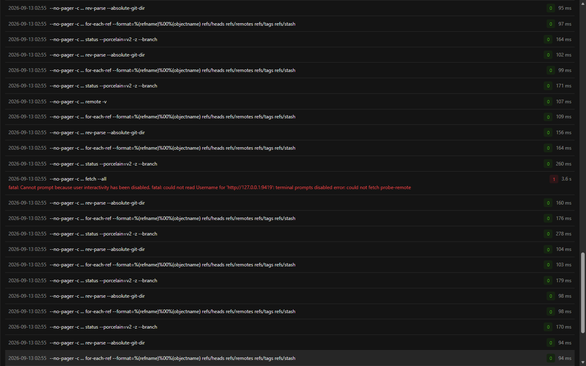

  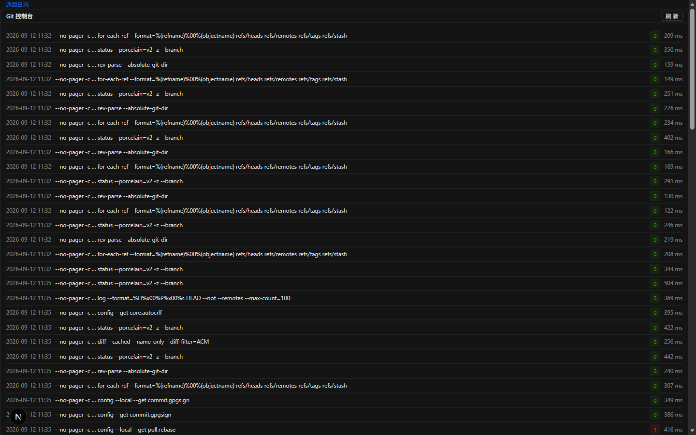

| 功能 | 用途与场景（解决什么） | 如何使用 |
|------|------------------------|----------|
| 命令记录列表（F-145） | 看清每次操作背后真正执行的 git 命令与结果，定位失败原因。 | 打开页面即见；每行从左到右是执行时间（`YYYY-MM-DD HH:mm`）、命令参数、退出码徽标（0 绿、非 0 红，git 根本没启动起来记 -1，同样标红）、耗时（≤1000 显示毫秒，超过显示秒）；记录按发生顺序自上而下排列，最新一条在最下面。 |
| 失败原因（stderr 尾）（F-145） | 不用猜「为什么失败」：git 的错误原文就在这一行下面。 | 无需操作：失败行下方多一行红色小字，内容是 git 错误输出的末尾（例如缺少凭据、无法连接远端）；成功行没有这行小字，所以扫一眼有没有红字就知道哪些命令出过问题。 |
| 令牌剥离（F-145） | 远程操作会用到访问令牌，令牌不会出现在这个页面上，截图或复制日志都安全。 | 无需操作：带令牌的启动参数（形如 `-c http.extraHeader=…`）在写记录前就被整对丢掉，页面上与接口返回里都搜不到令牌文本；命令本身照常带着令牌发出去，只是记录里看不到。 |
| 刷新（F-145） | 刚在别的页面做完操作，想让记录跟上。 | 卡头「刷新」重新拉取最近的命令记录；它只读日志，不会重跑任何命令。 |
| 命令参数折叠 `-c …`（F-146） | 命令前面叠着一长串启动配置时收掉噪音，只留真正的子命令。 | 无需操作：`-c` 与其后的配置值会被折叠成一个 `-c …` 占位（例如显示成 `--no-pager -c … status --porcelain=v2`），一眼看出这条命令带过启动配置，子命令本身仍完整可读；孤立出现的 `-c` 原样显示。 |

- **边界与提示**：
  - 条数上限：本页只取最近 100 条（接口最多可给 500），后台缓冲每个仓库只保留最近 200 条——更早的记录已被滚掉，页面上找不回来。
  - 记录按仓库目录分开保存（换仓库、换到工作树目录看到的是另一份记录）。
  - 只记录通过本应用执行、且真正跑起来的 git 命令；你在终端里敲的命令不会出现在这里。
  - 时间列按记录时刻的 UTC 值显示、不做时区换算，与本地时钟可能差数小时，只用于比对先后顺序。
  - 本页只读：没有清空与导出入口；失败的命令要回到对应页面重试，而不是在这里点。

### 4.29 快捷操作聚合 QuickActionsMenu（日志页顶栏 +「更多」菜单 + 操作条）

- **用途**：把仓库的全部常用操作收进日志页顶栏：页面入口按钮、最多 18 项的「更多」菜单与进行中操作条。
- **解决什么问题**：没有它就得靠快捷键、右键、开终端凑齐拉取/推送/贮藏/标签/子模块等入口；现在「这个仓库现在能做什么」全摊在顶栏一处，点一下就到。
- **入口**：首页打开仓库 → `/repos/:id` 日志页顶栏；`顶栏「变更」/「分支」/「合并」/「贮藏」/「设置」` ／ `顶栏「更多」（省略号图标）` ／ `顶栏「撤销最近提交」（回退箭头图标）` ／ `顶栏最左「首页」链接`。
- **界面构成**：一行顶栏分左右两端——左端「首页」链接 + 仓库名 + 分支状态条（分支名 chip + 待拉取蓝点/待推送绿点）+ 进行中操作条；右端依次为 撤销最近提交 / 变更 / 分支 / 合并 / 贮藏 / 设置 / 更多 七个图标按钮，每个都有可读名称与悬停说明。
- **配图**：

  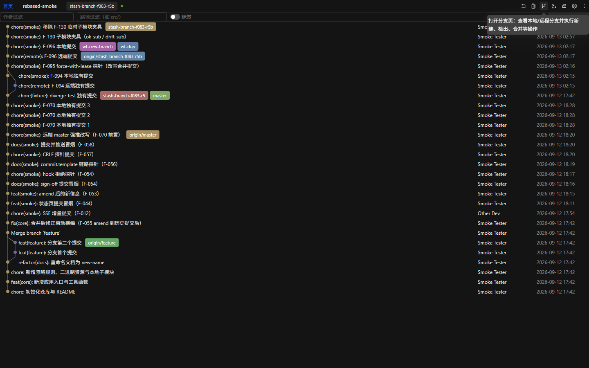

  

  

| 功能 | 用途与场景（解决什么） | 如何使用 |
|------|------------------------|----------|
| 顶栏「变更」（F-148） | 进改动页看工作区与暂存区改了什么；提交前必看 | 点「变更」（差异图标）→ `/repos/:id/status` |
| 顶栏「分支」（F-147） | 原「分支快捷弹窗」的等效落点：新建/检出/删除/合并分支、清理已合并分支 | 点「分支」（分支图标）→ `/repos/:id/branches` |
| 顶栏「合并」（F-148） | 把别的分支或提交并进当前分支 | 点「合并」→ `/repos/:id/merge` |
| 顶栏「贮藏」（F-148） | 临时收走未提交改动，或把已有贮藏取回工作区 | 点「贮藏」→ `/repos/:id/stashes` |
| 顶栏「设置」（F-148） | 只改本仓库的 git 配置与 GPG 提交签名 | 点「设置」→ `/repos/:id/settings`（应用级项在首页「设置」） |
| 「撤销最近提交」（F-148） | 提交错了/漏了文件：回退最近一笔提交，改动原样留在暂存区 | 点回退箭头 → 确认框「将撤销最近提交并保留改动到暂存区」→「确定」；等价 `reset --soft HEAD~1` |
| 顶栏最左「首页」 | 离开当前仓库回欢迎屏；不改动仓库里的任何内容 | 点「首页」链接 → `/` |
| 顶栏「更多」 | 只读浏览 + 本地操作 + 远程操作的总入口（可读名「更多」） | 点省略号图标展开下表 18 项全集；**实际项数随托管远程变化：无托管远程 16 项、仅 GitHub 或仅 GitLab 17 项、两者都有 18 项** |
| 更多 →「溯源」（F-148） | 逐行看某个文件每行最后由谁改的，顺带看它的提交记录与每次改动 | 点「溯源」→ `/repos/:id/blame`（进页后在左栏树里选文件，或直接在路径框里输入） |
| 更多 →「历史」（F-148） | 只看改动过某个文件的提交 | 点「历史」→ `/repos/:id/history`（页内填路径） |
| 更多 →「已提交」（F-148） | 按提交逐条浏览已提交的变更（左侧提交列表 + 右侧目录树） | 点「已提交」→ `/repos/:id/committed` |
| 更多 →「搜索」（F-148） | 按提交信息、作者或文件内容在整仓历史里检索 | 点「搜索」→ `/repos/:id/search` |
| 更多 →「变基」（F-148） | 把当前分支的提交重新应用到指定基底（会重写提交哈希） | 点「变基」→ 打开「变基」对话框（留在本页）；简单模式填基底，或切交互模式逐行编排 pick/reword/squash/fixup/drop |
| 更多 →「标签」（F-148） | 查看、创建、推送、删除标签 | 点「标签」→ `/repos/:id/tags` |
| 更多 →「拉取」（F-148） | 从远程取回最新提交并合入当前分支 | 点「拉取」→ 打开「拉取」对话框（留在本页） |
| 更多 →「推送」（F-148） | 把当前分支的本地提交推到远程跟踪分支 | 点「推送」→ 打开「推送」对话框（留在本页） |
| 更多 →「更新项目」（F-148） | 按配置的同步策略（合并或变基）把当前分支更新到远程 | 点「更新项目」→ 打开「更新项目」对话框（留在本页） |
| 更多 →「远程管理」（F-148） | 查看、新增、编辑、删除远程地址，单个远程 fetch | 点「远程管理」→ `/repos/:id/remotes` |
| 更多 →「补丁」（F-148） | 把改动导出成补丁文件，或把补丁应用到工作区 | 点「补丁」→ `/repos/:id/patches` |
| 更多 →「搁置」（F-148） | 把当前改动整份存档（保存后工作区不变） | 点「搁置」→ `/repos/:id/shelves` |
| 更多 →「控制台」（F-148） | 看本仓库执行过的 git 命令、退出码、耗时与报错尾巴 | 点「控制台」→ `/repos/:id/console`（页内「刷新」重取记录，不会重跑命令） |
| 更多 →「忽略」（F-148） | 把文件或目录写进 `.gitignore`，之后不再算未跟踪 | 点「忽略」→ `/repos/:id/ignore` |
| 更多 →「GitHub 面板」（F-148） | 看该仓库关联的 PR、议题与动态 | **检测到 GitHub 远程才出现**；点它 → `/repos/:id/github` |
| 更多 →「GitLab 面板」（F-148） | 看该仓库关联的 MR、议题与动态 | **检测到 GitLab 远程才出现**；点它 → `/repos/:id/gitlab` |
| 更多 →「工作树」（F-148） | 同一仓库多目录检出：查看、新增、移除工作树 | 点「工作树」→ `/repos/:id/worktrees` |
| 更多 →「子模块」（F-148） | 查看嵌套仓库状态、初始化或更新子模块 | 点「子模块」→ `/repos/:id/submodules` |
| 操作条：进行中操作状态（F-148） | 合并/变基/摘樱桃/还原卡在半路时的状态提示与退出通道 | **仓库处于上述四种操作中途时**，顶栏分支名旁出现琥珀色状态标签（「合并中」「变基中（第 n/m 步）」「拣选中」「还原中」）+ 红色「中止」按钮；点「中止」→ 确认框「确定中止当前操作？工作区将回到操作前状态」→「确定」 |
| 操作条：「去解决冲突」链接（F-148） | 合并冲突时一步跳到冲突页 | **只在「合并中」时出现**（紧跟操作条右侧）；点它 → `/repos/:id/conflicts` |

- **边界与提示**：菜单项按可用性出现——容器没接上的入口直接不渲染，全都接不上时连「更多」按钮本身都不出现；「GitHub 面板」「GitLab 面板」各需检测到对应远程，这就是 16/17/18 项之差。「撤销最近提交」必须过确认框，撤销后改动在暂存区，不会丢。「中止」只在日志页有，人在子页面时想中止要先回日志页。「去解决冲突」只有合并中有；变基/摘樱桃/还原撞上冲突会自动跳到冲突页，不出现这个链接。原「快捷操作弹窗」独立组件明确不做，本小节即它的等效形态；`Alt+\`` 一类快捷键不做。

### 4.30 设置页（应用设置 / 仓库设置）

- **用途**：配置应用全局偏好与单个仓库 Git 选项的两个设置页。
- **解决什么问题**：改主题、换签名密钥、调换行符策略以前都要开终端敲 `git config`，还得记住键名和作用域（全局还是只对这个仓库）。这里把常用项做成表单，并把「对所有仓库生效」与「只对本仓库生效」分成两个页面，保存到哪儿不再靠猜。
- **入口**：首页顶栏「设置」→ 应用设置 `/settings` ／ 仓库日志页顶栏「设置」图标 → 仓库设置 `/repos/:id/settings`。
- **作用域差异**：应用设置写全局配置，与当前仓库无关、对所有仓库生效；仓库设置只写当前仓库的 `.git/config`，换一个仓库就是另一份。
- **界面构成**：两页都是「顶部一行返回链接 + 互跳链接，其余为一列卡片」，所有控件为紧凑小尺寸。

**应用设置 `/settings`**

- **入口**：首页最右的「设置」按钮（最近仓库列表上方那一行）；页顶「返回首页」回列表。
- **界面构成**：自上而下四张卡片——「应用设置」（编辑器开关 + 界面主题）、「保护分支」、「Git 可执行文件」、「账户」。
- **配图**：

  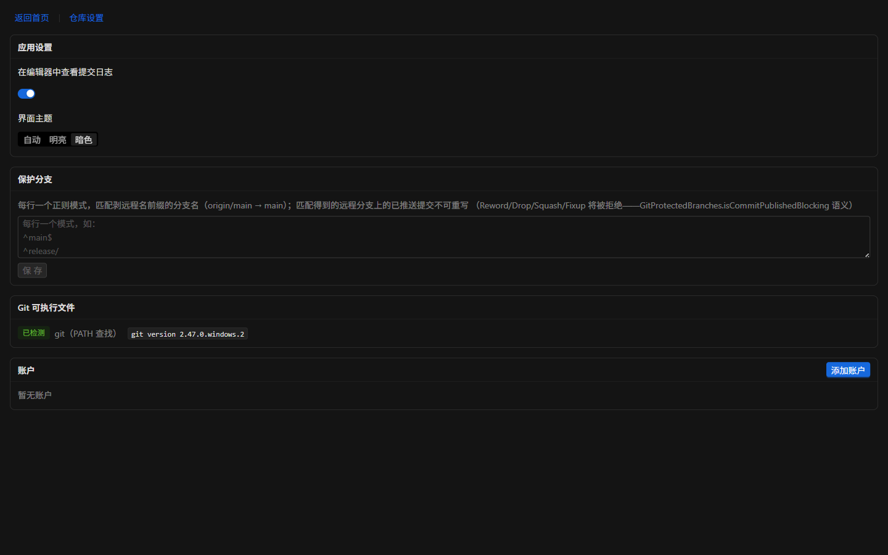

  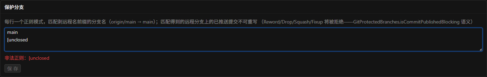

| 功能 | 用途与场景（解决什么） | 如何使用 |
|------|------------------------|----------|
| 应用设置读写（F-149） | 换浏览器、清缓存都不用重设偏好；值存在服务端，刷新或重启服务后仍在 | 「应用设置」卡片里拨「在编辑器中查看提交日志」开关，拨完即保存，无需点保存按钮；刷新页面或重启服务后开关保持原状态 |
| 界面主题（F-149） | 白天要亮色看得清、夜里要暗色不刺眼 | 同卡片「界面主题」在「自动／明亮／暗色」三选一：自动跟随操作系统明暗偏好，明亮与暗色为显式指定；首次使用默认暗色；选完全站立即生效（含页面底色与代码编辑器）并持久化 |
| 账户/令牌管理（F-151） | 免去每次拉取、推送都要输账号密码或令牌；凭据只存本机，可供需要认证的远程操作使用 | 「账户」卡片右上「添加账户」→ 填主机（如 github.com）、账户名、访问令牌，三项都非空才能点「确定」→ 列表显示主机、账户名与掩码令牌；同主机 + 同账户名再次保存是覆盖原记录；行尾「删除」→ 在确认气泡里再点「确定」（气泡写明是哪台主机的哪个账户） |
| 集中存储（F-152） | 设置不散落：偏好、最近仓库、账户都写在同一份应用配置文件里，重启服务后原样恢复 | 改任意一项设置 → 重启服务或刷新页面 → 重开应用设置页，值仍在；最近仓库列表与账户列表同样自动恢复 |
| Git 可执行文件检测（F-153） | 排查「提交、拉取全都失败」这类问题：先确认服务端找得到 git | 打开应用设置页即自动检测：「Git 可执行文件」卡片正常时显示绿色「已检测」+ `git（PATH 查找）`+ 版本串（如 `git version 2.47.0.windows.2`）；未检出时显示黄色「未检测到可用的 git 可执行文件」，并提示安装 Git、确保服务进程的 PATH 里能执行 git 命令 |
| 保护分支设置（F-155） | 防止重写已推送到主干/发布分支的提交（改写公共历史会坑到别人） | 「保护分支」卡片文本框里每行写一个正则模式（如 `^main$`、`^release/`；写 `main` 也能匹配到剥掉 `origin/` 前缀后的分支名）→ 点「保存」；某行正则非法时卡片内红字「非法正则：」并附上该行原文，且「保存」禁用；保存成功后，这些远程分支上已推送的提交再做 Reword／Drop／Squash／Fixup 会被拒绝，提示「目标提交已推送到受保护分支，不可重写」 |

**仓库设置 `/repos/:id/settings`**

- **入口**：顶栏「设置」图标按钮（任何仓库页同一入口，本页时该按钮高亮）。
- **界面构成**：两张卡片——「Git 配置（仓库级）」9 行（每行：键名 + 生效值 + 覆盖输入框 + 行尾「保存」）、「GPG 提交签名」（状态行 + 右上「配置…」）。
- **配图**：

  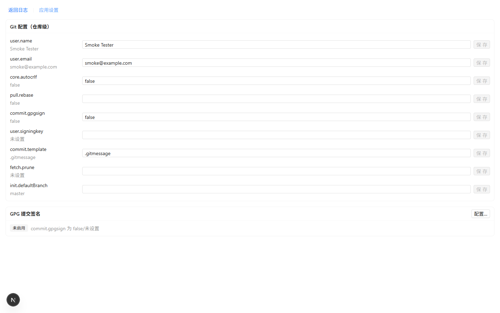

| 功能 | 用途与场景（解决什么） | 如何使用 |
|------|------------------------|----------|
| Git 配置（仓库级）9 键读写（F-150） | 查看并覆盖影响本仓库行为的常用配置，不用开终端、不用记键名 | 每行左侧是键名与当前生效值（本仓库 > 全局 > 系统合并的结果，没设过显示「未设置」），右侧输入本仓库的覆盖值 → 点该行「保存」→ 写入本仓库 `.git/config`；可配置的 9 个键：`user.name`、`user.email`、`core.autocrlf`、`pull.rebase`、`commit.gpgsign`、`user.signingkey`、`commit.template`、`fetch.prune`、`init.defaultBranch` |
| GPG 提交签名配置（F-154） | 让本仓库的提交带上签名（合规、可验签），不用记两条 git config | 「GPG 提交签名」卡片显示「已启用」（附密钥 ID 与描述）或「未启用：commit.gpgsign 为 false/未设置」→ 点「配置…」→ 勾「为仓库提交签名（commit.gpgsign）」并从密钥下拉选私钥（未勾选或未选密钥时「确定」禁用）→ 「确定」后卡片状态更新；取消勾选只写 `commit.gpgsign=false`，不会清掉已保存的 `user.signingkey` |

- **边界与提示**：
  - 别混两页：首页「设置」进的是应用设置（全局生效），日志页顶栏「设置」进的是仓库设置（只写当前仓库）；两页顶部可互跳，应用设置页的「仓库设置」在没有任何最近仓库时禁用（此时无从指定要配置哪个仓库）。
  - 「Git 配置」左侧的「生效值」只说明当前生效结果，不代表已写进本仓库——必须点该行「保存」才落到本仓库；9 行内容都没改动时「保存」全是禁用的，且值不能为空、最长 500 字符。
  - 账户令牌只上行不下行：列表只显示前 4 位加 `***`（令牌长度 ≤4 位时整串掩码），保存后无法再看原文；账户以「主机 + 账户名」为键，删除只清本机记录，不影响远端服务器上的账号。
  - GPG 弹窗在系统里没有可用私钥时给黄色提示「未找到可用的 gpg 密钥」，「为仓库提交签名」勾选框与密钥下拉都禁用（「确定」仍可点，等于写 `commit.gpgsign=false`，用于关掉旧配置）；启用签名后若签名的私钥不可用，提交会失败。
  - 「在编辑器中查看提交日志」开关目前只保存偏好，切换不会改变 Web 端日志的打开方式。

### 4.31 日志页就地快照栏与文本复制

- **用途**：不离开日志页就能核对某一版的文件树与文件内容、看清一次提交改了哪些文件与某个文件的差异；界面上看到的 hash、作者、分支与提交信息都能点一下就复制。
- **解决什么问题**：查「这条提交当时改了什么文件」原本要跳到另一页、回来还得重新找提交；而 hash / 分支名 / 作者这些值平时要手抄或从别处翻。现在两者都在原地完成。
- **入口**：日志页选中提交 → 右侧详情面板「浏览快照」（再点一次收起）；或「查看变更集」（再点一次收起该标签）。**两个按钮各管自己那一族标签**：只开「查看变更集」也有右栏，只是里面没有文件树标签；两个都关右栏才消失。
- **界面构成**：三栏 —— 提交日志（弹性，被挤时自动收窄并隐去作者/日期两列）｜提交详情（340，可拖）｜**快照栏**（默认 100 字符宽、下限约 240px，可拖）。快照栏内部是**一条标签栏**，两族标签各由自己的开关显隐：「浏览快照」开着才有「文件（N）」的文件树（树里点开的每个文件各占一个可关闭的标签）；「查看变更集」开着才有「变更集（N）」（本次提交的变更清单，可关闭，清单里点开的每个文件各占一个可关闭的**差异标签**）。标签栏右端**不再显示版本短名 chip**（用户口径删除：在哪一版由详情面板与地址栏 `?select=` 表达）。两条分隔条各调整**其左侧**那一栏的宽度；鼠标拖、`←/→`（`Shift` 加速）、双击复位都可用。宽度记在本机，下次打开还是你拖出来的样子。

  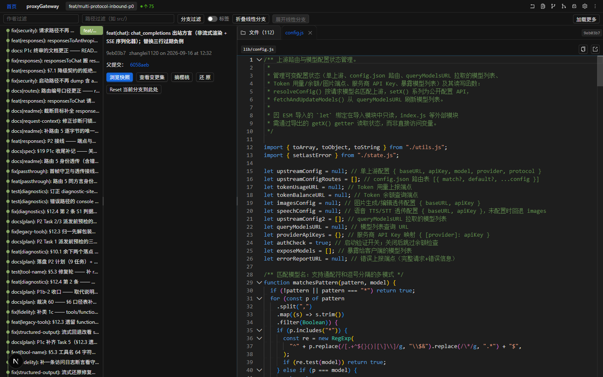

  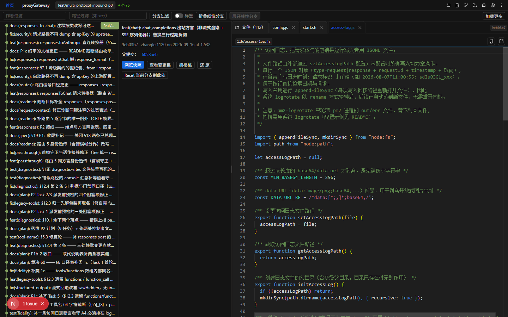

  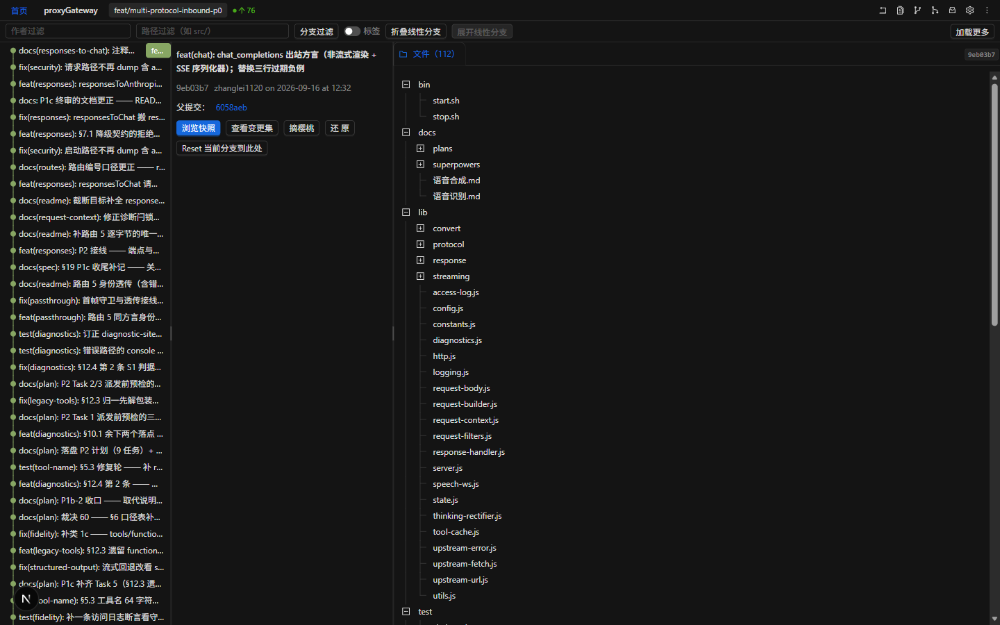

| 功能 | 用途与场景（解决什么） | 如何使用 |
|------|------------------------|----------|
| 文件树浏览（F-156） | 像文件夹一样展开某一版的目录，看清那次提交时仓库里到底有什么 | 快照栏「文件（N）」标签页里按目录聚合（目录排在文件前、同级按名称排序），**初始只展开第一层目录**；点目录名展开或收起（目录只当容器，不进选中态）；子模块带「子模块」标签且点不开，符号链接带「链接」标签（可点开看它指向的内容） |
| 文件内容只读查看（F-157） | 核对某一版的真实内容，而不是工作区当前的内容 | 点文件树里的文件名 → 该文件开成一个标签，正文是**该版本**的内容（等宽只读、带行号、不折行）；换选中提交即换到那一版 |
| 文件内容只读查看·二进制提示（F-157） | 图片、可执行文件之类不该硬塞成文本 | 选中二进制文件（内容含 NUL 字节）→ 正文区只显示「二进制文件，不支持文本预览」，不渲染任何内容 |
| 降级边界（F-158） | 版本号打错或该版本里没有这个文件时给出明确原因，而不是白屏 | 换到一个取不到树的版本 → 快照栏内红字「无效的 ref：…」；深链里 `?file=` 指向该版本没有的文件 → 正文区提示错误原因 |
| 入口与导航边（F-159） | 从日志页原地进出，不留垃圾参数 | 日志页选中提交 → 详情面板点「浏览快照」→ 就地展开快照栏（三栏：日志｜详情｜快照，不离开日志页）；再点一次收起，`browse` 键删掉（只收起文件树那一族时，若变更集还开着，右栏仍在） |
| 就地快照栏（F-160） | 核对某一版的文件树与文件内容，不必离开日志页、不必重新找提交 | 点「浏览快照」→ 右侧插入快照栏：**「文件（N）」标签**里是这一版的文件树，点文件名就把它开成一个**文件标签**看该版本全文（等宽只读、带行号、不折行，长行横向滚动）；换选提交时整条标签栏跟着换到那一版。**两个面板键与各自的定位都写进地址栏**（`?browse=<路径|空>` / `?diff=<路径|空>`），刷新、复制链接、前进后退都能回到同一视图——连「我停在树上/停在清单上」都还原 |
| 多文件标签（编辑器式） | 对着两个文件改代码时要来回看；以前换文件就丢掉上一个 | 树里每点一个文件开一个标签，可同时开多个：点标签切换、点标签上的 `×` 关闭；关闭当前标签会自动切到相邻标签，关掉最后一个就回到「文件」标签。切回开过的标签**立即出内容**（内容按路径留了副本），编辑器实例不重建——滚动位置不丢 |
| 变更集标签（#13） | 看一次提交到底动了哪些文件，以及其中某个文件具体改了什么，都在快照栏原地完成 | 详情面板「查看变更集」→ 快照栏里出现「变更集（N）」标签：逐行状态徽标（A/M/D/R/C/T）+ 文件名（重命名写成「旧 → 新」）——**清单里不重复提交主题**（主题在日志行、详情面板与标签 Tooltip 上都有）；点文件名在同一标签栏开它的**差异标签**（路径栏 + 差异视图，`from=父提交`、`to=该提交`，路径栏右端「上一个 / 下一个」在这批文件里前后翻）。差异视图默认「行内」（快照栏窄，行内更好读），可切「并排」，另有忽略空白 / 自动换行 / 上下文行数（未变更区折叠）等与差异页同一套选项；根提交与 R 重命名文件只给提示行（不做伪 diff）。标签上的 `×` 关闭整个变更集标签族 |
| 列宽可拖（F-161） | 长路径、宽代码、窄屏幕各人要的分配不同 | 拖动栏间分隔条调整宽度；`←/→` 微调（按住 `Shift` 步进更大）；双击分隔条复位该栏默认宽；拖出来的宽度记在本机 |
| 提交信息完整展示（F-162） | 提交正文往往写明了改因与影响，只看首行会漏掉关键信息 | 详情面板在首行之下补出正文（保留原有换行）；点首行或正文即复制**整条**提交信息 |
| 点文本即复制（F-163） | hash / 作者 / 分支名这些值要粘到终端、PR 或聊天里 | 点短 hash 复制完整 40 位；点作者复制 `姓名 <邮箱>`（不含时间）；点分支/标签 chip 复制该引用名；顶栏当前分支 chip 同样可点；复制成功后图标变对勾并提示「已复制到剪贴板」 |

- **边界与提示**：
  - 文件标签的路径栏右侧只有「复制全文」——原「在新标签页打开」的导出按钮与那个独立整页形态都已按用户口径删除（整页快照浏览页在应用内没有入口）；路径过长用省略号截断，悬停看全路径。
  - **正文自适应可见区域高度**：栏高恒等于窗口可视高度，代码再长也只在栏内滚动，不会把整页拉长；栏再窄也不会折行（长行由横向滚动兜住）。
  - 「文件」标签**不提供关闭按钮**——关掉它就没有挑文件的入口了；文件标签才有 `×`。
  - 复制依赖浏览器剪贴板权限；浏览器拒绝时不会谎报成功（不出现「已复制」提示）。
  - 顶栏分支 chip 在游离 HEAD 状态下显示 `(detached HEAD)`，那是展示占位，不做成复制目标。
  - 换选中提交时快照栏跟随，并清空已选文件（文件标签重置）——同一路径在新版本里未必存在，留着会显示上一版的旧文本。
  - **变更集标签跨提交保留**：开着它换提交，标签不会消失，内容自动换成新提交的变更集；已开的差异标签**只在路径仍属于新提交的变更集时**保留（换个提交没动过那个文件，标签自动关掉，免得留一条「看的还是上一版差异」的假标签）。再点一次「查看变更集」只收起变更集那一族，文件树（若开着）不受影响。
  - **两个面板键各自留在地址栏**：`?browse=`（浏览快照）与 `?diff=`（查看变更集）互相独立，各自的值还表达「前台是谁」（有路径 = 那个文件/差异在前台，空值 = 树/清单在前台）；刷新、复制链接、前进后退都回到同一视图。深链里这两个参数按选中提交（`?select=`）就地展开对应那一族标签。
  - **差异工具条的选项记在本机**：并排/行内、忽略空白、自动换行、空白字符、上下文行数**各占一个本机键**（`rebased.diff.*`），改过就记住——刷新、关掉再开、**新开标签页**都按最后一次要求摆好（差异页与快照栏的差异标签共用同一套偏好）。它们不进地址栏：分享链接不该带上别人的阅读习惯。「工作区 / 已暂存」不在此列，它是取数开关且由页面/地址栏决定。
  - 快照栏不再有「显示/隐藏文件树」开关：合并成标签栏后，树本身就是第一个标签，切过去即见、切走即让位。

## 五、典型任务流程

> 跨页面的完整办事路径。每一步的按钮位置与页面细节见 §四 对应小节。

### 5.1 改完代码，提交并推送到远程

1. 变更状态页：勾选要进这次提交的文件 → 「暂存」。
2. 写提交信息（必填）→ 「提交并推送」。
3. 推送成功会提示「已提交并推送」；若只点「提交」，之后再从日志页「更多 → 推送」。

### 5.2 推送被拒（远端有你没有的提交）

1. 推送被拒 → 自动弹出「推送被拒 — 更新项目」。
2. 选 **合并**（保留分叉痕迹）或 **变基**（把本地提交接到远端之上，历史更直）→ 确定。
3. 更新成功后自动续推；若更新过程中出现冲突 → 自动进入冲突解决页，解决完再推一次。

### 5.3 合并另一条分支

1. 日志页顶栏「合并」→ 合并页。
2. 选目标分支（本地或 `origin/xxx` 远程分支）；按需勾选 不自动提交（`--no-ff`）/ 压缩/暂不提交，填合并信息。
3. 结果三种：已是最新（留在本页）/ 合并成功（回日志页）/ 有冲突（自动跳冲突页）。

### 5.4 解决冲突

1. 冲突页按目录列出冲突文件，每行有类型徽标（双方修改 / 双方新增 / 对方删除我方修改…）。
2. 逐文件选：「用我们的」「用他们的」「删除该文件」或「手动合并」（三栏对比：当前分支 / 合并来源 / 可编辑结果）。
3. 全部解决后点「完成合并」或「继续变基」→ 自动回日志页。
4. 中途想放弃：回日志页顶栏操作条点「中止」；变基/摘樱桃/还原还可以「跳过」当前这一个提交。

### 5.5 整理本地提交历史

| 想做的事 | 怎么做 |
|----------|--------|
| 改最近一次提交的信息/内容 | 状态页提交框勾「amend」 |
| 改更早某次提交的信息 | 日志行右键「Reword Commit」 |
| 把当前暂存的改动并进某次历史提交 | 日志行右键「Fixup Commit」/「Squash Commit」 |
| 删掉某次提交 | 日志行右键「Drop Commit」 |
| 把某次提交并进它的父提交 | 日志行右键「Squash Commit（并入父提交）」/「Fixup Commit（并入父提交）」 |
| 调整多个提交的顺序/动作 | 日志页「更多 → 变基」→ 交互式：填起点 → 逐行选 pick/reword/squash/fixup/drop → 上移/下移 → 开始 |
| 把整条分支挪到另一个基上 | 日志页「更多 → 变基」→ 简单模式填目标基 |

> 已推送到**受保护分支**的提交不允许重写：会被拦下并提示「目标提交已推送到受保护分支，不可重写」（保护分支规则在应用设置页配置）。

### 5.6 手头的活要临时收走

| 方式 | 存哪 | 什么时候用 |
|------|------|------------|
| 贮藏（stash） | 仓库内（等价 `git stash`），可被推送/共享语义覆盖 | 临时切分支，稍后 `pop`/`apply` 回来 |
| 搁置（shelf） | 应用存档（含未跟踪文件快照），**保存后工作区不变** | 想留一份「当前全貌」又不打断手头的活 |
| 补丁（patch） | 应用存档（unified diff 文件） | 只想导出某几个文件/某段区间的改动，拿去别处套用 |
| 变更列表（changelist） | 应用记账（只是分组，不动文件） | 改动太多，想按任务分堆、只提交某一堆 |

### 5.7 追查「这行代码是谁改的、为什么」

1. 溯源页（带 `?file=` 的链接，或在左栏树里点文件）→ 中栏挑一条提交 → 右栏「逐行注解」里看这份文件的逐行归属；**点某一行 = 选中该行归属的提交**（追责主链路）。
2. 选中提交后右栏「本文件改动」看它对当前文件的改动；「与最新版本差异」看这一版与当前工作区差多少；操作条「差异页」在新标签页打开同一对比。
3. 操作条「日志定位」回日志页定位这次提交（看完整提交信息）；「文件历史」看该文件的全部提交（含改名前的）。
4. 操作条「受影响」看这次提交一共改了哪些文件，清单里点文件 → 新标签页看该文件的差异。
5. 想看某个历史版本整棵树长什么样：日志页详情面板「浏览快照」。

### 5.8 远端被强推过，本地推不上去

1. 分支页找到当前分支（会显示与上游双向分叉）。
2. 点「force-push 修复」：先拉取，再把本地独有提交逐个重放到远端最新之上。
3. 若确实要覆盖远端（团队约定允许）：推送对话框勾「force-with-lease：安全强推」——远端在你上次拉取后没有新变化才会推成功。

### 5.9 误操作之后的补救阶梯

| 情况 | 补救 |
|------|------|
| 刚提交完就后悔（还没推） | 日志页顶栏「撤销最近提交」：提交撤掉，改动回到暂存区 |
| 想把分支指针挪回某次提交 | 日志页详情面板「Reset 当前分支到此处」→ 选 soft/mixed/hard |
| 把没提交的改动丢掉了 | 若之前搁置/贮藏过：搁置页「恢复」/ 贮藏页 `apply`；否则 git 层面无法恢复 |
| 删除分支删错了 | 该仓库的本地分支需自行用 git 找回；应用不提供回收站 |
| 想放弃某个文件的改动 | 变更状态页勾选 → 「放弃」（不可恢复，会二次确认） |

### 5.10 并行开发（工作树）

1. 工作树页「创建」→ 选「关联已有分支」或「创建新分支」→ 填目录。
2. 新目录立刻是一份独立检出，可以在里面同时改代码/跑构建，互不打扰。
3. 用完后行内「移除」（目录里有未提交内容需勾「强制移除」）；目录被手工删掉的用「清理失效工作树」。

### 5.11 评审 PR / MR

1. 仓库必须挂有 github.com / gitlab.com 远程，日志页「更多」里才会出现对应面板。
2. 首次使用：设置页账户卡片录入令牌（host 填 `github.com` / `gitlab.com`）。
3. 面板内：看列表 → 打开详情与时间线 → 发评论 → 行级 diff 上选行号写行级评论 → 审查（通过 / 请求修改）→ 合并（合并/压缩/变基）。
4. 想直接跑一遍：检出 PR/MR 分支（本地分支名形如 `pr-12`、`mr-7`）。

### 5.12 让某些文件不再打扰变更列表

- 单个文件/目录：变更状态页未跟踪行点「忽略」（写入 `.gitignore`，幂等）。
- 成批规则：忽略配置页选目标文件（项目级 `.gitignore` 或仅本机的 `.git/info/exclude`）→ 套用模板或手写 → 保存。

### 5.13 出问题时的排查顺序

1. 看提示：页面顶部/右下角的红字或 toast 通常会直接给出原因。
2. 「更多 → 控制台」：看实际执行的 git 命令、退出码与错误输出（这是最接近真相的地方）。
3. 认证类失败：确认设置页里对应 host 的令牌是否有效；远程操作会把失败原因回显到对话框。
4. 卡在「进行中的操作」：日志页顶栏操作条状态会显示当前是什么操作、第几步，可中止；中止后工作区回到操作前。

## 六、功能点索引（F-001 ~ F-163）

> 编号沿用 `docs/e2e-verification.md` §四 的冒烟功能点；「手册位置」指向本手册 §四 的页面小节。

| 编号 | 功能点 | 手册位置 |
|------|--------|----------|
| F-001 | 打开路径表单（校验→验证→注册→跳日志页） | §4.1 首页 RepoPage |
| F-002 | 最近列表（打开即注册/同路径复用/最近优先） | §4.1 首页 RepoPage |
| F-003 | 显示名（定案单级） | §4.1 首页 RepoPage |
| F-004 | 路径副文本 `~/` 相对化 | §4.1 首页 RepoPage |
| F-005 | 列表上限 50 | §4.1 首页 RepoPage |
| F-006 | 移除动作 + Popconfirm | §4.1 首页 RepoPage |
| F-007 | 克隆对话框（URL + Directory） | §4.1 首页 RepoPage |
| F-008 | 初始化仓库入口 | §4.1 首页 RepoPage |
| F-009 | 提交图真图渲染（lane/边路由） | §4.2 提交日志页 LogPage |
| F-010 | 分支着色（ref 名 hash → HSB 色板） | §4.2 提交日志页 LogPage |
| F-011 | 虚拟滚动（固定行高窗口渲染） | §4.2 提交日志页 LogPage |
| F-012 | 首屏快照 + SSE 增量渲染 + hash 去重 | §4.2 提交日志页 LogPage |
| F-013 | 取消链路（断开即杀 git 进程） | §4.2 提交日志页 LogPage |
| F-014 | 行默认列 Subject + Author + Date | §4.2 提交日志页 LogPage |
| F-015 | refs chips（分支默认开/tag 默认关） | §4.2 提交日志页 LogPage |
| F-016 | 行点击 → 提交详情面板 | §4.2 提交日志页 LogPage |
| F-017 | 详情面板操作按钮 | §4.2 提交日志页 LogPage |
| F-018 | 顶栏状态条（分支名 + 徽标） | §4.2 提交日志页 LogPage |
| F-019 | 状态变更自动刷新（事件驱动） | §4.2 提交日志页 LogPage |
| F-020 | `refs.changed` 订阅 | §4.2 提交日志页 LogPage |
| F-021 | `?select=<hash>` 深链 | §4.2 提交日志页 LogPage |
| F-022 | 顶栏入口 5 按钮 | §4.2 提交日志页 LogPage |
| F-023 | 「更多」菜单 18 项 | §4.2 提交日志页 LogPage |
| F-024 | OperationStatus 操作条（kind + 中止） | §4.2 提交日志页 LogPage |
| F-025 | 远程操作认证重试回路 | §4.2 提交日志页 LogPage |
| F-026 | 按需加载更早提交（页大小 ≤500 + skip 游标） | §4.2 提交日志页 LogPage |
| F-027 | 过滤（author / path） | §4.2 提交日志页 LogPage |
| F-028 | 行右键菜单形态 | §4.2 提交日志页 LogPage |
| F-029 | Monaco DiffEditor（懒加载/行号/高亮/只读） | §4.3 差异页 DiffPage |
| F-030 | 并排/行内切换 + 忽略空白 | §4.3 差异页 DiffPage |
| F-031 | staged / 工作区切换（三态映射） | §4.3 差异页 DiffPage |
| F-032 | 任意两版本对比（from/to 成对） | §4.3 差异页 DiffPage |
| F-033 | 新增/删除/重命名两侧渲染 | §4.3 差异页 DiffPage |
| F-034 | unified diff 文本视图 | §4.3 差异页 DiffPage |
| F-035 | 大 diff 分块流渲染（DiffStreamView） | §4.3 差异页 DiffPage |
| F-036 | word diff/同步滚动/未变更区折叠（上下文行数） | §4.3 差异页 DiffPage |
| F-037 | 三版本对比（本地/暂存/HEAD） | §4.3 差异页 DiffPage |
| F-038 | 与分支比较（hunk 应用/回退经 StatusPage 通道） | §4.3 差异页 DiffPage |
| F-039 | 变更分组列表（已暂存/工作区/未跟踪） | §4.4 变更状态页 StatusPage |
| F-040 | 变更列表子分组与管理 | §4.4 变更状态页 StatusPage |
| F-041 | 文件级暂存/取消暂存/放弃修改 | §4.4 变更状态页 StatusPage |
| F-042 | hunk 级暂存（行内 hunk 选择） | §4.4 变更状态页 StatusPage |
| F-043 | 行内补丁预览 | §4.4 变更状态页 StatusPage |
| F-044 | 提交框（message + amend/signOff/noVerify） | §4.4 变更状态页 StatusPage |
| F-045 | 跳 DiffPage | §4.4 变更状态页 StatusPage |
| F-046 | 未跟踪行「忽略」一键入口 | §4.4 变更状态页 StatusPage |
| F-047 | 三版本对比入口 | §4.4 变更状态页 StatusPage |
| F-048 | Create Patch from changes | §4.4 变更状态页 StatusPage |
| F-049 | Shelve Changes | §4.4 变更状态页 StatusPage |
| F-050 | Stash Files | §4.4 变更状态页 StatusPage |
| F-051 | Annotate / Show History 入口 | §4.4 变更状态页 StatusPage |
| F-052 | 提交（信息必填/身份预检） | §4.5 提交框（CommitDialog 等效） |
| F-053 | amend（改上次提交） | §4.5 提交框（CommitDialog 等效） |
| F-054 | sign-off / 跳过 hooks | §4.5 提交框（CommitDialog 等效） |
| F-055 | amend 历史提交（amend 到…） | §4.5 提交框（CommitDialog 等效） |
| F-056 | GPG 签名 / commit template | §4.5 提交框（CommitDialog 等效） |
| F-057 | CRLF 提示（三选 Modal） | §4.5 提交框（CommitDialog 等效） |
| F-058 | commit & push（提交并推送） | §4.5 提交框（CommitDialog 等效） |
| F-059 | Reset soft / mixed / hard | §4.6 重置对话框 ResetDialog |
| F-060 | Reset Current Branch to Here（等价入口） | §4.6 重置对话框 ResetDialog |
| F-061 | Undo Commit | §4.6 重置对话框 ResetDialog |
| F-062 | 分组（本地/远程/最近检出/标签）与过滤 | §4.7 分支页 BranchPanel |
| F-063 | 行内信息（current/上游徽标/已合并图标） | §4.7 分支页 BranchPanel |
| F-064 | 创建/删除/重命名/设上游 | §4.7 分支页 BranchPanel |
| F-065 | 检出三态（既有/新建并检出/detached） | §4.7 分支页 BranchPanel |
| F-066 | 查找已合并 / 清理已合并与过时分支 | §4.7 分支页 BranchPanel |
| F-067 | 与当前分支比较 | §4.7 分支页 BranchPanel |
| F-068 | 与工作树差异 | §4.7 分支页 BranchPanel |
| F-069 | 弹窗 Fetch | §4.7 分支页 BranchPanel |
| F-070 | force-push 后修复 | §4.7 分支页 BranchPanel |
| F-071 | 检出并变基到当前 | §4.7 分支页 BranchPanel |
| F-072 | 检出并更新 | §4.7 分支页 BranchPanel |
| F-073 | 合并方向选择 | §4.8 合并页 MergeDialog |
| F-074 | merge 策略 / commit 选项 | §4.8 合并页 MergeDialog |
| F-075 | 进行中状态联动（中止/冲突跳转） | §4.8 合并页 MergeDialog |
| F-076 | rebase onto（目标基选择） | §4.9 变基对话框 RebaseDialog |
| F-077 | 交互式列表（pick/reword/squash/fixup/drop + 上移/下移） | §4.9 变基对话框 RebaseDialog |
| F-078 | continue / abort / 冲突联动 | §4.9 变基对话框 RebaseDialog |
| F-079 | auto-squash / fixup、squash by subject | §4.9 变基对话框 RebaseDialog |
| F-080 | 单提交编辑直通（reword/drop/squash/fixup） | §4.9 变基对话框 RebaseDialog |
| F-081 | stash save（message/-u/--keep-index） | §4.10 贮藏页 StashPanel |
| F-082 | pop / apply / drop | §4.10 贮藏页 StashPanel |
| F-083 | stash as branch | §4.10 贮藏页 StashPanel |
| F-084 | Unstash As 对话框 | §4.10 贮藏页 StashPanel |
| F-085 | 查看差异 | §4.10 贮藏页 StashPanel |
| F-086 | 创建标签（含附注） | §4.11 标签页 TagPanel |
| F-087 | 删除标签（本地/远程） | §4.11 标签页 TagPanel |
| F-088 | 推送标签（单个/全部） | §4.11 标签页 TagPanel |
| F-089 | 远程添加/删除/编辑 | §4.12 远程管理页 RemotePanel |
| F-090 | fetch（spec/全远程/单远程） | §4.12 远程管理页 RemotePanel |
| F-091 | shallow 识别 / unshallow | §4.12 远程管理页 RemotePanel |
| F-092 | HTTPS 认证对话框 / token 存储 | §4.12 远程管理页 RemotePanel |
| F-093 | push（远程/分支选择、setUpstream/forceWithLease） | §4.13 推送对话框 PushDialog |
| F-094 | rejected push → 自动 Update 联动 | §4.13 推送对话框 PushDialog |
| F-095 | push tags / force-push 后修复（通道验证） | §4.13 推送对话框 PushDialog |
| F-096 | pull（远程/分支选择、rebase 选项） | §4.14 拉取对话框 PullDialog |
| F-097 | fetch 全远程 / fetch spec 定制（通道验证） | §4.14 拉取对话框 PullDialog |
| F-098 | merge/rebase 策略选择 | §4.15 更新项目 UpdateProjectDialog |
| F-099 | 更新会话（进度/结果汇总） | §4.15 更新项目 UpdateProjectDialog |
| F-100 | Reset to tracked | §4.15 更新项目 UpdateProjectDialog |
| F-101 | 注解展示（等效行列表形态） | §4.16 文件溯源 BlameWorkbench |
| F-102 | 注解点击联动 | §4.16 文件溯源 BlameWorkbench |
| F-103 | Show All Affected（受影响文件） | §4.16 文件溯源 BlameWorkbench |
| F-104 | previousLineno 边界 | §4.16 文件溯源 BlameWorkbench |
| F-105 | 文件历史列表 | §4.17 文件历史 HistoryPanel |
| F-106 | 重命名跟随（`--follow`） | §4.17 文件历史 HistoryPanel |
| F-107 | 版本 diff 联动 | §4.17 文件历史 HistoryPanel |
| F-108 | 按提交浏览已提交变更 | §4.18 已提交变更 CommittedChangesPanel |
| F-109 | 目录树组织变更文件 | §4.18 已提交变更 CommittedChangesPanel |
| F-110 | 与 diff 查看器联动 | §4.18 已提交变更 CommittedChangesPanel |
| F-111 | 提交搜索（grep / pickaxe） | §4.19 提交搜索 SearchPanel |
| F-112 | 结果 → 日志页 | §4.19 提交搜索 SearchPanel |
| F-113 | 分支快速搜索 | §4.19 提交搜索 SearchPanel |
| F-114 | 冲突文件列表 + 类型徽标 + 目录分组 | §4.20 冲突解决 ConflictsPanel |
| F-115 | 整侧解决（ours/theirs/delete） | §4.20 冲突解决 ConflictsPanel |
| F-116 | 3-way 手动合并（MergeView） | §4.20 冲突解决 ConflictsPanel |
| F-117 | 完成合并（continue 泛化） | §4.20 冲突解决 ConflictsPanel |
| F-118 | 跳过（skip） | §4.20 冲突解决 ConflictsPanel |
| F-119 | 合并状态联动 | §4.20 冲突解决 ConflictsPanel |
| F-120 | 创建补丁（unified diff 三态导出） | §4.21 补丁页 PatchPanel |
| F-121 | 应用补丁（check 先行） | §4.21 补丁页 PatchPanel |
| F-122 | 补丁列表管理 | §4.21 补丁页 PatchPanel |
| F-123 | 导入补丁到搁置 | §4.21 补丁页 PatchPanel |
| F-124 | 搁置保存（工作区+暂存+未跟踪随档） | §4.22 搁置页 ShelfPanel |
| F-125 | 恢复 / 删除 | §4.22 搁置页 ShelfPanel |
| F-126 | Unshelve 联动 | §4.22 搁置页 ShelfPanel |
| F-127 | 工作树列表 | §4.23 工作树 WorktreePanel |
| F-128 | 工作树创建 | §4.23 工作树 WorktreePanel |
| F-129 | 移除 / 清理 | §4.23 工作树 WorktreePanel |
| F-130 | 子模块状态列表（四态徽标） | §4.24 子模块 SubmodulePanel |
| F-131 | 子模块更新（init/update） | §4.24 子模块 SubmodulePanel |
| F-132 | 创建/编辑/模板（双 target） | §4.25 忽略配置 IgnoreDialog |
| F-133 | 一键忽略文件/目录 | §4.25 忽略配置 IgnoreDialog |
| F-134 | 检测门（远程形态才渲染） | §4.26 GitHub 面板 |
| F-135 | 账户/token 认证 + 降级卡 | §4.26 GitHub 面板 |
| F-136 | PR 列表/详情/时间线/评论 | §4.26 GitHub 面板 |
| F-137 | PR 审查（approve/request changes） | §4.26 GitHub 面板 |
| F-138 | PR diff 视图 + 行级评论 | §4.26 GitHub 面板 |
| F-139 | 三种合并策略 + 检出 PR 分支 | §4.26 GitHub 面板 |
| F-140 | 检测门 + 账户认证 | §4.27 GitLab 面板 |
| F-141 | MR 创建/列表/详情/评论 | §4.27 GitLab 面板 |
| F-142 | MR diff 视图 + 行级讨论 | §4.27 GitLab 面板 |
| F-143 | MR 审查 / 合并 | §4.27 GitLab 面板 |
| F-144 | MR 检出 | §4.27 GitLab 面板 |
| F-145 | git 命令输出展示（环形缓冲 + token 剥离） | §4.28 命令控制台 GitConsole |
| F-146 | 输出折叠（`-c key=value`） | §4.28 命令控制台 GitConsole |
| F-147 | 分支快捷弹窗（等效 = 顶栏「分支」） | §4.29 快捷操作聚合 |
| F-148 | 操作聚合（等效 = 顶栏 + 更多菜单 + 操作条） | §4.29 快捷操作聚合 |
| F-149 | 应用设置读写 | §4.30 设置页 |
| F-150 | git 配置白名单 9 键读写 | §4.30 设置页 |
| F-151 | 账户/令牌管理 | §4.30 设置页 |
| F-152 | 集中存储（config-store） | §4.30 设置页 |
| F-153 | git 可执行文件检测/引导 | §4.30 设置页 |
| F-154 | GPG 专属配置对话框 | §4.30 设置页 |
| F-155 | 保护分支设置 | §4.30 设置页 |
| F-156 | 文件树浏览（目录聚合 + 初始一层展开） | §4.31 日志页就地快照栏 |
| F-157 | 文件内容只读查看（含二进制提示） | §4.31 日志页就地快照栏 |
| F-158 | 降级边界（无效 ref / 版本内无此文件） | §4.31 日志页就地快照栏 |
| F-159 | 入口与导航边（详情面板开关 + 地址栏参数） | §4.31 日志页就地快照栏 |
| F-160 | 就地快照栏（文件树 + 文件标签页） | §4.31 日志页就地快照栏与文本复制 |
| F-161 | 列宽可拖（快照栏并入两栏后仍可拖） | §4.31 日志页就地快照栏与文本复制 |
| F-162 | 提交信息完整展示 | §4.31 日志页就地快照栏与文本复制 |
| F-163 | 点文本即复制 | §4.31 日志页就地快照栏与文本复制 |

## 七、明确不做与已知边界

### 7.1 不提供的功能（不是缺陷，是决策）

| 不提供 | 替代方式 |
|--------|----------|
| 内置终端 | 用系统终端；「控制台」页可回看应用执行过的 git 命令 |
| 编辑器级「本地历史」 | 用搁置/贮藏留快照，或日志页查提交 |
| 全局搜索（Search Everywhere） | 提交搜索页（含本地分支快速搜索） |
| 键盘快捷键 | 全部走按钮/右键菜单 |
| SSH 专属设置界面 | SSH 密钥属系统级配置，由 git/ssh 自身管理 |
| 自动定时拉取 | 远程变化通过事件推送即时反映；需要时手动 Fetch/更新项目 |
| GitHub Gist / GitLab Snippet、自托管 GitLab、OAuth 登录 | 用个人访问令牌（PAT）手动录入；仅支持 github.com 与 gitlab.com |
| 克隆/分享项目到 GitHub、PR 描述 AI 生成 | 克隆本地/远端仓库可用；其余不做 |
| 多项目会话（同时开多个仓库窗口） | 首页最近列表切换仓库 |

### 7.2 数据放在哪

| 内容 | 位置 | 说明 |
|------|------|------|
| 提交、分支、标签、贮藏、远程、子模块、工作树 | 仓库自身（`.git`） | 与命令行完全同源，换个客户端照样可见 |
| 最近仓库列表、主题、保护分支规则、账户令牌、变更列表分组、列表头像色号 | 应用配置（本机 `~/.rebasedjs/config.json`） | 令牌仅掩码回显；配置文件按属主独占权限写盘；头像色号在首次看到某个仓库路径时分配一次并长期沿用（移出列表也不清除，重新加入仍是原色号） |
| 搁置存档、补丁文件 | 应用存档目录（本机） | 换机器/清配置即失去；需要长期保存请导出补丁内容 |

### 7.3 已知边界

- **单仓库维度**：切换仓库会重置页面内的临时状态（选中提交、打开的对话框、过滤条件）。
- **保护分支**是应用侧的编辑拦截（阻止重写已发布的提交），不是服务端保护规则。
- **GPG 签名**需要本机安装 gpg 且有可用私钥；没有密钥时无法在界面开启签名。
- **CRLF 提示**只在特定条件（Windows + 换行配置建议 + 暂存区存在 CRLF 文件）下出现。
- **GitHub / GitLab 面板**需要目标仓库挂有对应托管远程且令牌有效，否则只显示检测门或「去设置」提示卡。
- **冲突态下的合并**没有「跳过」（只有完成/中止）；变基、摘樱桃、还原才有「跳过」。
- **子模块冲突**态不能用「更新」解决，需先在子模块内解决冲突。
- **超大差异**会先以流式文本逐块显示，全文就绪后自动切换为标准对比视图。
- **远程操作**需要网络；失败会在对话框与控制台留下原因，不会静默成功。
- **首页失效条目**的判定只看**目录是否存在**：目录还在、但已经不是 git 仓库的条目仍按正常行显示，点它会走到「不是 git 仓库」的提示，而不是「仓库路径不可用」确认框。
